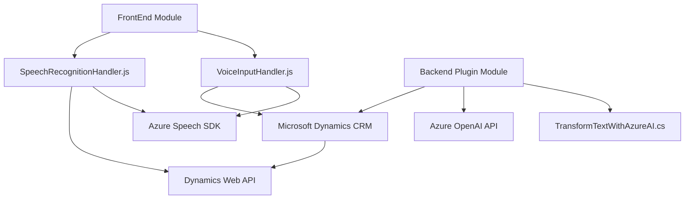

### Breve resumen técnico
El repositorio parece ser parte de una solución que integra funciones avanzadas de reconocimiento y síntesis de voz, además de procesamiento de datos con inteligencia artificial. Esto se utiliza en un entorno relacionado con formularios interactivos en Microsoft Dynamics CRM, aprovechando servicios en la nube como Azure Speech SDK y Azure OpenAI API.

---

### Descripción de arquitectura
La solución implementa una **arquitectura modular de n capas** que combina una lógica de frontend (JS) para interacción con usuarios con una integración de backend (C#) mediante un sistema de plugins y servicios externos. La interacción con los servicios Azure refuerza el carácter híbrido y conectado de la arquitectura. 

1. **Capas principales:**
   - **Frontend (JavaScript):** Ofrece entrada y salida por voz para formularios, integrando servicios de síntesis y reconocimiento de habla.
   - **Integración de servicios externos:** Usa Azure Speech SDK y servicios de Azure OpenAI para realizar tareas de síntesis de voz y procesamiento avanzado de texto.
   - **Backend (C#):** Actúa sobre Microsoft Dynamics CRM mediante plugins y proporciona integración con servicios externos para ampliar la funcionalidad del sistema.
   
2. **Patrones utilizados:**
   - **Event-driven programming:** Callbacks y funciones asincrónicas que responden a eventos como carga de SDK y reconocimiento de voz.
   - **Facade Pattern:** Interfaces modulares que simplifican la interacción con funciones especializadas.
   - **Plugin Pattern:** En el backend, el uso del plugin `IPlugin` para extender la funcionalidad de Dynamics CRM.
   - **Modularidad:** Código que organiza funciones y métodos según responsabilidades específicas.

3. **Interacción con servicios externos:** 
   - El frontend utiliza SDKs de Azure y consume APIs externas dinámicamente para reconocimiento y síntesis.
   - El backend realiza solicitudes HTTP hacia Azure OpenAI para procesamiento con inteligencia artificial.

---

### Tecnologías usadas
1. **Frontend (JavaScript):**
   - **Azure Speech SDK:** Para sintetizar texto en voz y reconocer voz.
   - **Dynamics Web API:** Para manipular formularios y datos en el sistema CRM.

2. **Backend (C#):**
   - **Microsoft Dynamics SDK:** Plugin que actúa directamente en el modelo de datos de CRM.
   - **Azure OpenAI API:** Procesamiento de texto avanzado vía modelos de inteligencia artificial (e.g., GPT).
   - **Newtonsoft.Json:** Manejo de JSON estructurado.

3. **Servicios externos utilizados:**
   - **Azure Speech SDK (JS):** `https://aka.ms/csspeech/jsbrowserpackageraw`.
   - **Azure OpenAI API (HTTP).**

---

### Diagrama Mermaid válido para GitHub

---

### Conclusión final
La solución se implementa en una arquitectura de n capas, con módulos JavaScript orientados al manejo de formularios y procesamiento basado en voz en el frontend, y un backend en C# que extiende la funcionalidad de Dynamics CRM mediante un plugin integrado. Utiliza tecnologías modernas como el Azure Speech SDK para la síntesis y reconocimiento de voz, junto con el modelo de IA de Azure OpenAI para transformación de texto. Este enfoque demuestra un diseño modular, flexible y apoyado en servicios en la nube que brindan capacidades avanzadas de interacción y análisis de datos. Sin embargo, se recomienda evaluar temas de seguridad como la gestión de claves API.