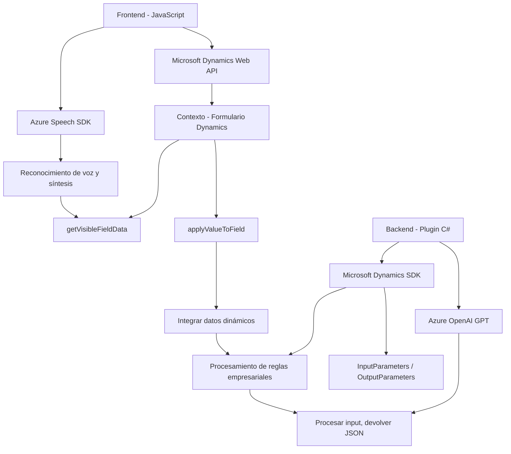

### **Breve Resumen Técnico**
Este repositorio contiene un conjunto de archivos orientados a la integración y procesamiento de datos mediante tecnologías avanzadas como Azure Speech SDK y Azure OpenAI GPT dentro del entorno de un sistema Microsoft Dynamics CRM/Dataverse. Las funcionalidades principales incluyen:
- **Reconocimiento de voz y síntesis de texto** en formularios de Dynamics CRM.
- **Transformación de texto con inteligencia artificial** mediante integraciones con Azure OpenAI GPT.

### **Descripción de la Arquitectura**
La arquitectura del sistema sigue un enfoque híbrido, compuesto por:
- **Interacción directa con APIs externas** (Azure Speech SDK y Azure OpenAI GPT).
- **Modularización funcional**: Cada archivo maneja aspectos específicos de las operaciones (grabación de voz, transcripción, síntesis de texto, o transformación de datos).
- **Plugin Architecture para Dynamics CRM**: La lógica empresarial específica está encapsulada en plugins que interactúan con el contexto del CRM proporcionado por Microsoft Dataverse.
- **Patrones n-capas + integraciones externas**: Separación entre la capa de presentación (frontend para voz/texto) y la capa backend (plugins en C# y servicios OpenAI).

### **Tecnologías Usadas**
#### **Frontend**
1. **JavaScript**:
   - Manipulación del DOM.
   - Uso de asincronía (promesas, callbacks, async/await).
   - Dynamic imports (carga condicional de SDK).
2. **Azure Speech SDK**:
   - Reconocimiento de voz y síntesis.
3. **Microsoft Dynamics CRM WebApi**:
   - Conexión para interactuar con entidades y datos del CRM.
4. **Integración con API personalizada para IA**: Uso de APIs externas para procesamiento de texto con reglas de usuario.

#### **Backend**
1. **C# Plugins**:
   - Extensiones para Microsoft Dynamics CRM.
   - Comunicación HTTP con Azure OpenAI GPT para procesamiento de texto.
2. **Azure OpenAI GPT**:
   - Inteligencia artificial para la transformación del texto.
3. **Bibliotecas utilizadas en .NET**:
   - **Newtonsoft.Json** y **System.Text.Json** para trabajar con JSON.
   - **System.Net.Http** para llamadas al servicio OpenAI.

### **Dependencias o Componentes Externos**
1. **Azure Speech SDK**: Servicios para reconocimiento y síntesis de voz.
2. **Azure OpenAI GPT**: Transformación de texto con inteligencia artificial.
3. **Microsoft Dynamics CRM SDK (Xrm API)**: Para acceder y manipular datos del formulario y contexto de Dynamics CRM.
4. **Custom APIs**: Se mencionan servicios básicos para IA que procesan texto transcrito mediante reglas específicas definidas por el usuario.

### **Diagrama Mermaid**

### **Conclusión Final**
El repositorio representa una solución intermedia entre una arquitectura **orientada a n-capas** y **orientada a microservicios**. Cumple con los principios de encapsulación y modularidad, enfocándose en:
1. La interacción con **servicios externos** como Azure Speech SDK y OpenAI GPT para reconocer, sintetizar y transformar datos.
2. **Reutilización de componentes**, tanto en frontend como en backend, con alta integración hacia Microsoft Dynamics CRM.
   
Esta arquitectura podría ser optimizada mediante:
- Implementación de peticiones asincrónicas en **plugins backend** para aumentar la escalabilidad y el rendimiento.
- Mejor desacoplamiento entre la lógica de negocio y las dependencias externas, favoreciendo la adaptabilidad y pruebas unitarias.
