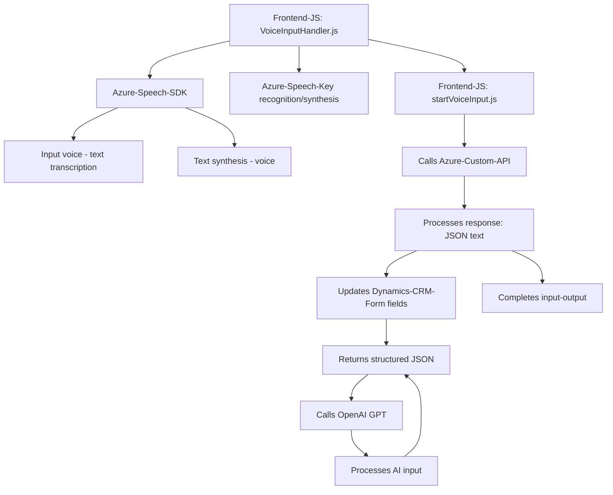

## Resumen técnico

El repositorio es un **proyecto de integración con Azure Speech SDK** y Microsoft Dynamics CRM, orientado a proporcionar capacidades avanzadas de interacción mediante entrada y salida de voz. Además, incorpora procesamiento inteligente con Azure OpenAI GPT para transformar texto hablado en JSON estructurado. Los módulos gestionan entradas en formularios, reconocimiento y síntesis de voz, y actualización de datos directamente en el CRM.

---

### Descripción de arquitectura

La arquitectura está basada en **n capas**, dividiendo responsabilidades en varios niveles:
1. **Front-End (JavaScript)**: Maneja la interacción del usuario y el flujo de entrada/salida de voz a través de integración con Azure Speech SDK.
2. **API personalizada (Azure OpenAI)**: Procesamiento y transformación avanzada del texto mediante llamadas a servicios REST.
3. **Back-End Plugins (Dynamics CRM)**: Ejecución de lógica de negocio directamente en el servidor del CRM para actualizar datos y aplicar reglas específicas.

Se utiliza el patrón **service integration** para la comunicación entre los componentes externos (Speech SDK y OpenAI) y los internos (CRM SDK).

---

### Tecnologías usadas
1. **JavaScript**:
   - Implementación de lógica en el frontend basada en modularización y programación asíncrona.
   - Uso del SDK de Azure Speech para síntesis y reconocimiento de voz.

2. **C#**:
   - Plugins para Dynamics CRM implementando el patrón `IPlugin`.
   - Llamadas HTTP hacia Azure OpenAI para procesamiento de texto.

3. **Azure Services**:
   - **Azure Speech SDK**: Para entrada/salida de voz.
   - **Azure OpenAI GPT Model**: Procesamiento avanzado del texto para estructuración JSON.

4. **Microsoft Dynamics CRM SDK**:
   - Mecanismo principal de integración para actualizar datos directamente en formularios y entidades del CRM.

5. **Dependencias adicionales**:
   - **Newtonsoft.Json**: Para manejo de datos en formato JSON.
   - **System.Net.Http**: Para comunicación REST.

---

### Diagrama Mermaid válido para GitHub

---

### Conclusión final

El repositorio ofrece una solución integrada basada en **Azure Speech SDK**, **Dynamics CRM**, y **Azure OpenAI GPT**, enfocada en simplificar la interacción humano-máquina en aplicaciones empresariales. La arquitectura sigue un paradigma de **n capas**, organizando lógica cliente, servicios externos, y funcionalidad de backend del CRM mediante plugins y procesamiento REST. 

Es adecuada para casos de uso que requieren:
1. **Entrada y salida de voz**.
2. **Transformación inteligente de datos con IA**.
3. **Actualización eficiente de formularios y entidades empresariales** en sistemas de CRM como Dynamics.