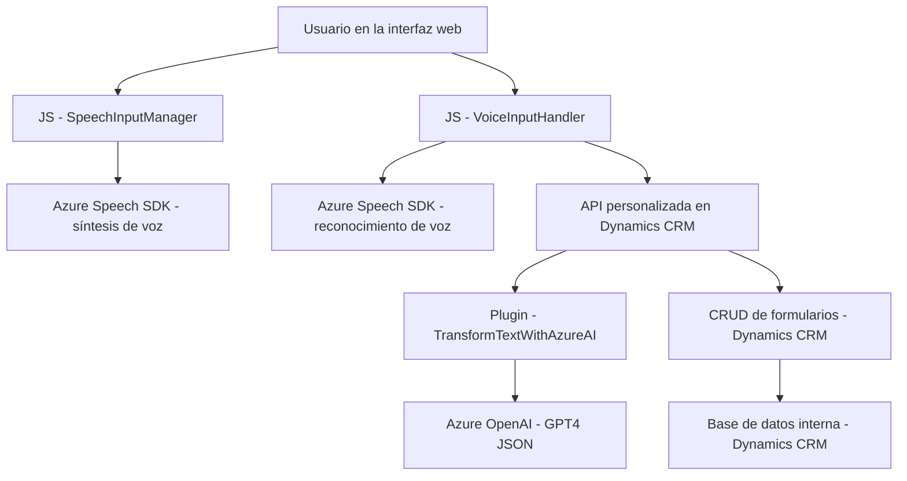

### Breve resumen técnico

El proyecto combina módulos de frontend en JavaScript para interactuar en tiempo real con usuarios mediante el reconocimiento y síntesis de voz, enlazado con servicios de backend construidos como plugins de Microsoft Dynamics CRM que integran tecnologías avanzadas como Azure OpenAI y Azure Speech SDK. La solución está orientada a enriquecer la interacción de usuarios con formularios dinámicos en ambientes empresariales.

---

### Descripción de arquitectura

#### Tipo de solución
- **API backend con lógica de procesamiento** (Plugins).
- **Frontend dinámico para interacción usuario-formulario** (JavaScript).
- Uso de servicios externos (Azure Speech SDK y Azure OpenAI).

#### Arquitectura general
- **Arquitectura de n capas**: 
  - Frontend interactúa con los usuarios y envía datos a un backend.
  - Plugins en Dynamics CRM sirven como capa intermedia para delegar procesos complejos a servicios externos.
  - Servicios en Azure manejan procesamiento avanzado como síntesis de voz y transformación de texto a estructuras JSON.

- **Microservice interaction pattern**:
  - Servicios externos (Azure Speech SDK y Azure OpenAI) funcionan como microservicios especializados bajo demanda, integrados mediante APIs REST.

#### Patrones usados
1. **Callback-driven structure**:
   - Uso de callbacks en el frontend para cargar el SDK de Azure Speech de forma dinámica y manejar sus eventos asíncronos.

2. **Integration with external APIs**:
   - Plugins delegan operaciones a Azure OpenAI y Azure Speech SDK.
   - Frontend también consume el Azure Speech SDK directamente.

3. **DTO (Data Transfer Object)**:
   - JSON utilizado en el plugin como DTO entre Dynamics CRM y Azure OpenAI.

4. **Separation of concerns**:
   - Módulos JavaScript separados para tareas específicas como reconocimiento de voz, síntesis de voz, y manipulación de formularios.

---

### Tecnologías usadas
1. **Frontend**:
   - **JavaScript** (puro). 
   - Azure Speech SDK: Para interacción con servicios de reconocimiento y síntesis de voz.

2. **Backend**:
   - **Microsoft Dynamics CRM SDK**:
     - Extiende funcionalidades de CRM mediante plugins.
   - **Azure OpenAI Service**:
     - Procesamiento avanzado de texto con GPT.
   - **C#**:
     - Lenguaje principal para implementar plugins.
   - **Newtonsoft.Json**:
     - Manejo avanzado de JSON.

3. **Otros**:
   - **HttpClient**: Para consumir APIs externas (Azure OpenAI).

---

### Diagrama Mermaid válido para GitHub

---

### Conclusión final

Este sistema implementa una solución híbrida entre un frontend dinámico que facilita la interacción vocal y un backend robusto que delega tareas avanzadas, como el análisis de texto estructurado, a servicios externos como Azure OpenAI. La solución aprovecha patrones como n capas para gestionar responsabilidades entre frontend y backend, al mismo tiempo que utiliza integración con SaaS para ampliar la funcionalidad. Es ideal para entornos empresariales que requieran interacción avanzada con formularios y procesamiento cognitivo de textos.