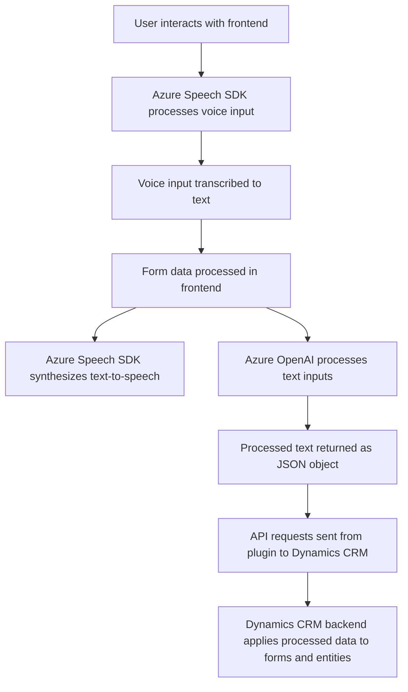

### Breve resumen técnico

El repositorio contiene múltiples archivos que implementan una solución de integración entre un **interfaz de usuario (frontend)** y **servicios en la nube de Microsoft Azure**, específicamente utilizando **Azure Speech SDK** y **Azure OpenAI API**. Adicionalmente, incluye un **plugin para Microsoft Dynamics CRM** que interactúa con Azure OpenAI para proporcionar una capa de inteligencia artificial y procesamiento avanzado de texto en aplicaciones empresariales.

---

### Descripción de arquitectura

La solución utiliza una arquitectura **multicomponente**, donde las partes principales son:
1. **Frontend en JavaScript**: Implementa la interfaz del usuario para interacción por voz con formularios en Dynamics CRM. Aplica el patrón de programación modular orientada a funciones.
2. **Plugin Backend** (en C#): Opera como una extensión directa dentro de Dynamics CRM para comunicarse con Azure OpenAI utilizando una arquitectura monolítica, basada en el patrón de plug-ins de Dynamics.
3. **Integración cloud**: Tanto el frontend como el plugin utilizan servicios externos de Azure para realizar tareas como síntesis de voz (Azure Speech SDK) y procesamiento de lenguaje natural (Azure OpenAI), y conforman un modelo basado en cliente-servidor.

**Patrones utilizados**:
- **Callback-centric architecture**: Muy evidente en la lógica de carga dinámica de SDKs y en los procesos asincrónicos en la interacción del frontend.
- **Procedural programming** para el frontend.
- **SOA (Service-Oriented Architecture)**: La solución emplea microinteracciones con servicios en la nube (Azure APIs) para ejecutar tareas específicas.

---

### Tecnologías usadas

1. **Frontend**: 
   - JavaScript.
   - Azure Speech SDK (`https://aka.ms/csspeech/jsbrowserpackageraw`) para reconocimiento y síntesis de voz.
   - Promesas y callbacks para sincronización asincrónica.
   - Dynamics CRM SDK para la manipulación de formularios.

2. **Backend Plugin**:
   - **Microsoft Dynamics CRM SDK** (`IPlugin`, `IPluginExecutionContext`, `IOrganizationService`) para manejos en el contexto CRM.
   - **Azure OpenAI API** para inteligencia artificial en procesamiento de texto.
   - **System.Net.Http** para solicitudes a APIs externas.
   - **System.Text.Json** y **Newtonsoft.Json.Linq** para trabajo con JSON.
   - **C#** como lenguaje principal.

3. **Frameworks**:
   - Dynamics CRM SDK (backend integration).
   - Azure Cloud APIs (Speech SDK y OpenAI).

---

### Diagrama Mermaid válido para GitHub

---

### Conclusión final

El repositorio representa una **hybrid architecture** que integra un **frontend** en JavaScript con el SDK de Azure Speech y una **backend plugin** desarrollado en C#. Este sistema se centra en enriquecer las interacciones del usuario con entradas y salidas de voz mediante **inteligencia artificial**, procesadas a través de servicios de **Microsoft Azure**, aplicando los resultados directamente a un sistema **Dynamics CRM**. Aunque utiliza prácticas como modularización, separación de responsabilidades y callbacks en el frontend, y soporta la integración en la nube con servicios de API, se pueden mejorar ciertos aspectos como el manejo de configuración segura y ser más explícito en el uso de patrones como inyección de dependencias en el plugin.