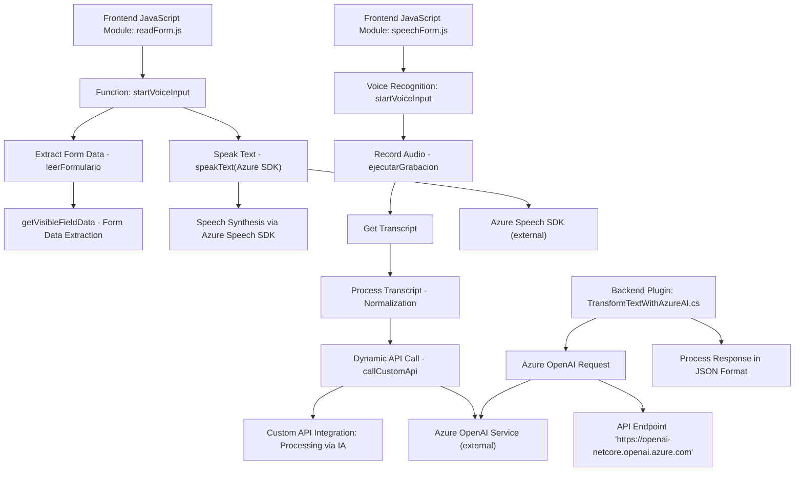

### **Breve resumen técnico**
El repositorio parece ser una solución híbrida que integra la funcionalidad de reconocimiento de voz, procesamiento de texto mediante inteligencia artificial, y generación de texto hablado. Se opera en el contexto de formularios en sistemas como Microsoft Dynamics CRM, utilizando tanto componentes de frontend escritos en JavaScript como plugins en C# y APIs externas como Azure Speech SDK y Azure OpenAI.

---

### **Descripción de arquitectura**
El diseño utiliza un enfoque modular y distribuido, que combina las siguientes tecnologías y paradigmas:
1. **Modularidad:** Cada archivo o componente está enfocado en una única responsabilidad (reconocimiento de voz, síntesis de voz, transformación de texto).
2. **Event-Driven Architecture:** La aplicación responde a eventos activados por el reconocimiento de voz, la interacción del usuario, y los cambios en el estado del formulario.
3. **Integración con servicios externos:** Procesamiento de datos mediante APIs externas como Azure Speech SDK y Azure OpenAI.
4. **Sistema híbrido:** Consiste en una combinación de funcionalidad frontend para interacción con formularios y plugins backend en Dynamics CRM para procesos avanzados.

La arquitectura predominante es **n capas**, por la separación de responsabilidades entre el frontend, procesamiento de datos en plugins y servicios externos. Sin embargo, también puede adoptar características de una arquitectura orientada a microservicios en los componentes integrados con APIs.

---

### **Tecnologías usadas**
1. **Frontend:**
   - JavaScript (ECMAScript 6+).
   - SDK de Azure Speech (importado vía CDN).
   - Dynamically loaded SDK dependency.

2. **Backend:**
   - Plugins de Microsoft Dynamics implementados en C#.
   - Microsoft Dynamics SDK (`Microsoft.Xrm.Sdk`).
   - ASP.NET Core.
   - Bibliotecas .NET (`HttpClient`, `JsonSerializer`, `Newtonsoft.Json.Linq`, etc.).

3. **Servicios externos:**
   - Azure OpenAI API: Procesamiento de texto asistido por inteligencia artificial.
   - Azure Speech SDK: Reconocimiento y síntesis de voz.

4. **Patrones de diseño:**
   - **Facade:** Punto de entrada único para funcionalidad de voz.
   - **Plugin-Based Architecture:** Integración con Microsoft Dynamics CRM.
   - **Separation of Concerns:** Funciones y clases modulares y orientadas a tareas específicas.
   - **API-Oriented Design:** Integración directa mediante HTTP hacia servicios en la nube.

---

### **Diagrama en Mermaid**

---

### **Conclusión final**
El repositorio combina el uso de tecnologías de frontend, plugins backend y servicios en la nube para proporcionar una solución robusta centrada en el procesamiento de entrada de voz y datos de formularios. Está diseñado para integrarse con Microsoft Dynamics CRM, utilizando una arquitectura modular que facilita la extensibilidad y mantiene una separación adecuada de responsabilidades. Sin embargo, se recomienda mejorar la seguridad de las claves de API y considerar migrar variables sensibles a sistemas gestionados y seguros. El proyecto puede evolucionar hacia una arquitectura más orientada a microservicios si se abstraen y desplegan los componentes en sistemas independientes.