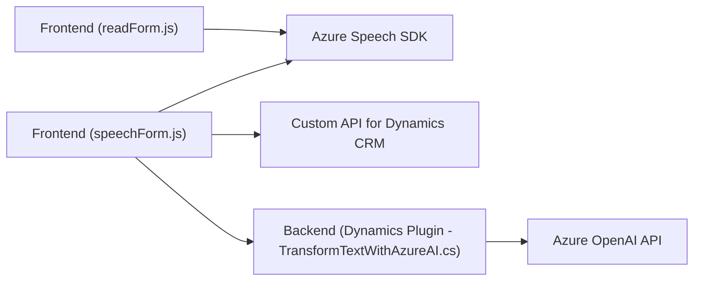

### Breve Resumen Técnico
El proyecto es una solución basada principalmente en Microsoft Dynamics CRM, que implementa varios módulos y servicios para mejorar la interacción entre usuarios y formularios mediante el procesamiento de voz e inteligencia artificial. Utiliza el **Azure Speech SDK** para reconocimiento y síntesis de voz y el **Azure OpenAI API** para la transformación y generación de datos en formato estructurado (JSON).

---

### Descripción de la Arquitectura
La solución parece ser una arquitectura **multicapa** orientada a servicios. Está dividida en tres capas principales:
1. **Frontend**: Implementa lógica para funcionalidad de voz en la interfaz de usuario de los formularios de Dynamics 365 (archivos `readForm.js` y `speechForm.js`).
   - Se apoya en componentes como el Azure Speech SDK para el procesamiento de voz y captura de audio.
   - Utiliza callbacks y funciones específicas para manipular dinámicamente el contenido de formularios.

2. **Backend / Plugins**: Extiende la funcionalidad de Dynamics 365 mediante un plugin específico (`TransformTextWithAzureAI.cs`).
   - Este plugin comunica datos y lógica del CRM con servicios externos de transformación de texto (Azure OpenAI), lo que significa una integración que amplía las capacidades nativas del CRM.

3. **APIs Externas y Servicios de IA**: Integra servicios REST externos, como:
   - **Azure Speech SDK** para el procesamiento de voz.
   - **Azure OpenAI** para la interpretación semántica y transformación de datos.

El diseño integra patrones de **modularización funcional**, donde cada unidad (módulo, función, o plugin) tiene una clara responsabilidad. Además, sigue un enfoque **orientado a eventos** mediante el uso de callbacks y disparadores propios de Dynamics CRM.

---

### Tecnologías Usadas
1. **Frontend**:
   - **JavaScript**: Para implementar la lógica de interacción y eventos en la interfaz.
   - **Azure Speech SDK**: Para síntesis y reconocimiento de voz.
   - Frameworks o bibliotecas no especificadas, pero posiblemente Dynamically Loaded Scripts (sin un paquete definido).

2. **Backend (CRM Plugins)**:
   - **C# y .NET Framework** (herencia del namespace `Microsoft.Xrm.Sdk`).
   - **Azure OpenAI API/GPT Models**: Para transformación inteligente de texto.
   - **Newtonsoft.Json**: Para manejar datos JSON.

3. **Infrastructure**:
   - **Dynamics CRM SDK**: Herramientas de desarrollo para Microsoft Dynamics 365.
   - **CDN Loading**: Usado para cargar dinámicamente Azure Speech SDK.

---

### Diagrama Mermaid 100% Compatible con GitHub Markdown

---

### Conclusión Final
Este repositorio implementa una **multicapa orientada a servicios**, con integración en **Microsoft Dynamics CRM** mediante plugins y servicios externos. Su frontend se enfoca en mejorar la experiencia del usuario con voz, capaz de leer y reconocer comandos en formularios. El backend detalla un plugin que transforma datos en el CRM utilizando inteligencia artificial. Además, se observa una dependencia principal hacia los servicios en la nube de Microsoft Azure.

Si bien el proyecto muestra una arquitectura organizada y modular, se sugiere mejorar la seguridad de las credenciales y endpoints. Finalmente, el diseño es escalable y puede adaptarse para ampliar funcionalidades relacionadas con la automatización o integraciones adicionales.