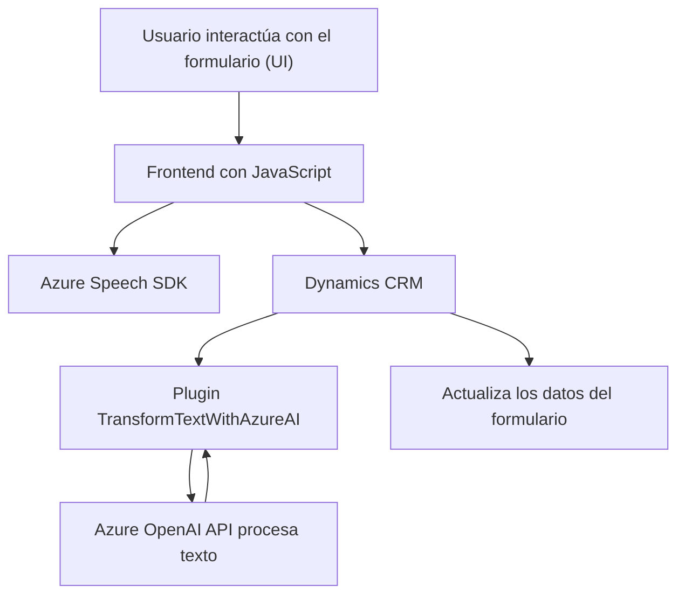

### Breve resumen técnico
Este repositorio presenta una solución de integración entre una frontend implementada en JavaScript y una backend extendida mediante plugins en Dynamics CRM, que se conecta con servicios de Azure (Speech SDK y OpenAI API) para mejorar la interacción con usuarios mediante reconocimiento de voz y transformación de texto en datos estructurados.

---

### Descripción de arquitectura
La solución utiliza una arquitectura **n-capas** mezclada con integración de servicios externos:
- Una **frontend en JavaScript** interactúa con Dynamics CRM para leer, actualizar o completar ciertos campos en los formularios usando el reconocimiento de voz (Azure Speech SDK).
- La **backend** (en C#) incluye un plugin empleado para extender Dynamics CRM con procesamiento avanzado de texto, comunicándose con un servicio de IA (Azure OpenAI) responsable de transformar texto en JSON estructurado.

### Tecnologías usadas
1. **Frontend:**
   - **JavaScript:** Desarrollo de las interacciones con el usuario y SDKs.
   - **Azure Speech SDK:** Reconocimiento y síntesis de voz para mejorar la accesibilidad.
   - **Dynamics 365 Context:** Uso de `executionContext` para leer y escribir datos en formularios.

2. **Backend:**
   - **C#:** Implementación de plugins en Dynamics CRM mediante la interfaz `IPlugin`.
   - **Microsoft.Xrm.Sdk:** Extensión del ecosistema Dynamics CRM.
   - **Azure OpenAI API:** Comunicación HTTP con modelos de IA.

3. **Patrones:**
   - Modularidad: Las funciones y clases tienen una separación clara de responsabilidades.
   - Event-driven: Dependencia de eventos, como voz o ejecución de plugins en el contexto de Dynamics CRM.
   - External Integration: Acceso a servicios externos (Azure Speech y OpenAI).

---

### Diagrama Mermaid válido para GitHub

---

### Conclusión final
Esta solución se posiciona como una integración moderna que combina tecnologías de Azure (Speech SDK y OpenAI), Dynamics CRM y una interfaz interactiva construida en JavaScript. Su arquitectura n-capas garantiza una separación entre lógica de presentación (frontend), lógica de negocio (plugins y CRM) y servicios externos (Azure Speech y OpenAI). Además:
- **Puntos fuertes:** Modularidad, uso de servicios modernos en la nube, y accesibilidad habilitada mediante voz e IA.
- **Mejoras sugeridas:** 
   1. Considerar la externalización o cifrado seguro de las claves de las API en el backend.
   2. Aprovechar tecnologías como Azure Function o un middleware en lugar de plugins para potenciar la interoperabilidad y simplificar el mantenimiento del sistema.

El diseño cumple con los principios de escalabilidad y extensibilidad adecuadas para entornos empresariales.