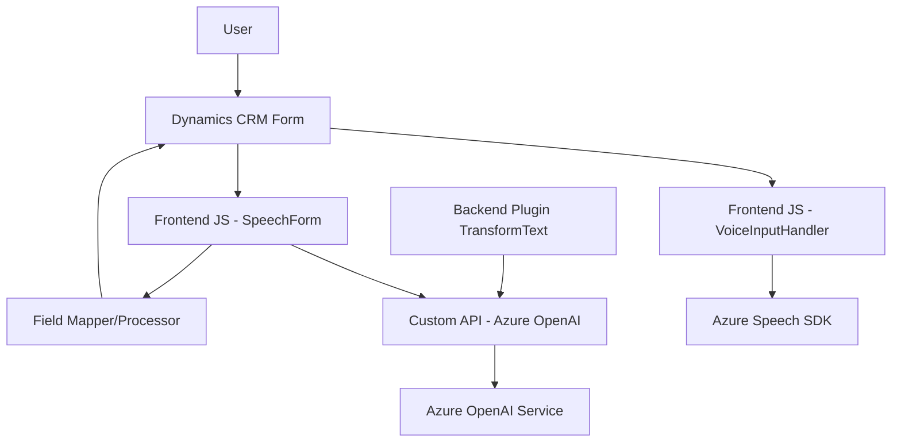

### Breve resumen técnico
Este repositorio implementa una solución basada en la integración de tecnologías de **Azure Speech SDK**, **Azure OpenAI** y **Dynamics 365 CRM**. Está orientada a la interacción mediante voz, procesamiento de transcripciones en tiempo real, y transformación de texto para su uso en contextos dinámicos. La solución tiene múltiples componentes (librerías JavaScript y plugins en C#) que trabajan en conjunto, ofreciendo funcionalidad avanzada.

---

### Descripción de arquitectura
La arquitectura es basada en "Cliente-Servidor" con una lógica distribuida:
1. **Frontend (JavaScript)**: Manejo de voz mediante el **Azure Speech SDK**, donde cada interacción se vincula al formulario de Dynamics 365 en el navegador.
2. **Backend (Plugins en C#)**: Ejecutados en Dynamics 365 CRM, encargados de transformar texto y realizar tareas de procesamiento vía **Azure OpenAI**.

La interacción entre los componentes sigue el patrón de **Servicios externos**:
- Los archivos JavaScript cargan dinámicamente las dependencias externas del **Azure Speech SDK** para el reconocimiento de voz.
- Los plugins en C# conectan a Azure OpenAI para realizar procesamiento avanzado de datos.

---

### Tecnologías usadas
1. **Frontend**:
   - **JavaScript**: Desarrollo basado en ES6+.
   - **Azure Speech SDK**: Integración para reconocimiento y síntesis de voz.
   - **Framework de Dynamics 365**: Manipulación de datos del formulario.
   
2. **Backend**:
   - **C# (Plugins)**: Implementación de lógica dentro de Dynamics CRM.
   - **Azure OpenAI**: Realiza análisis semántico y transformación avanzada de texto.
   - **Microsoft.Xrm.Sdk**: Manejo del contexto de Dynamics CRM.
   - **System.Net.Http**: Realización de API calls a OpenAI en Azure.

---

### Patrones usados
1. **Estructura orientada a servicios**:
   - Carga dinámica del Azure Speech SDK y consumo de servicios OpenAI.
2. **Transformación desacoplada**:
   - El texto se transforma fuera de Dynamics mediante Azure OpenAI, siguiendo el principio de "Single Responsibility".
3. **Integración de SDKs**:
   - Uso dinámico de SDKs externos para extender las capacidades del sistema.
4. **Plugin pattern**:
   - Plugin para extender funcionalidades específicas dentro del contexto de Dynamics CRM.

---

### Diagrama Mermaid

A continuación, se presenta el diagrama que explica las interacciones y dependencias entre componentes:

---

### Conclusión Final
El repositorio está diseñado para ofrecer capacidades avanzadas de interacción por voz y procesamiento semántico de texto en **Dynamics 365 CRM**. Combina tecnologías modernas como **Azure Speech SDK** y **Azure OpenAI**, cada una integrada de manera modular. La arquitectura sigue el patrón **Cliente-Servidor distribuido**, lo que le da flexibilidad y escalabilidad. Sin embargo, habría que considerar la mejora en la gestión de seguridad mediante externalización de claves y configuración sensible.