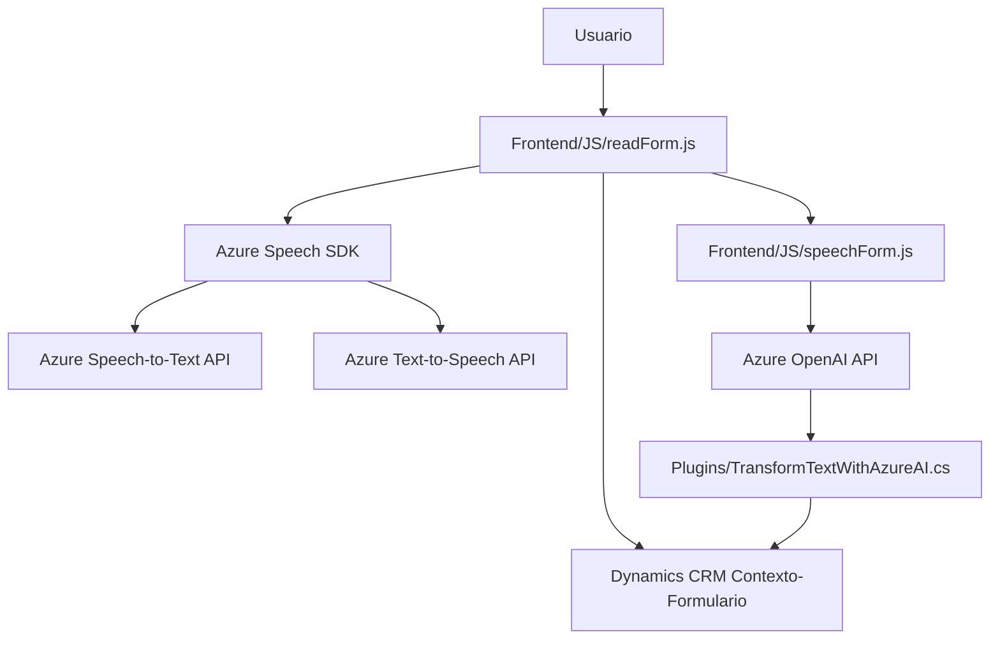

### Breve resumen técnico

El repositorio describe la implementación de un sistema integrado en un contexto de Dynamics 365 CRM. La solución permite a los usuarios interactuar con formularios mediante voz, traduciendo datos hablados a texto legible que se conecta a campos específicos del formulario en CRM. También emplea inteligencia artificial mediante el servicio Azure OpenAI para enriquecer los datos y ofrecer formatos estructurados. Además, utiliza plugins personalizados en Dynamics CRM para integrar la funcionalidad de procesamiento de texto, conectándose con servicios externos como Azure Speech SDK y Azure OpenAI.

---

### Descripción de arquitectura

La solución tiene una arquitectura **modular y orientada a servicios**, con los siguientes componentes:
1. **Frontend (FRONTEND/JS)**: Consiste en archivos de JavaScript para capturar inputs de voz, leer formularios y manejar interacciones. Emplea integraciones directas con servicios externos (Azure APIs), por lo que actúa como una capa de presentación para la funcionalidad.
   - Seguimiento de patrones de modularidad con funciones especializadas.
   - Uso del SDK de Azure Speech para conversión de voz-texto/texto-voz con carga dinámica.
   - Integración con APIs externas (Azure OpenAI y plugins Dynamics).

2. **Backend - Plugin (Plugins)**: Un plugin de Dynamics CRM basado en C#. Ejecuta reglas de negocio específicas para transformar datos mediante servicios avanzados de inteligencia artificial como Azure OpenAI.
   - Implementación del patrón Plugin para extender funcionalidades en Dynamics Framework.
   - Realiza operaciones tipo RESTful con APIs de Azure OpenAI.
   - Procesamiento de texto con reglas predefinidas y generación de un JSON estructurado.
   - Utiliza principios SRP (Single Responsibility Principle) para separar lógica de recuperación y procesamiento.

La arquitectura completa puede clasificarse como **n-capas**, estructurada principalmente en tres niveles distintos:
1. **Capa de presentación (Frontend)**: Responsable de interacción con el usuario, captura de voz, y actualización de formularios. Es autónoma, con servicios específicos gestionados por Azure SDK y navegación dinámica basada en contextos del CRM.
2. **Capa lógica de negocio (Plugin en C#)**: Encapsula toda la lógica de transformación y aplica reglas específicas de negocio. Se ejecuta dentro de Dynamics 365 como un evento específico.
3. **Capa de datos/servicio externo (Azure APIs y Dynamics CRM)**: Proporciona mecanismos para almacenamiento y procesamiento de datos con modelado avanzado mediante IA.

---

### Tecnologías usadas

1. **Frontend**: 
   - Lenguaje: JavaScript.
   - Framework: Dynamics CRM APIs (contexto de formularios), Azure Speech SDK (SDK de servicios de voz y reconocimiento por Azure).

2. **Backend plugin en Dynamics CRM**:
   - Lenguaje: C#.
   - Frameworks: .NET Framework (posiblemente estándar Dynamics CRM SDK), Azure SDK para interacción con OpenAI.
   - Librerías: Newtonsoft.Json (manipulación JSON), System.Text.Json (serialización).

3. **API externas y recursos cloud**:
   - **Azure Speech SDK**: Para funcionalidades de síntesis de voz (TTS) y reconocimiento de voz (STT).
   - **Azure OpenAI**: Para procesamiento de lenguaje natural y enriquecimiento de datos.

Patrones principales observados:
1. Modularización.
2. Responsabilidad única.
3. Delegate Pattern.
4. RESTful Communication (para interacción con Azure APIs).
5. Plugin Pattern (Dynamics CRM).

---

### Diagrama Mermaid válido para GitHub

---

### Conclusión final

La solución está diseñada para integrar el procesamiento de voz y datos en una plataforma de interacción ubicua, como Dynamics CRM. Mediante tecnologías avanzadas de Microsoft (Speech SDK, RESTful APIs y OpenAI), proporciona una experiencia interactiva que aprovecha sistemas externos escalables de IA y servicios en la nube. La arquitectura modular facilita su mantenimiento, escalabilidad, y mejora incremental en los distintos archivos que forman parte del repositorio.

Sin embargo, ciertas áreas pueden ser optimizadas, como la seguridad (protección de claves de acceso) y el manejo de excepciones en plugins críticos. En general, el repositorio es una solución destacada como un ejemplo de integración entre servicios de voz, inteligencia artificial y CRM.