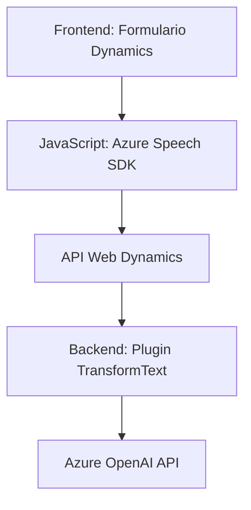

### Breve Resumen Técnico

La solución presenta una combinación de componentes orientados a la integración de voz, reconocimiento de texto, y procesamiento semántico en formularios Dynamics 365. Utiliza el Azure Speech SDK y el Azure OpenAI API para interactuar con servicios externos que ofrecen funcionalidades avanzadas como síntesis de voz, reconocimiento de voz y transformación de texto, desplegados principalmente mediante una arquitectura basada en eventos y desacoplada.

### Descripción de Arquitectura

La arquitectura utiliza un diseño orientado a servicios que combina:
- Componentes frontend para interacción dinámica con formularios (JavaScript).
- Plugins backend (C#) integrados en Dynamics CRM, que extienden funcionalidades mediante Azure OpenAI.
  
Se aplica una estructura **n-capas**, donde:
1. **Frontend (JavaScript)**: Captura y procesa datos. Interactúa con APIs externas (Azure Speech SDK & Web API de Dynamics).
2. **Backend (Plugins C#)**: Procesa peticiones desde Dynamics 365 hacia Azure OpenAI para transformación avanzada de texto.

Se observa además principios de diseño como:
- Carga dinámica de dependencias (Speech SDK).
- Modularización y desacoplamiento para facilitar integraciones (IA para formularios).

### Tecnologías Usadas

1. **Azure Speech SDK**: 
   - Synthesis de voz y reconocimiento de texto en formularios.
2. **Azure OpenAI Service**: 
   - Transformación semántica de texto mediante IA.
3. **Dynamics CRM**: 
   - Integración del Web API (`Xrm.WebApi`) y SDK (`Plugin`), para vinculación con entidades CRM.
4. **JavaScript**: 
   - Interactividad frontend y manipulación de DOM.
5. **C#**: 
   - Lógica backend bajo el patrón `IPlugin` (extensión CRM).

### Dependencias y Componentes Externos

- **Azure SDKs**: 
  - Azure Speech SDK para reconocimiento y síntesis.
  - Azure OpenAI API para procesamiento de texto.
- **Dynamics 365 SDK**:
  - Permite la interacción con entidades y servicios del CRM.
- **Web API**:
  - Manejo dinámico de formularios mediante llamadas RESTful.

### Diagrama Mermaid

El siguiente diagrama ofrece una representación visual simplificada de las interacciones de estos componentes.

### Conclusión Final

Esta solución representa una integración avanzada en el ecosistema de Microsoft Dynamics 365, complementada por servicios externos de Azure. La arquitectura modular y basada en eventos garantiza la extensibilidad y mantiene una separación clara entre las responsabilidades de manejo de datos, procesamiento semántico y síntesis de voz.

La elección de tecnologías como Azure Speech SDK, OpenAI y Dynamics CRM refleja un enfoque actual y moderno, ideal para sistemas empresariales que buscan incorporar mejoras en accesibilidad y automatización utilizando IA.