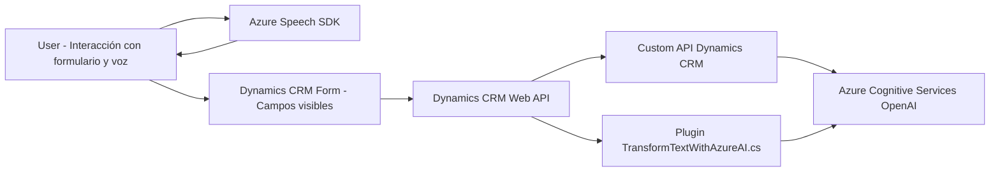

# Análisis técnico del repositorio

Basándome en los archivos proporcionados, realicé un análisis exhaustivo para evaluar la naturaleza de la solución y su arquitectura, además de identificar patrones utilizados, dependencias y características.

---

### **1. Tipo de solución**
#### **Clasificación:**
Esta solución combina múltiples componentes que interactúan para realizar operaciones específicas:
- **Archivos FRONTEND:** Orientados a la manipulación de formularios en Dynamics 365 y al uso de entrada/salida de voz, con integración directa al **Azure Speech SDK**.
- **Archivo PLUGIN:** Representa un **plugin** para Dynamics CRM orientado a transformar texto con inteligencia artificial mediante Azure OpenAI.

#### **Tipo de solución global:**
1. **Principalmente orientada a integración de servicios:**
   - Una solución híbrida entre frontend, API (Dynamics CRM Web API) y un plugin backend (C# para Dynamics CRM).
2. **Aplicación CRM extendida:**
   - Diseñada para ampliar las capacidades de Microsoft Dynamics CRM, integrando funcionalidades avanzadas como entrada de voz y procesamiento con inteligencia artificial.

---

### **2. Tecnologías, frameworks y patrones utilizados**
#### **Tecnologías utilizadas**:
- **Frontend:**
  1. SDK de **Azure Cognitive Speech Services.**
  2. **JavaScript DOM API:** Procesamiento de campos visibles en formularios.
  3. Integración con la **Dynamics 365 CRM API**.

- **Backend:**
  1. **Microsoft.Xrm.Sdk:** Herramienta principal para interactuar con entidades y servicios de Dynamics CRM.
  2. Plugin creado con **C#**.
  3. **Azure OpenAI API:** Procesamiento de texto mediante modelos GPT.

#### **Patrones de arquitectura aplicados**:
1. **Arquitectura modular:**
   - Separación clara de responsabilidades por funciones en el frontend para manipulación de datos, entrada de voz y APIs externas.
   - Plugins bien organizados con métodos independientes y específicos para control de flujo en Dynamics CRM.
2. **Event-driven architecture en frontend:**
   - Los archivos `readForm.js` y `speechForm.js` utilizan eventos y callbacks (e.g., `ensureSpeechSDKLoaded`) para manejar condiciones de carga dinámica y asincrónica.
3. **Facade pattern (Backend):**
   - El método `GetOpenAIResponse` encapsula la complejidad de la integración con Azure OpenAI.

---

### **3. Tipo de arquitectura utilizada**
#### **Descripción:**
La combinación de los archivos revela una solución con características orientadas a la arquitectura **en capas** pero con integración de servicios basados en **eventos**.

#### **Arquitectura:**
1. **Frontend:** 
   - Sigue una lógica **orientada a n capas**, donde cada función tiene independencia clara:
     a. Capa de adquisición de datos (lectura del formulario).
     b. Capa de integración con el SDK de Azure Speech.
     c. Capa de comunicación con APIs.

2. **Backend:** 
   - Los plugins en C# implementan una arquitectura **Plugin-Based**, inherente al modelo de Dynamics CRM, con orquestación externa de servicios (Azure OpenAI).

3. **Solución global:**
   - **Modelo híbrido orientado a servicios.**
   - Comunicación entre frontend, APIs externas y CRM backend para extender la funcionalidad del sistema original.

---

### **4. Componentes externos presentes**
#### **Dependencias principales:**
1. **Azure Speech SDK:** Integración desde frontend para síntesis y transcripción de voz.
2. **Dynamics CRM Web API:** Modificación y mapeo de campos de entidades.
3. **Azure OpenAI (GPT-4):** En backend, para transformaciones avanzadas de texto interactuando con CRM.
4. **Microsoft.Xrm.Sdk:** Biblioteca estándar para plugins en Dynamics CRM, incluyendo acciones CRUD.

#### **Componentes posibles:**
1. CDN de Azure Cognitive Services Speech SDK (`https://aka.ms/csspeech/jsbrowserpackageraw`).
2. Formulario en Dynamics CRM basado en **Xrm.Page API**.
3. **Servicio de traducción de texto:** vinculado mediante `callCustomApi`, probablemente otro endpoint interno o externo del Dynamics CRM.

---

### **5. Diagrama Mermaid**

---

### **Conclusión final**
Este repositorio parece ser parte de una aplicación extendida de **Microsoft Dynamics CRM**, diseñada para interactuar con usuarios mediante entrada de voz, generar texto estructurado con inteligencia artificial (Azure OpenAI) y manejar datos de formularios. La solución emplea las mejores prácticas como modularidad, división clara de responsabilidades, arquitectura basada en servicios, y una integración eficiente entre frontend y backend.

Aunque actualmente tiene un enfoque claro en lógica CRM, puede expandirse para soportar características más genéricas de procesamiento de datos en otros escenarios empresariales. Además, el uso conjunto de servicios de Azure demuestra la intención de aprovechar tecnologías en la nube para extender capacidades.