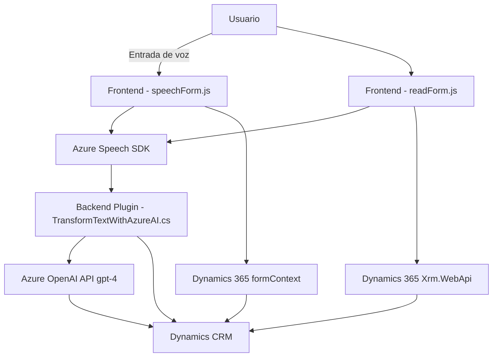

### Breve resumen técnico
El repositorio parece ser parte de una solución integrada entre Dynamics 365 y Azure, diseñada para habilitar entradas por voz y procesamiento inteligente de datos de formularios mediante tecnología de reconocimiento de voz e inteligencia artificial. Hay múltiples archivos que colaboran en diferentes niveles: desde el frontend (JavaScript) que interactúa con formularios y el SDK, hasta backend/plug-ins que invocan servicios externos de Azure OpenAI API.

---

### Descripción de la arquitectura
La arquitectura empleada en este repositorio puede clasificarse como una **arquitectura en n capas**, donde las responsabilidades están distribuidas entre:
1. **Capa de presentación (frontend):** Se encuentran los archivos `readForm.js` y `speechForm.js`, que manejan la interacción con el usuario y la manipulación del DOM en los formularios de Dynamics 365 y Azure Speech SDK (reconocimiento y síntesis de voz).
2. **Capa de aplicación (backend/plugin):** El plugin `TransformTextWithAzureAI.cs` implementa la lógica para enviar solicitudes a OpenAI y transforma el texto reconocido en estructuras JSON para usar en la capa de modelo de Dynamics CRM.

La solución se encuentra dividida entre un **frontend altamente interactivo** que utiliza SDKs dinámicos, y un backend basado en una integración modular (plug-ins) que extiende funcionalidades de Dynamics 365.

### Tecnologías usadas
1. **Frontend:**
   - JavaScript.
   - Azure Speech SDK.
   - Manipulación de formularios en Dynamics 365 (`formContext`, `Xrm.WebApi`).

2. **Backend/plugins:**
   - C# con la interfaz `IPlugin` de Dynamics CRM.
   - Azure OpenAI (Api Key, HTTP requests).
   - JSON parsing via `Newtonsoft.Json` y `System.Text.Json`.

3. **Servicios externos:**
   - **Azure Speech SDK:** Para reconocimiento y síntesis de voz.
   - **Azure OpenAI API (GPT-4):** Para la transformación de texto mediante modelos avanzados de inteligencia artificial.

### Dependencias o componentes externos presentes
1. **Azure Speech SDK:** Herramienta para la síntesis y reconocimiento de voz.
2. **Azure OpenAI API:** Extensión para procesar texto con IA y obtener salidas estructuradas.
3. **Dynamics CRM SDK interfaces:** Para trabajar con la API de Dynamics 365, la manipulación de entidades y la ejecución de plug-ins.
4. **Librerías de procesamiento JSON:** Como `Newtonsoft.Json.Linq`.
5. **System.Net.Http:** Para realizar llamadas REST a servicios web externos.

---

### Diagrama Mermaid válido para GitHub

---

### Conclusión final
La solución es un ejemplo de integración avanzada entre tecnologías Microsoft (Dynamics, Azure) y servicios externos basados en inteligencia artificial (Azure OpenAI). Utiliza una arquitectura de **n capas**, con una separación bien definida entre la capa frontend para interacción del usuario, la capa backend/plugin para la transformación de texto con IA y la capa de servicios externos como Azure Speech y OpenAI. Este diseño favorece la flexibilidad, escalabilidad y extensibilidad del sistema, mientras aprovecha las ventajas de las herramientas cloud como Azure.