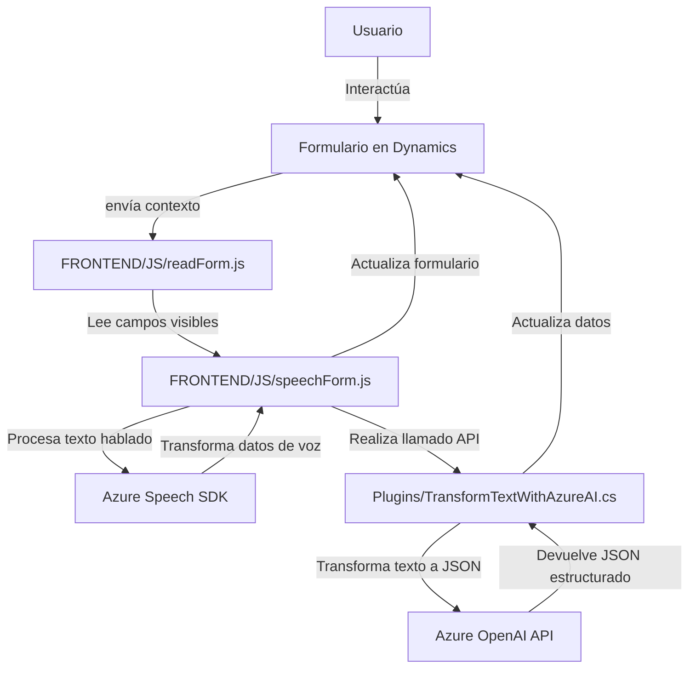

# Breve resumen técnico
El repositorio contiene tres archivos orientados principalmente a la interacción con formularios, lectura de datos y entrada por voz, además de un plugin para transformar texto mediante IA. La solución parece estar diseñada para integrarse con aplicaciones empresariales basadas en Microsoft Dynamics 365 usando Azure Cognitive Services y Azure OpenAI API.

# Descripción de arquitectura
Este repositorio utiliza una arquitectura híbrida:
1. **Frontend (JavaScript)**: Implementación basada en una arquitectura MVC para manejar interacción entre usuario y servicios.
2. **Dynamics CRM Plugin (.NET)**: Aplicación basada en el paradigma de **plugin** que se ejecuta como extensibilidad en Dynamics CRM aprovechando la potencia de Azure OpenAI y otros servicios relacionados.
3. **Integración con servicios externos**: Uso de API externas (Azure Speech SDK y Azure OpenAI).

# Tecnologías usadas
1. **Frontend**
   - **JavaScript**: Funciones específicas para transcripción de voz y síntesis de contenido.
   - **Azure Cognitive Services - Speech SDK**: API para síntesis y reconocimiento de voz.
   - **Dynamics 365 APIs**: Interfaces para consulta y actualización de datos en formularios.
   - **JSON**: Manejo de datos estructurados entre componentes.

2. **Backend (.NET Plugin)**:
   - **C#**: Lenguaje central para la lógica del plugin.
   - **Azure OpenAI Service**: Para procesamiento de datos basados en modelos IA.
   - **ASP.NET**: Framework para integrar las herramientas CRM con el servicio externo.
   - **Microsoft Dynamics SDK**: Interacción directa con CRM y gestión de datos.

# Dependencias o componentes externos
1. **Azure Speech SDK y OpenAI API**: Para síntesis de voz y transformación de texto con modelos IA.
2. **Microsoft Dynamics SDK**: Estándar para interacciones restringidas con CRM.
3. **HTTP Request Libraries**: Para consumir servicios externos mediante REST API.
4. **JSON Parsers**: Manejo y manipulación de datos JSON (Newtonsoft y System.Text.Json).

# Diagrama Mermaid válido para GitHub Markdown

# Conclusión final
Este repositorio es implementado como una solución híbrida para formularios dinámicos basados en Microsoft Dynamics 365 que combina accesibilidad (sintetización y transcripción de voz) y procesamiento avanzado de datos con IA. La arquitectura modular facilita que diferentes componentes (frontend, CRM plugin, y APIs externas) trabajen en conjunto. Pese a ser funcional, sería ideal reforzar aspectos de seguridad, como la gestión de claves fuera del código o implementar cifrado de datos sensibles antes de transmitirlos.