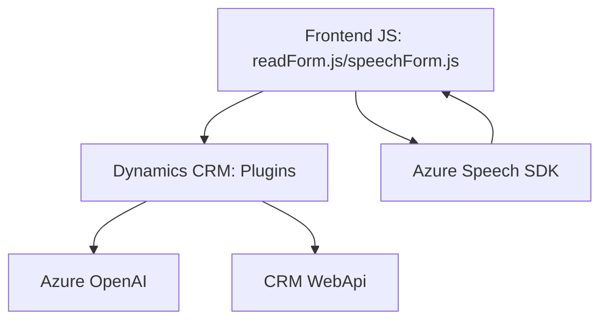

### Resumen técnico:
Este repositorio implementa una solución completa que integra procesamiento de voz, transcripción y conversión de texto empleando servicios de Azure, específicamente **Azure Speech SDK** y **Azure OpenAI**. La funcionalidad está orientada a extender Microsoft Dynamics CRM con capacidades avanzadas de entrada por voz y transformación inteligente de texto.

---

### Descripción de arquitectura:
La arquitectura del sistema se basa en una combinación de **n capas** y **orientación a servicios**:
1. La capa frontend proporciona la interfaz interactiva en el navegador, integrando **JavaScript** y dinámicamente Azure Speech SDK para entrada y síntesis de voz.
2. La capa backend, desplegada como **plugins en Dynamics CRM**, implementa lógica empresarial y conexión con **Azure OpenAI** para procesamiento avanzado.
3. Existen interacciones directas entre el frontend y Dynamics CRM, además de conexiones hacia APIs externas (Azure Speech y OpenAI), siguiendo un patrón **Service-Oriented Architecture (SOA)**.

---

### Tecnologías usadas:
1. **JavaScript** – Implementa funciones frontend encapsuladas para procesamiento de voz, mapeo de datos y comunicación con CRM.
2. **Azure Speech SDK** – Permite entrada de voz transcrita y síntesis de texto a audio.
3. **Dynamics CRM SDK** – Utilizado en el plugin backend para interacción y lógica de negocio en CRM.
4. **Azure OpenAI** – Modelo de IA para transformar texto en JSON estructurado.
5. **HTTP Communication** – El backend hace llamadas HTTP estructuradas a Azure OpenAI.
6. **JSON Manipulation** – Usando `Newtonsoft.Json` y `System.Text.Json` para parseo y serialización.

---

### Patrones identificados:
1. **N capas** – División clara entre frontend y backend.
2. **SOA (Service-Oriented Architecture)** – Uso extensivo de servicios externos, como Azure Speech y OpenAI.
3. **Modularización** – Código está segmentado en funciones específicas escalables.
4. **Plugin-Based Architecture** – El backend usa plugins para integrarse con Dynamics CRM.
5. **Cargador dinámico de dependencias** – SDKs como Azure Speech se cargan dinámicamente para optimizar rendimiento.
6. **Adaptador** – Traduce datos de formularios en uno o varios formatos.

---

### Dependencias externas:
1. **Azure Speech SDK** para entrada/salida de voz.
2. **Azure OpenAI** para procesamiento textual basado en IA.
3. **Dynamics CRM APIs** como `WebApi` y servicios de entidade.
4. **HTTP Libraries** en el backend .NET para comunicarse con APIs externas.

---

### Diagrama **Mermaid** 100% compatible con **GitHub Markdown**:

---

### Conclusión final:
Esta solución utiliza una arquitectura híbrida de **n capas** combinada con **orientación a servicios**, siendo ideal para sistemas extensibles que interactúan con APIs externas especializadas. El uso de plugins en Dynamics CRM permite integrar capacidades avanzadas de procesamiento de voz y transformación textual, potenciando las interfaces dinámicas. Las decisiones técnicas garantizan modularidad y escalabilidad, adecuándose a sistemas con interacción SaaS como Azure.