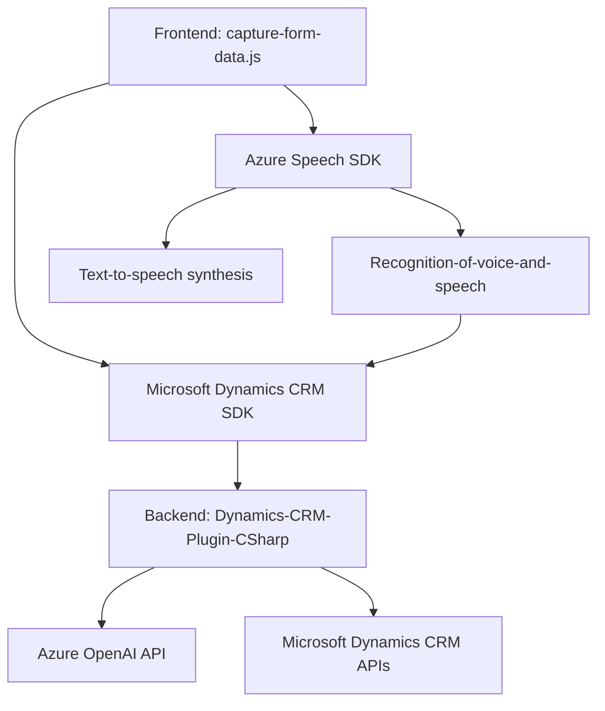

## Análisis y explicación técnica

### **Breve resumen técnico**
El repositorio descrito parece estar relacionado con una **aplicación empresarial basada en formularios** para Dynamics CRM, que integra **Azure Cognitive Services** y **Azure OpenAI** para proporcionar funcionalidades avanzadas de reconocimiento de voz, síntesis de voz y análisis de texto estructurado. La arquitectura emplea una combinación de frontend en JavaScript y plugins backend en C#, con foco en integraciones externas.

---

### **Descripción de la arquitectura**
1. **Tipo de solución**: La solución es una **aplicación híbrida corporativa** que combina lógica de frontend (integrada en formularios) y backend (mediante plugins de Dynamics CRM). Incluye las siguientes características:
   - **Frontend**: Funciones relacionadas con captura de entrada de voz, transcripción y síntesis mediante Azure Speech SDK.
   - **Backend**: Procesamiento avanzado de texto con OpenAI utilizando plugins de Dynamics CRM (C#).

2. **Nivel de abstracción arquitectónico**:
   - **Frontend**: JavaScript interactúa directamente con formularios del sistema Microsoft Dynamics CRM, implementando un modelo basado en componentes modulares.
   - **Backend**: Plugins C# son utilizados para extender las funcionalidades del sistema CRM, proporcionando transformación de texto mediante un servicio externo (Azure OpenAI).
   - Forma general: Un diseño **multicapa** con integración directa a APIs externas. Utiliza elementos de **arquitectura orientada a eventos** para manejar flujos asincrónicos en frontend.

3. **Patrones de diseño utilizados**:
   - **Event-driven architecture**:
      - El frontend espera hasta que se cargue el SDK (Azure Speech) para iniciar funcionalidad basada en eventos.
   - **Separación de preocupaciones**:
      - Las capas están diferenciadas entre frontend (captura de voz, actualización de formulario) y backend (procesamiento de texto mediante OpenAI).
   - **Plugin-based architecture**:
      - Utiliza plugins estándar en Dynamics CRM para acoplar lógica personalizada con servicios externos.
   - **Desacoplamiento mediante APIs externas**:
      - Azure Cognitive Services y OpenAI son integrados de una manera modular.

4. **Tipo de arquitectura**:
   - La solución sigue una **estructura multicapa**:
      - **Frontend (Navegador/Formularios)**: Lógica de presentación y captura de datos de usuarios.
      - **Backend (Dynamics CRM)**: Ranuras de integración mediante plugins (C#, HTTP APIs).
   - **Orientación hacia microservicios externos**:
      - Los SDK de Azure Speech y endpoints de Microsoft OpenAI actúan como servicios especializados conectados a la arquitectura general.

---

### **Tecnologías utilizadas**
1. **Frontend**:
   - **JavaScript**:
      - Interacción con DOM y captura de datos visibles en formularios.
      - Carga dinámica de Azure Speech SDK para reconocimiento y síntesis de voz.
   - **Azure Speech SDK**:
      - Reconocimiento de voz (captura/transcripción).
      - Síntesis de voz (lectura de textos del formulario).
   - **Microsoft Dynamics CRM SDK**:
      - Interacción basada en formularios para captura y actualización de datos.

2. **Backend**:
   - **C#**:
      - Implementación de plugins mediante la interfaz estándar de Dynamics CRM (`IPlugin`).
   - **Azure OpenAI**:
      - Creación de texto estructurado basado en un servicio externo AI.
   - **Newtonsoft.Json**:
      - Procesamiento y manipulación de JSON.
   - **System.Net.Http**:
      - Comunicación entre el plugin y el endpoint REST de Azure OpenAI.

---

### **Dependencias o componentes externos**
La solución depende de varias tecnologías internas y externas:
1. **Azure Speech SDK**: Reconocimiento y síntesis de voz.
2. **Azure OpenAI API**: Transformación del texto hablado o editado en estructuras JSON.
3. **Microsoft Dynamics CRM SDK**: Gestión de formularios, datos y lógica empresarial.
4. **Newtonsoft.Json y System.Text.Json**: Serialización y deserialización de datos JSON en el plugin.
5. **System.Net.Http**: Comunicación API REST entre el plugin y Azure OpenAI.

---

### **Diagrama Mermaid**
A continuación, una representación gráfica de la arquitectura definida:

---

### **Conclusión final**
La solución presentada integra *Azure Cognitive Services* y *Microsoft OpenAI* con Dynamics CRM para mejorar procesos empresariales, brindando capacidades avanzadas como reconocimiento de voz, síntesis de voz y procesamiento textual basado en IA. Su arquitectura evidencia el uso de un diseño multicapa (frontend para presentación/interacción y backend mediante lógica acoplada por plugins). Además, se aprovecha de tecnologías modernas y patrones como la *separación de preocupaciones* y *desacoplamiento mediante APIs externas*. Es una implementación robusta que cumple los estándares de aplicaciones empresariales en la nube.