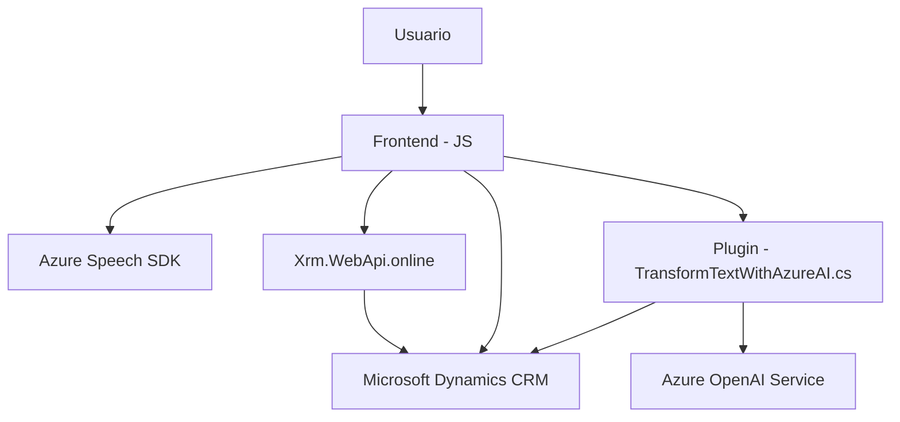

### Resumen Técnico

Este repositorio implementa una combinación de tecnologías para la interacción avanzada con formularios mediante entrada de voz y servicios de inteligencia artificial. Integra múltiples componentes, incluyendo el frontend para manejo de formularios, la entrada y salida de voz mediante el Azure Speech SDK, y un plugin en el backend que aprovecha Azure OpenAI para transformar texto en formato estructurado.

---

### Descripción de Arquitectura

La solución tiene una arquitectura híbrida que combina un frontend basado en JavaScript para la interacción del usuario con Microsoft Dynamics forms y un backend desarrollado en C# como plugins para extender la funcionalidad del sistema CRM. Además, hace uso de servicios cloud externos (Azure Speech y Azure OpenAI API) para la síntesis y reconocimiento del lenguaje natural y procesamiento de texto. Este diseño se asemeja a un modelo **n-capas** o **cliente-servidor**, con un enfoque adicional en **SOA (Service-Oriented Architecture)** ya que se está delegando gran parte de la lógica al procesamiento externo basado en servicios.

### Tecnologías Usadas

1. **Frontend**:
   - **JavaScript**:
     - Manipulación de DOM (por ejemplo, lectura y escritura en formularios).
     - Utilización de eventos para interacción con el usuario (patrón Observer/Event Driven).
     - Promise y funciones asincrónicas (async/await) para operaciones con APIs y SDK.
   - **Azure Speech SDK**:
     - Procesa la entrada y salida de voz (Texto a voz y voz a texto).
   - **Xrm.WebApi.online (Dynamics CRM)**:
     - Integración con APIs internas del sistema CRM para lectura/modificación de formularios y valores.

2. **Backend**:
   - **C#**:
     - Implementación del plugin en Microsoft Dynamics CRM utilizando SDK.
   - **Azure OpenAI Service**:
     - Realiza transformaciones de texto a JSON basado en reglas de negocio predefinidas.
     - HTTP requests con `HttpClient`.
   - **JSON Serialization**:
     - Manejo de datos en formato JSON con bibliotecas como `Newtonsoft.Json.Linq` y `System.Text.Json`.

3. **Arquitectura**:
   - **Modularidad**: Código del frontend dividido en funciones independientes. El backend organiza la lógica de procesamiento en separación clara (Execute y GetOpenAIResponse).
   - **Service-Oriented Approach (SOA)**: Uso de servicios externos (Azure APIs) para tareas especializadas.
   - **n-capas**: Separación entre presentación (frontend) y lógica de negocio (backend/plugin).
   - **CQRS** (en el plugin): Separación entre la consulta de datos y los comandos de procesamiento/lógica.
   - **Callback** y **Event-driven architecture** (Frontend): Mecanismos para cargar SDK y manejar interacciones.

---

### Dependencias y Componentes Externos

- **Azure Speech SDK**:
  - Generación de textos en formato de voz.
  - Reconocimiento de voz y transcripción.
  - Dinámicamente cargado en el frontend.

- **Azure OpenAI Service**:
  - Transformación de entrada de texto en un formato estructurado JSON usando un modelo GPT.

- **Xrm.WebApi.online**:
  - API de Microsoft CRM para gestionar formularios y valores.

- **Microsoft Dynamics CRM SDK**:
  - Extensión de funcionalidades en la plataforma mediante plugins.

- **System Frameworks (C#)**:
  - `System.Net.Http` y `HttpClient`: Para realizar solicitudes API.
  - `Newtonsoft.Json` y `System.Text.Json`: Manejo de datos en formato JSON.

---

### Diagrama Mermaid

Este diagrama representa la interacción de los componentes del repositorio:

---

### Conclusión Final

La solución del repositorio corresponde a una integración avanzada con Microsoft Dynamics CRM combinada con servicios de Azure Speech y Azure OpenAI. Los archivos del frontend (JavaScript) se centran en la interacción de los usuarios con formularios utilizando voz, mientras que el backend (C#) implementa plugins en Dynamics CRM para transformar texto de entrada y almacenarlo como JSON siguiendo reglas predefinidas.

La arquitectura sigue principios de modularidad, separación de capas, uso de patrones asincrónicos y callbacks. Se apoya en una integración SOA mediante APIs externas. Es relevante destacar la dependencia de servicios de Microsoft: Azure Speech SDK y Azure OpenAI, así como Dynamics CRM APIs.

Esta solución destaca por su enfoque pragmático, aunque sería bueno optimizar la seguridad en la gestión de las claves y mejorar algunos aspectos de documentar el código. Ideal en entornos empresariales basados en plataformas CRM como Dynamics.