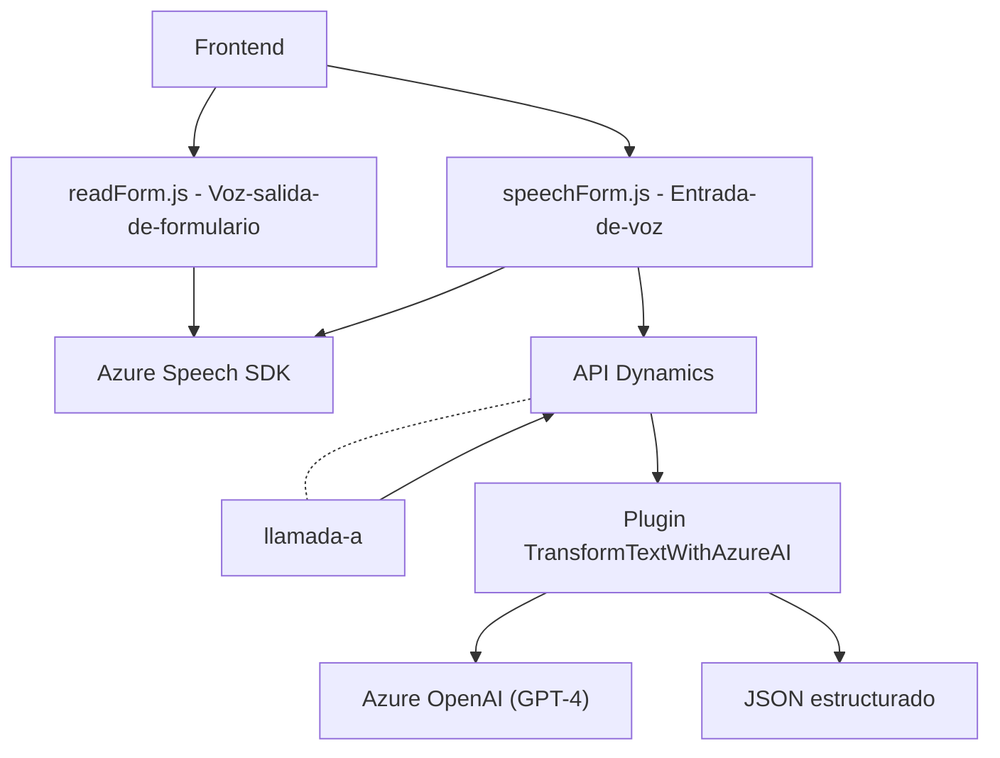

## Breve resumen técnico

El repositorio contiene tres principales archivos utilizados en una solución de software integrada con Microsoft Dynamics CRM y Azure services. El propósito principal es interactuar con formularios dinámicos y ofrecer capacidades de entrada/salida por voz usando Azure Speech SDK y Azure OpenAI GPT-4. Esta solución también incluye un plugin para transformar texto en JSON estructurado, complementando las capacidades de entrada y salida de voz.

---

## Descripción de la arquitectura

La solución expuesta realiza tareas como lectura de formularios mediante síntesis de voz, entrada de transcripción con mapeo dinámico a formularios, y transformación avanzada de texto a JSON con OpenAI GPT-4. La arquitectura general sigue un enfoque modular y cuenta con tres principales capas:

1. **Front-End:** Representada por los archivos `readForm.js` y `speechForm.js`, los cuales interactúan con el usuario para realizar tareas de voz y entrada dinámica.
2. **Integración con servicios:** Consumo de SDK y APIs externas (Azure Speech SDK y OpenAI GPT-4) para procesamiento avanzado.
3. **Plugin Backend (CRM):** El archivo `TransformTextWithAzureAI.cs` implementa una arquitectura orientada a eventos de Dynamics CRM, transformando datos basados en reglas definidas.

La solución utiliza una arquitectura **modular**, apoyada en **n capas** que separan claramente las responsabilidades del frontend, backend CRM, y servicios externos integrados.

---

## Tecnologías usadas

1. **Frameworks y Libs:**
   - **Frontend:**
     - JavaScript ES6.
     - Azure Speech SDK (a través de CDN).
   - **Backend Plugin:**
     - Microsoft Dynamics CRM SDK.
     - Newtonsoft.Json (manejo avanzado de JSON).
     - Azure OpenAI API.
     - System.Net.Http para la gestión de HTTP.

2. **Servicios Externos:**
   - **Azure Speech SDK** para entrada/salida de voz.
   - **Azure OpenAI GPT-4** para procesamiento inteligente de texto.

3. **Patrones y Arquitectura:**
   - **Composición Modular:** Código organizados en funciones independientes y reutilizables.
   - **Fachada de Integración:** Simplifica la interacción con servicios externos (Speech SDK, OpenAI API).
   - **Event-Driven Plugin:** Sigue el patrón de eventos del CRM para su ejecución.
   - **Uso de Factory:** Gestor de servicios en Dynamics CRM (`IOrganizationServiceFactory`).
   - **RESTful Integration:** Llama a las APIs de Azure para servicios específicos de voz e inteligencia artificial.

---

## Diagrama Mermaid

---

## Conclusión final

La solución presentada integra frontend, servicios externos y backend CRM para funcionalidades avanzadas relacionadas con voz y procesamiento de texto, destacando en su modularidad y aprovechamiento de herramientas de Azure. Los archivos analizados muestran una estructura limpia y enfocada en la tarea, favoreciendo la reutilización, la evolución de la solución y la integración con otros componentes del sistema. Esta solución es ideal para sistemas en entornos corporativos que necesiten interacción dinámica con el cliente mediante voz o procesamiento inteligente de datos.