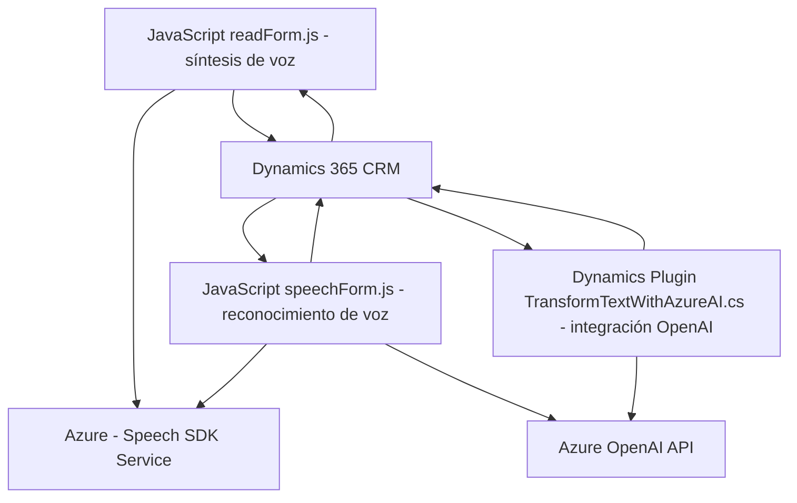

### **Análisis Técnico y Descripción Detallada**

#### **Breve resumen técnico**
El repositorio contiene un proyecto que integra funcionalidades avanzadas de reconocimiento y síntesis de voz mediante el **Azure Speech SDK**, vinculado con el sistema CRM de **Microsoft Dynamics 365**. Las funciones del frontend se encargan de la interacción usuario-sistema, obteniendo entradas y generando respuestas en voz y texto. Un módulo en backend (plugin) se conecta con **Azure OpenAI** para realizar transformaciones avanzadas en datos de texto.

---

#### **Descripción de la arquitectura**
La solución implementa una arquitectura híbrida de **n capas** combinada con componentes de **Service-Oriented Architecture (SOA)**, donde cada capa tiene una responsabilidad claramente definida:
1. **Capa de presentación (Frontend)**: Archivos en JavaScript (e.g., **readForm.js**, **speechForm.js**), implementan lógica de interfaz de usuario para la interacción con el CRM y procesan datos de voz/texto con servicios externos.
2. **Capa de negocio y servicios (Backend)**: Utiliza un plugin de Dynamics CRM (`TransformTextWithAzureAI`) para llamar y consumir servicios de Azure OpenAI y realizar transformaciones en el texto de entrada.
3. **Capa de integración con sistemas externos**: Comunicación directa con APIs externas de Azure (Speech SDK y OpenAI) y la **Dynamics 365 Web API**.

#### **Tecnologías, frameworks y patrones**
1. **Frontend (Javascript)**:
   - **Azure Speech SDK API**: Síntesis y reconocimiento de voz para la interacción usuario-sistema.
   - **Microsoft Dynamics Web API**: API RESTful para operaciones con entidades y datos del formulario.

   **Patrones en frontend**:
   - **Facade Pattern**: Punto único de entrada mediante funciones centralizadas (ej. `startVoiceInput` y `ejecutarGrabacion`).
   - **Modularidad**: Funcionalidades específicas separadas en funciones independientes.
   - **Callback Pattern**: Para cargar dinámicamente las dependencias y ejecutar funciones relacionadas con el SDK.

2. **Backend (C# Plugin)**:
   - **Azure OpenAI API**: Transformación de texto en JSON estructurado con IA.
   - **Dynamics 365 SDK (`IPlugin`)**: Utilizado para la integración y manejo de eventos del CRM.
   - **Async/Await**: Para llamadas asíncronas al servicio externo y manejo de respuestas JSON en tiempo real.
   - **HttpClient**: Comunicación con Azure para realizar solicitudes HTTP a APIs externas.

   **Patrones en backend**:
   - **Plugin Pattern**: Implementación de plugins en Dynamics 365 para responder a eventos del sistema.
   - **SOA**: Uso de servicios externos, donde cada componente implementa una funcionalidad específica (ej. Azure Speech SDK para voz, OpenAI para IA).

---

#### **Dependencias y componentes externos**
1. **SDKs y bibliotecas externas**:
   - **Azure Speech SDK**: Proporciona API para síntesis de voz y reconocimiento.
   - **Azure OpenAI API**: Para transformar texto mediante inteligencia artificial.
   - **Microsoft Dynamics Web API & SDK (`IPlugin`)**: Integración con el sistema de planificación CRM.
   - **Librerías JavaScript para frontend**: Carga del **Speech SDK** desde una URL proporcionada.

2. **Infraestructura externa**:
   - **Azure**: Como plataforma base para los servicios de síntesis de voz y OpenAI.
   - **Dynamics 365 CRM**: Utilizado para la gestión de formularios y datos con entidades del sistema.

3. **Riesgos de seguridad**:
   - Claves de acceso (Azure Speech API y Azure OpenAI API) hardcodeadas en los archivos, lo que permite el acceso no autorizado si el código está en un repositorio público.

---

#### **Diagrama Mermaid**

---

#### **Conclusión final**
Este repositorio constituye una solución para integración avanzada entre voz, texto e inteligencia artificial en un contexto de formularios dinámicos de CRM (Dynamics 365). La arquitectura es de **n capas**, con una fuerte orientación hacia servicios externos (**SOA**) con Azure Speech SDK y Azure OpenAI. Aunque bien estructurado, el código presenta hábitos inseguros como el hardcoding de credenciales sensibles, que se recomienda migrar a configuraciones seguras. El uso de patrones como Facade y modularidad aumenta la mantenibilidad y escalabilidad del sistema. Sin embargo, la gestión de dependencias y posibles fallos en la conexión a servicios externos podría requerir mecanismos más robustos para garantizar la calidad y confiabilidad.