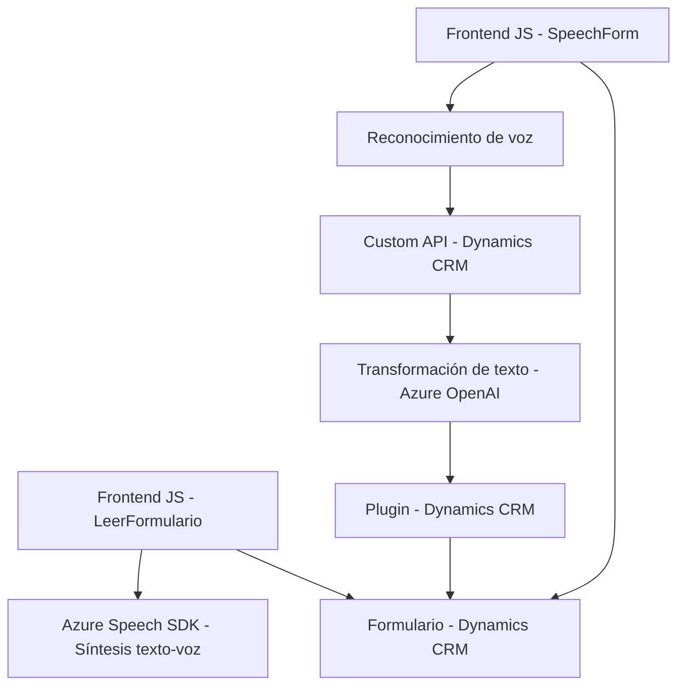

### Breve resumen técnico

El repositorio contiene archivos que destacan una solución integrada basada en JavaScript y C# para Microsoft Dynamics CRM. Los scripts de frontend implementan funcionalidades de reconocimiento y síntesis de voz utilizando **Azure Speech SDK**, mientras que los plugins de backend utilizan **Azure OpenAI** para transformar texto según reglas definidas. El objetivo central es procesar datos de formularios en Dynamics CRM mediante interfaces de voz y transformación semántica inteligente, aprovechando APIs y SDKs.

### Descripción de la arquitectura

La solución es **multicapa**:
1. **Frontend integrador**: Scripts que usan el navegador y la capa de cliente de Dynamics para capturar datos, procesar texto, y consumir APIs específicas con Azure Speech.
2. **Backend basado en plugins**: C# define plugins personalizados con la arquitectura típica de **Dynamics CRM**, que interactúan con **Azure OpenAI**.
3. **Servicios externos**: Los servicios de IA (OpenAI) y reconocimiento/síntesis de voz (Azure Speech) forman una capa adicional de infraestructura externa.

Se puede percibir una arquitectura híbrida entre un sistema **n capas** y **microservicios** porque:
- La lógica del frontend y backend con SDKs externos está acoplada pero delega procesamiento especializado a servicios de IA y APIs externas (Azure Speech y OpenAI).

### Tecnologías usadas

1. **Frontend**:
   - Lenguaje: **JavaScript**
   - Framework: No se usan frameworks específicos, pero se interactúa con Dynamics CRM a través de su API de JavaScript (`formContext`, `Xrm.WebApi`) y DOM.
   - SDK: **Azure Speech SDK** (reconocimiento y síntesis de voz).
   - Patrones: Modularidad (funciones pequeñas), carga condicional (SDK dinámico), encapsulación.

2. **Backend**:
   - Lenguaje: **C#**
   - Framework: Basado en **Microsoft Dynamics CRM SDK** (implementación de `IPlugin`).
   - API: **Azure OpenAI API** (transformación de texto).
   - Librerías: `System.Net.Http`, `Newtonsoft.Json.Linq`.

3. **Infraestructura**:
   - Servicios externos: **Azure Speech API**, **Azure OpenAI API**.
   - Entorno de ejecución: Dynamics CRM.

### Diagrama Mermaid válido para GitHub

### Conclusión final

La arquitectura presentada implementa una solución integrada que utiliza tres capas principales: frontend basado en JavaScript, backend basado en Dynamics CRM con C#, y servicios externos de Azure. El diseño favorece la modularidad, la compatibilidad con servicios IA avanzados (Azure OpenAI y Azure Speech SDK), y una fuerte integración con CRM. Aunque no es estrictamente una arquitectura de microservicios, el uso de APIs externas y plugins le permite delegar tareas especializadas, encajando en un modelo híbrido n capas/microservicios.

Se recomienda cuidar la gestión de claves API y evaluar módulos de seguridad adicionales para garantizar robustez ante posibles riesgos en servicios externos.