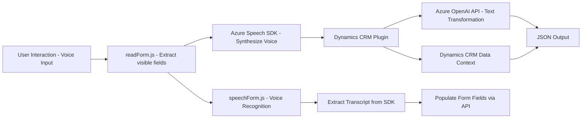

### Breve resumen técnico

El repositorio está enfocado en la interacción entre el usuario y Microsoft Dynamics CRM mediante tecnologías como **Azure Speech SDK** y **Azure OpenAI API**. Consiste en módulos que manejan la entrada de voz, sintetización de texto a voz, reconocimiento de datos de formularios, y transformación de texto hacia estructuras JSON utilizando un microservicio alojado en Azure OpenAI.

---

### Descripción de arquitectura

#### Tipo de solución:
1. **Frontend para Dynamics CRM**:
   - Scripts en JavaScript interactúan con Dynamics CRM y Azure Speech SDK para entrada y salida de datos por voz.
   - Uso de front-end scripts en un contexto específico de CRM para facilitar la interactuación por voz con formularios.
2. **Backend Plugin**:
   - Plugin de Microsoft Dynamics CRM programado en **C#** que se integra con el **Azure OpenAI API** para ejecutar transformaciones de texto a JSON siguiendo reglas específicas.

#### Tipo de arquitectura:
1. **Híbrida**:
   - **Monolítica**: Basada en la estructura de desarrollo inherente a Microsoft Dynamics CRM (plugins y scripts dentro del sistema centralizado).
   - **Service-Oriented Architecture (SOA)**: Utiliza servicios externos (Azure Speech SDK y Azure OpenAI) que añaden funcionalidad modular y desacoplada.

---

### Tecnologías usadas

1. **Microsoft Dynamics SDK**:
   - Framework para desarrollo de extensiones en CRM.
2. **Azure Speech SDK**:
   - Encargado de sintetizar voz y transcribir datos hablados.
3. **Azure OpenAI API**:
   - Servicio externo que convierte texto en estructuras JSON. Utiliza modelos de inteligencia artificial como GPT.
4. **Microsoft.Xrm.Sdk**:
   - Biblioteca para el manejo de objetos del CRM desde plugins.
5. **JavaScript**:
   - Scripts para manejar eventos, reconocimiento de voz, y procesar datos de formularios CRM.

---

### Diagrama Mermaid válido para GitHub

---

### Conclusión final

El repositorio implementa una solución enfocada en extender las capacidades de interacción del usuario en **Microsoft Dynamics CRM** mediante reconocimiento de voz y síntesis de texto a voz. Además, los plugins aprovechan **Azure OpenAI API** para realizar transformaciones de texto en estructuras útiles para el sistema. La arquitectura es híbrida, combinando características monolíticas del CRM con servicios externos como Azure Speech y OpenAI.

Ventajas:
1. Modularidad: Extensiones específicas para síntesis, reconocimiento y transformación.
2. Uso eficiente de servicios externos: Delegación de tareas complejas a SDKs o APIs ya probadas.
3. Simplicidad de interfaz: Enfoque centralizado en el contexto del CRM.

Desafíos:
1. Alta dependencia de servicios de Azure que podrían limitar opciones de configuración o costos.
2. Baja modularidad en el plugin: Mezcla responsabilidades que podrían delegarse a microservicios más robustos.