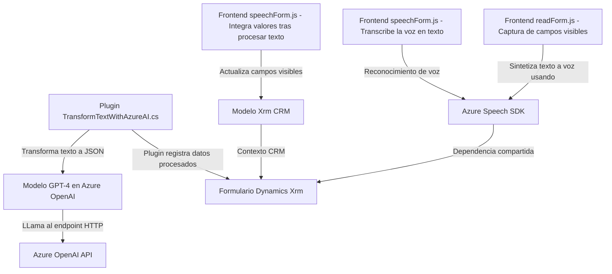

### Breve Resumen Técnico

El repositorio alberga tres principales componentes del sistema. El `readForm.js` y el `speechForm.js` están enfocados en la interacción frontend mediante la manipulación de datos de formularios. Utilizan Azure Speech SDK para síntesis y reconocimiento de voz respectivamente, con integración buscada hacia formularios asistidos en Dynamics CRM (modelo Xrm). Por otro lado, el archivo backend `TransformTextWithAzureAI.cs` está diseñado como un plugin dentro del ecosistema CRM y emplea Azure OpenAI para transformar textos en objetos JSON estructurados con reglas predefinidas.

---

### Arquitectura Descrita

La solución sigue un modelo **modular y segmentado**, desplegando la lógica en dos capas principales:
1. **Frontend**: Scripts del cliente orientados al procesamiento dinámico de voz (lectura y transcripción del texto visible en formularios).
2. **Backend**: Plugins en Microsoft Dynamics CRM que procesan transcripciones utilizando modelos GPT de Azure.

Seguiría una arquitectura **n capas**, con lógica enfocada en modularidad y desacoplamiento. Sin embargo, hay trazas hacia un posible futuro **hexagonal** o **plugin-driven** dado que:
- Los scripts frontend interactúan con APIs externas y el modelo CRM.
- Los plugins tienen reglas separadas que encapsulan la lógica y delegan operaciones a servicios externos.

---

### Tecnologías y Patrones Usados

#### Tecnologías:
1. **Frontend**:
   - **JavaScript** con modularización (archivo por funcionalidad específica).
   - Dependencias clave:
     - **Azure Speech SDK**: Interoperabilidad con servicios de voz y texto.
     - **Modelo Xrm**: Microsoft Dynamics CRM.

2. **Backend**:
   - **C# (.NET Framework)**:
     - Plugins basados en `IPlugin` para Dynamics CRM.
     - Comunicación HTTP con Azure OpenAI utilizando `HttpClient`.

#### Patrones:
- (**Frontend**) **Modularización funcional**:
  - Funciones distribuidas según responsabilidad (lectura de datos, síntesis, manejo de errores, etc.).
  - Carga dinámica de dependencias (SDK de Azure).

- (**Backend**) **Plugin Pattern**:
  - Encapsulación lógica con `IPlugin` para extensibilidad.
  - Separación de eventos CRM con el procesamiento de una respuesta programada por Azure OpenAI.

- (**Integración**) **Servicio externo dinámico**:
  - Uso de SDK y APIs para proporcionar funcionalidades avanzadas (GPT, reconocimiento de voz).

---

### Dependencias o Componentes Externos

- **Azure Speech SDK**: Funcionalidad de síntesis y reconocimiento de voz mediante servicios de Azure.
- **Azure OpenAI**: API utilizada para transformar textos en estructuras JSON avanzadas.
- **Modelo Xrm**:
  - `Xrm.WebApi`: Manipulación adicional de formularios y datos en Dynamics CRM.
- **Otras librerías C#**:
  - `Newtonsoft.Json`
  - `System.Net.Http` para solicitudes hacia APIs externas.

---

### Diagrama Mermaid

---

### Conclusión Final

La solución está diseñada como una integración entre un frontend basado en JavaScript (para interactuar con formularios de Dynamics CRM y servicios de voz mediante Azure SDK) y un backend basado en C# utilizando plugins para insertar lógica avanzada impulsada por GPT. La arquitectura aparenta seguir el modelo **n capas**, aunque con integración modular y externalizada en servicios de nube (Azure Speech y Azure OpenAI). Este despliegue permite extender capacidades existentes en Dynamics CRM, incluyendo inteligencia artificial y transcripción de voz adaptada a entornos web.