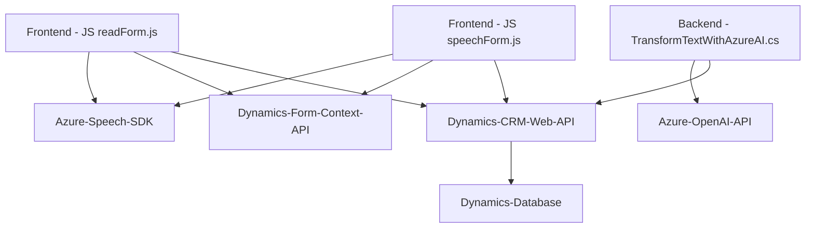

### Breve resumen técnico

El repositorio contiene tres archivos principales que delinean una solución híbrida basada en módulos frontend (JavaScript) y backend (C# plugin). La funcionalidad general está centrada en la interacción multimodal (voz y texto) con formularios dentro de Dynamics 365, pero con una dependencia externa clave hacia servicios de Azure, como Speech SDK y OpenAI.

- **Frontend:** Gestiona input de voz, síntesis de voz, extracción y manipulación de datos visibles de un formulario.
- **Backend Plugin:** Ejecuta transformaciones avanzadas de texto en JSON utilizando Azure AI.

---

### Descripción de arquitectura

La solución está basada en una arquitectura de **n capas**. El frontend sirve como una capa de presentación mediante JavaScript y está completamente acoplado a Dynamics 365. Provee interacción directa con el usuario mediante la interfaz del sistema de formularios. La capa backend implementa lógica empresarial avanzada en forma de plugins, comunicándose con Azure OpenAI. 

Además, la integración con servicios externos como Azure AI y Speech SDK permite añadir capacidades modernas como procesamiento de voz y generación de texto estructurado. Esto podría verse como un paso hacia una **arquitectura hexagonal** (puertos y adaptadores), con el backend actuando como core y los servicios externos como adaptadores.

---

### Tecnologías usadas
1. **Frontend:**
   - **JavaScript:** Para manipulación de formularios y lógica de negocio en el cliente.
   - **Azure Speech SDK:** Para captura vocal (Speech-to-Text), texto legible y síntesis de voz (Text-to-Speech).
   - **Dynamics Form Context API:** Para el acceso y manipulación de datos almacenados en formularios.
2. **Backend Plugin:**
   - **C# y Dynamics CRM SDK:** Para desarrollar y ejecutar una lógica personalizada de transformación en Dynamics 365.
   - **Azure OpenAI API:** Para procesamiento avanzado de texto mediante IA.
   - **HTTP Client y JSON libraries** (`System.Net.Http`, `System.Text.Json`, etc.): Para la comunicación con servicios externos.
3. **Integración:**
   - Comunicación REST entre el plugin en Dynamics CRM y el endpoint de OpenAI en Azure.

---

### Dependencias externas y componentes vinculados
1. **Azure Speech SDK:**  
   - Gestiona input de voz y síntesis de texto en voz.
   - URL de carga dinámica del SDK: `https://aka.ms/csspeech/jsbrowserpackageraw`.
   
2. **Dynamics 365 Web API:**  
   - Procesa y actualiza datos en formularios a través de la capa de presentación y lógica.
   
3. **Azure OpenAI API:**  
   - Efectúa transformaciones de texto generadas por el usuario mediante un modelo GPT (e.g., GPT-4).
   
4. **Microsoft Dynamics CRM SDK:**  
   - Extiende las capacidades de gestión de datos empresariales con complementos desarrollados en C#.

---

### Diagrama Mermaid

### Conclusión final

Este repositorio evidencia una arquitectura de **n capas** con un enfoque en el diseño de modularidad y extensibilidad para soluciones orientadas a Dynamics CRM. Los módulos frontend logran gestionar datos del formulario mediante voz y sintetizar respuestas gracias al **Azure Speech SDK**, mientras que el plugin implementado en C# aprovecha la **Azure OpenAI API** para transformaciones avanzadas de texto, integrando datos proporcionados por el usuario en el sistema CRM.

Aunque la solución es sólida en términos de funcionalidad principal, existen oportunidades en términos de seguridad (manejo adecuado de claves y endpoints). Finalmente, el diagrama representa una simplificada interacción entre los componentes principales. El diseño general es funcional y extensible hacia otras plataformas o integraciones en el futuro.