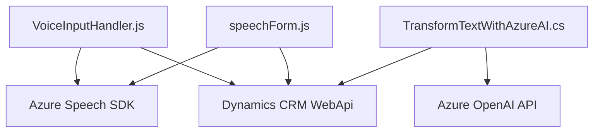

### Breve resumen técnico
Los archivos analizados forman parte de una solución orientada a mejorar la accesibilidad y automatización en sistemas CRM. Se implementa mediante tecnologías como **Azure Speech SDK** y servicios **Azure AI**, interactuando principalmente con formularios web y entidades en Dynamics CRM. La solución mezcla componentes backend y frontend.

---

### Descripción de arquitectura
La arquitectura principal es **multicapa/multicomponente**, organizada en dos segmentos:
1. **Capa frontend (client-side):** Maneja la lectura y síntesis de voz, así como la interacción directa con el usuario mediante HTML DOM para accesibilidad y reconocimiento vocal.
2. **Capa backend (Dynamics CRM plugin):** Procesa texto usando **Azure OpenAI**, delegando tareas intensivas (como generación de JSON) a servicios en la nube por API. También incluye interacciones con el modelo de datos de Dynamics CRM.

Es una estructura determinada por el entorno y plataforma Dynamics CRM, con **microservicios client-side** en JavaScript y extensiones backend como plugins en C#.

---

### Tecnologías usadas
**Frontend:**
- **Azure Speech SDK (JavaScript):** Entrada/salida basada en voz con reconocimiento y síntesis.
- **HTML DOM:** Manipulación directa para interfaz web.

**Backend:**
- **Dynamics CRM SDK:** Para interacción con datos y formularios CRM.
- **Azure OpenAI API:** Procesamiento avanzado de texto basado en IA.
- **Newtonsoft.Json:** Manejo de estructuras JSON.
- **System.Net.Http:** Para consumir servicios REST basados en Azure.

**Patrones:**
- **Callback (observador):** Para garantizar la carga dinámica de SDK.
- **Adaptador:** Normalización y procesamiento de transcripciones en estructuras específicas de CRM.
- **API Gateway:** Comunicación backend con Azure services.

---

### Diagrama **Mermaid** válido para GitHub Markdown

---

### Conclusión final
La solución identifica una arquitectura centrada en la accesibilidad mediante tecnologías de procesamiento de voz e inteligencia artificial. Es una implementación híbrida con componentes frontend y backend que aprovechan altamente servicios de Azure y patrones para integración con Dynamics CRM. Está diseñada para ofrecer experiencias conversacionales y procesamiento avanzado en sistemas empresariales. La estructura es modular y extensible, aunque depende en gran medida de servicios externos (Azure y CRM). Ideal para escenarios enfocados en accesibilidad y automatización mediante IA.