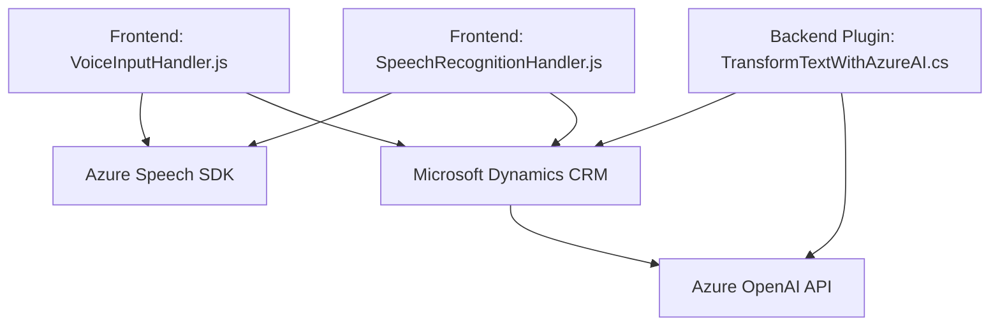

### Breve Resumen Técnico
Este repositorio contiene distintas implementaciones donde se integran servicios de Azure (Speech SDK y OpenAI) con Microsoft Dynamics CRM mediante archivos JavaScript y C#. Se observa una solución híbrida destinada a capturar datos de formularios, transformarlos y procesarlos mediante mecanismos de IA y voz. 

---

### Descripción de Arquitectura
1. **Tipo de solución:** La solución combina varios componentes:
   - **Frontend (JavaScript):** Gestiona formularios y la interacción con el usuario final mediante voz.
   - **Plugins (C#):** Amplía la funcionalidad del backend en Microsoft Dynamics con procesamiento de texto basado en IA.

2. **Arquitectura:**
   - En la parte de frontend, la aplicación adopta un modelo **modular basado en capas**, donde cada archivo gestiona una funcionalidad específica (lectura por voz, reconocimiento y actualización de formularios).
   - En la parte backend (C#), se integra en un modelo de **microservicios** o **composición plugins**, característico de Dynamics CRM.

3. **Patrones destacados:**
   - **Facilitator/Manager pattern:** Organiza la interacción entre formularios y servicios de Azure.
   - **Event-driven programming:** Uso de callbacks para SDK dinámico y asincronía en las llamadas a APIs externas.
   - **Plugin design pattern:** C# está diseñado bajo este patrón, lo que facilita la integración modular con Dynamics CRM.

---

### Tecnologías Usadas
1. **Frontend (JavaScript):**
   - **Azure Speech SDK:** Para síntesis y reconocimiento de texto/vocal.
   - **Microsoft Dynamics Web API SDK:** Para manipular y actualizar datos dentro de formularios dinámicos.
   - **Vanilla JavaScript:** Para construir funciones modulares y manipular datos.

2. **Backend (C# Plugin):**
   - **Microsoft Dynamics CRM Plugin SDK:** Gestión y manipulación del contexto de CRM.
   - **Azure OpenAI API:** Solicitudes HTTP para transformar texto según normas específicas.
   - **Newtonsoft JSON.NET & Text.Json:** Serialización y procesamiento eficiente de JSON.

---

### Componentes y Dependencias Externas
1. **Azure Speech SDK:** Usado para síntesis y reconocimiento de voz en ambos archivos `VoiceInputHandler.js` y `SpeechRecognitionHandler.js`.
2. **Azure OpenAI API:** Utilizado por el plugin C# para transformar texto basado en IA.
3. **Microsoft Dynamics SDK:** Referencias como `executionContext`, `formContext`, `Xrm.WebApi`, etc., explícitamente utilizan las estructuras del contexto de Dynamics CRM.
4. **HTTP Client Libraries (System.Net.Http, Newtonsoft.JSON):** Para solicitudes múltiples hacia API de AI.

---

### Diagrama Mermaid compatible con GitHub Markdown

---

### Conclusión Final
La solución presentada es un sistema híbrido con una arquitectura de múltiples capas en el frontend y un diseño centrado en plugins en el backend. Basado en integraciones con servicios externos como Azure Speech SDK y OpenAI API, se logra una experiencia avanzada de reconocimiento de voz y procesamiento de datos para usuarios de Microsoft Dynamics CRM. Las buenas prácticas como modularidad, event-driven programming y desacoplamiento de funciones son evidentes en la implementación, lo cual confirma una base sólida para ampliaciones futuras. Sin embargo, debe garantizarse el manejo seguro de credenciales y datos sensibles al usar servicios en la nube como Azure.