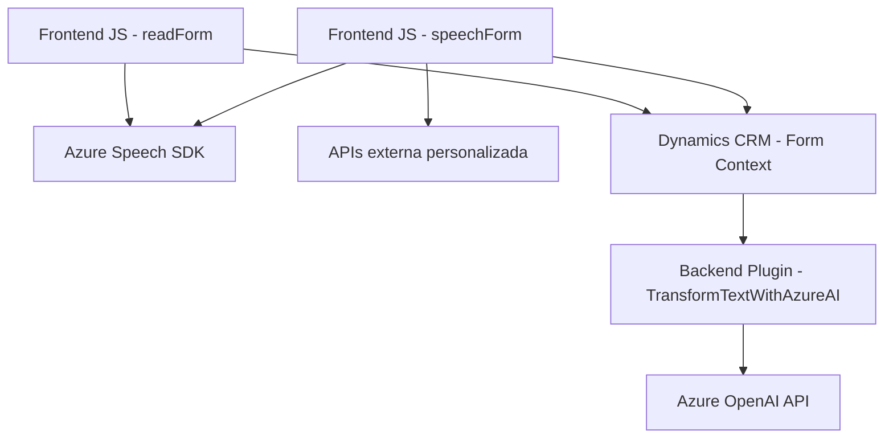

### Breve resumen técnico:
El repositorio parece estar compuesto por varios módulos orientados a implementar diferentes capacidades relacionadas con la captura, procesamiento, síntesis y reconocimiento de voz, así como transformación de texto basado en un contexto de Microsoft Dynamics CRM. Utiliza integraciones externas como Azure Speech SDK y Azure OpenAI para habilitar capacidades avanzadas en interacción con datos de formularios y texto estructurado.

---

### Descripción de arquitectura:
Este proyecto parece tener una arquitectura **modular distribuida**:
1. **Frontend**: Los archivos JavaScript (`readForm.js`, `speechForm.js`) manejan la lógica relacionada con la captura y procesamiento de campos de formulario en Dynamics CRM. Además, integran Azure Speech SDK para sintetizar voz o reconocer entrada vocal.
2. **Plugin Backend**: El archivo `TransformTextWithAzureAI.cs` representa lógica personalizada que se ejecuta en el backend de Dynamics CRM mediante la implementación de plugins, actuando como una extensión del sistema.
3. **Integración con APIs Externas**:
    - **Azure Speech SDK**: Para síntesis y reconocimiento de voz.
    - **Azure OpenAI**: Para transformar texto basado en reglas en contenido JSON estructurado.

Aunque los elementos funcionan de manera modular, la comunicación parece fluir a través de Dynamics CRM como núcleo central. La arquitectura podría clasificarse como **n-capas** con integración de servicios externos.

---

### Tecnologías usadas:
1. **Frontend (JavaScript):**
   - **Azure Speech SDK**: Para la síntesis y reconocimiento de voz.
   - **Xrm.WebApi**: API del framework de Microsoft Dynamics CRM.
  
2. **Backend (C#):**
   - .NET SDK de Dynamics CRM:
     - `IPlugin`, `IPluginExecutionContext`, etc.
   - **Azure OpenAI**:
     - Procesamiento de texto mediante el modelo GPT.
   - **Newtonsoft.Json**: Para manipular y parsear JSON en C#.
   - **HttpClient**: Configuración y envío de solicitudes HTTP hacia APIs externas.
  
---

### Diagrama Mermaid válido para GitHub Markdown:

---

### Conclusión final:
Este repositorio implementa una solución modular con capacidades avanzadas de interacción entre usuarios y formularios a través de síntesis y reconocimiento de voz, además de procesamiento de texto utilizando Azure Speech SDK y Azure OpenAI. La arquitectura sigue un patrón de **n-capas** donde Dynamics CRM actúa como núcleo funcional principal y coordina la comunicación entre las funcionalidades del frontend y los plugins backend. Esto es ideal para soluciones empresariales que requieren extensibilidad en su operación y capacidad de integrar procesamiento avanzado desde servicios en la nube.