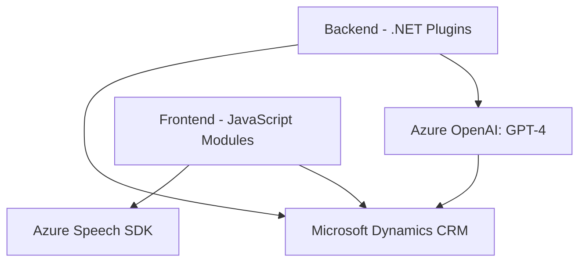

### Resumen técnico del repositorio

El repositorio combina tecnologías para reconocimiento de voz, síntesis de texto en voz y ejecución de plugins en Microsoft Dynamics CRM. La solución opera como un conjunto de componentes organizados alrededor de funcionalidades específicas: formularios frontend integrados con Azure Speech SDK y plugins backend que interactúan con Azure OpenAI mediante APIs REST. 

---

### Descripción de la arquitectura

La solución adopta una **arquitectura n-capas híbrida**:
1. **Frontend**: Contiene lógica relacionada a la captura de voz, síntesis de texto en voz y manipulación directa de formularios CRM mediante JavaScript. Se integra con el backend mediante APIs REST.
2. **Backend**: Implementa plugins para Dynamics CRM que ejecutan lógica de negocio avanzada y hacen uso de servicios externos como Azure OpenAI.
3. **Integración de servicios externos**: Las capas consumen servicios como **Azure Speech SDK** y **Azure OpenAI** de manera dinámica, asegurando separación y extensibilidad.

El diseño organiza las funciones y clases claramente separando responsabilidades:
- **Frontend**: Modularidad funcional con enfoque en la interacción con el SDK y manipulación del DOM del formulario.
- **Backend**: Patrones derivados del Plugin Pattern y REST Integration.

---

### Tecnologías usadas

1. **Frontend JavaScript**:
   - **Frameworks/librerías**: Ningún framework específico, pero utiliza objetos CRM desde el cliente (`Xrm.Page`, `Xrm.WebApi`).
   - **Azure Speech SDK**: Carga dinámica desde CDN para síntesis de voz y reconocimiento de comandos.
   - Patrones: Modularidad, asincronía (promesas y callbacks), composición funcional.

2. **Backend .NET**:
   - **Lenguaje**: C#
   - **Microsoft Dynamics SDK**: APIs para integrar plugins con el modelo de datos del CRM.
   - **Azure OpenAI integration**: Consumo de servicios REST usando `HttpClient` para aplicar lógica basada en GPT-4.
   - **JSON processing**: Utilización de `System.Text.Json`.

3. **Servicios de Azure**:
   - **Speech SDK** para reconocimiento y síntesis de voz.
   - **Azure OpenAI (GPT-4)** para transformación de texto (commands AI).

---

### Dependencias y componentes externos

1. **Azure Speech SDK**:
   - Cargado dinámicamente en el frontend para reconocimiento y síntesis de voz.
   - Requiere configuración de `azureKey` y `azureRegion`.

2. **Azure OpenAI API**:
   - Integrada con el plugin de backend mediante solicitudes REST.
   - Utiliza los servicios de procesamiento de lenguaje natural.

3. **Microsoft Dynamics CRM API**:
   - Usada tanto en el frontend como en el backend para manipular datos del CRM y realizar operaciones como búsqueda y actualización de registros.

4. **Libraries and Tools in Backend**:
   - `System.Net.Http`: Manejo de solicitudes HTTP para integración REST.
   - `System.Text.Json`: Procesamiento de JSON.

---

### Diagrama Mermaid compatible con GitHub Markdown

### Conclusión final

Este repositorio implementa una solución para habilitar funcionalidades avanzadas en formularios dinámicos de Microsoft Dynamics CRM. Utiliza **Azure Speech SDK** y **Azure OpenAI** para procesar y transformar datos de entrada, permitiendo una experiencia centrada en tecnologías de voz y lenguaje natural. La arquitectura del sistema se basa en una configuración híbrida de **n-capas**, con una separación clara de responsabilidades entre frontend y backend, y una integración eficiente con servicios de Azure.

La solución es extensible y adecuada para escenarios empresariales que requieran integración profunda con CRM junto con procesamiento de lenguaje avanzado.