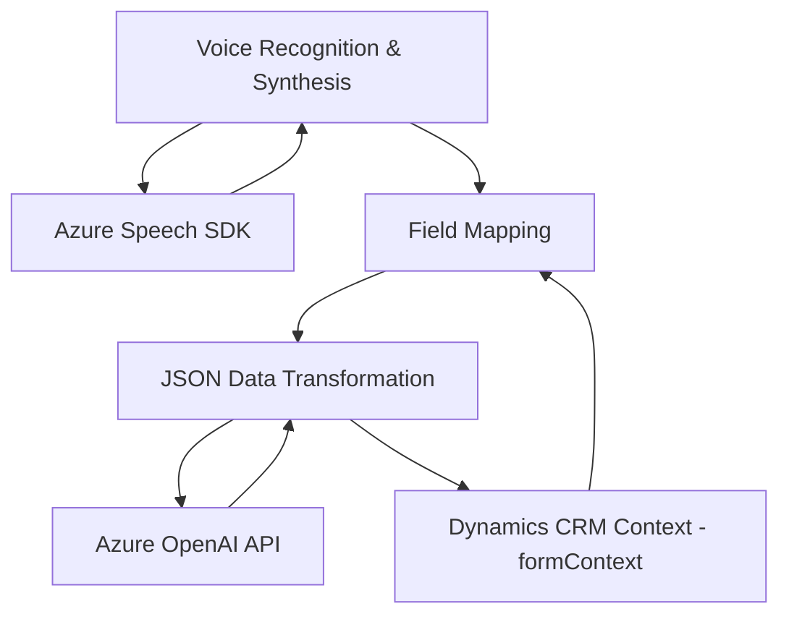

### Breve resumen técnico

El repositorio incluye tres componentes principales que forman parte de una solución integral que combina frontend dinámico, integración con un sistema CRM (Dynamics 365), y uso de inteligencia artificial mediante Azure OpenAI y Azure Speech SDK. La solución parece orientada a la interacción con el usuario mediante voz y reconocimiento de entradas al formulario. 

---

### Descripción de arquitectura

1. **Tipo de solución**: La arquitectura del repositorio corresponde a una solución híbrida que integra:
   - Un **frontend** desarrollado en JavaScript con funcionalidad de síntesis y reconocimiento de voz (usando Azure Speech SDK).
   - Un **plugin backend** en Dynamics 365 CRM (en C#), que actúa como puente procesador y transforma texto mediante API de Azure OpenAI.

2. **Tipo de arquitectura**:  
   - El sistema exhibe una arquitectura **n-capas** al dividir lógica:
      - **Frontend/Javascript** para la interfaz interactiva (procesamiento de datos del formulario, reconocimiento y síntesis de voz).
      - **Interfaz-API backend** para transformación avanzada de datos con OpenAI mediante el plugin.
   - También adopta principios de **microservicios**, ya que utiliza servicios externos como Azure Speech SDK y Azure OpenAI como componentes independientes que encapsulan funcionalidades específicas.

---

### Tecnologías usadas

1. **Frontend (JS)**
   - **Azure Speech SDK**: Para reconocimiento de voz y síntesis de voz.
   - **JavaScript**: Paradigma basado en funciones modulares.
   - **Event-Driven Pattern**: Usado para manejar cambios en el formulario y llamadas al SDK.
   - **Promise-based programming**: En tareas asincrónicas como la carga de SDK.

2. **Backend (Dynamics Plugin en C#)**
   - **Dynamics CRM SDK**: Para extender la lógica base de Dynamic CRM y acceder al contexto de formularios/entidades.
   - **Azure OpenAI API**: Para transformación basada en reglas.
   - **Libraries**:
     - `HttpClient` para llamadas REST.
     - `Newtonsoft.Json.Linq` y `.Net Core System.Text.Json` para manipular datos JSON.
   - **Design Patterns**:
     - **Plugin Pattern**: Para extender Dynamics CRM.
     - **Service-Oriented Architecture**: Integración con APIs externas para delegar tareas específicas.

---

### Dependencias y componentes externos
1. **Azure Speech SDK y Azure OpenAI**
   - Speech SDK para reconocimiento/síntesis de voz.
   - OpenAI para transformación avanzada de datos.
2. **Dynamics CRM** como plataforma base.
3. **Browser APIs** como soporte para procesamiento en entorno cliente.
4. **Newtonsoft.Json** para manipulaciones complejas de JSON en C# en el plugin.

---

### Diagrama Mermaid

---

### Conclusión final

La solución implementa un enfoque modular y escalable para la integración de reconocimiento de voz, sistemas CRM y algoritmos de inteligencia artificial. Su arquitectura está orientada a capas, con separación clara de responsabilidades entre frontend y backend. Además, utiliza servicios cloud modernos como Azure Speech SDK y OpenAI API, destacando patrones de diseño como `Event-Driven`, `Plugin`, y `Service-Oriented`. La lógica del sistema parece eficiente, aunque podría beneficiarse de mecanismos específicos de prueba o validación robusta para la integración con APIs externas.