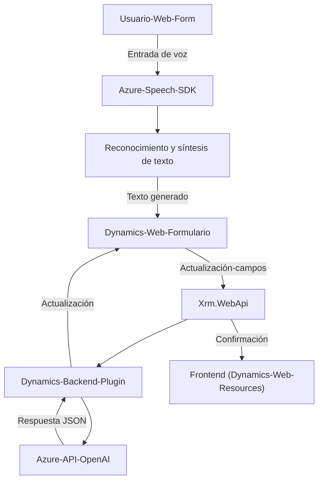

# Análisis técnico y arquitectónico

## 1. Breve resumen técnico
El repositorio contiene tres archivos principales que forman parte de una solución orientada al uso de reconocimiento de voz y transformación de texto en aplicaciones integradas con Microsoft Dynamics CRM. La solución combina una interfaz de usuario (frontend en JavaScript) y extensiones en forma de plugins para Dynamics CRM que interactúan con servicios de voz y OpenAI proporcionados por Azure.

---

## 2. Descripción de la arquitectura
La arquitectura observada se define como **n-capas** y utiliza integración con servicios externos (Azure Speech SDK y Azure OpenAI). Los módulos están divididos en dos capas principales:
1. **Frontend (Interfaz de usuario web)**: Una capa diseñada para operación client-side en el navegador, permitiendo el reconocimiento de voz y la síntesis mediante el SDK de Azure. Utiliza herramientas como Dynamics CRM web resources (`executionContext`) para capturar y escribir datos en formularios interactivos.
2. **Backend (Plugin en Dynamics CRM)**: Implementado como un plugin para Dynamics CRM utilizando `Microsoft.Xrm.Sdk`. La lógica de negocio está detallada en la clase principal (`TransformTextWithAzureAI`), con integración hacia servicios externos de Azure OpenAI.

--- 
### Elementos fundamentales de la arquitectura:
- **Desarrollo estructurado modular**: Cada archivo tiene funciones específicas y centradas, siguiendo principios de separación de responsabilidades.
- **Integración con servicios externos**:
  - Azure Speech SDK para reconocimiento y síntesis de voz en la interfaz web.
  - Azure OpenAI API para transformación de texto en el backend.
- **API Gateway (Xrm.WebApi)**: Uso de la API en `Plugins` para realizar comunicación entre el CRM y el servicio de transformación.
- **Patrón plugin**: Implementación que sigue el ciclo de vida de plugins en Dynamics CRM.

---

## 3. Tecnologías y frameworks utilizados
1. **Tecnologías**:
   - **Frontend / Client-Side**:
     - **JavaScript**: Implementación de funcionalidades relacionadas con el reconocimiento y síntesis de voz.
     - Dynamics 365 `executionContext`: Proporciona acceso a los formularios y sus atributos.
   - **Backend / Server-Side**: 
     - Dynamics CRM Platform (`Microsoft.Xrm.Sdk`): Extensión de lógica de negocio.
     - **C#/.NET**: Lenguaje de programación utilizado para los plugins.
     - **System.Net.Http**: Para realizar solicitudes HTTP a Azure OpenAI.
     - **System.Text.Json / Newtonsoft.Json**: Procesamiento y manipulación de datos JSON.
   - **Servicios con Azure**:
     - **Azure Speech SDK**: Reconocimiento de voz y síntesis.
     - **Azure OpenAI API**: Procesamiento y transformación del texto.
2. **Patrones**:
   - **Modularidad**: Utilización de funciones desacopladas en el frontend y servicios en el backend.
   - **Plugin Architecture**: El backend utiliza el patrón de plugins específico de la plataforma Dynamics CRM.
   - **Uso de APIs externas conscientemente**: Abstracción de servicios de terceros (Azure OpenAI y Speech SDK) bajo métodos encapsulados.
   - **Adaptadores dinámicos:** Gestión diversa de datos como valores de campos en formularios (lookup, fechas, booleanos, etc.).

---

## 4. Dependencias externas o componentes adicionales
1. **Externas**:
   - Azure Speech SDK (JavaScript runtime, cargado dinámicamente).
   - Azure OpenAI API: Procesa datos para generar texto estructurado usando algoritmos de inteligencia artificial.
   - `Xrm.WebApi`: APIs nativas de Dynamics CRM para manipulación de formularios y datos de entidades.
2. **Bibliotecas utilizadas**:
   - `Newtonsoft.Json.Linq`: Procesamiento JSON en el backend (Dynamics plugin).
   - `System.Text.Json`: Serialización/deserialización de datos.

---

## 5. Diagrama Mermaid 100% compatible con GitHub Markdown

---

### 6. Conclusión final
La solución presentada es una arquitectura **n-capas con integración de servicios externos** basada en Dynamics CRM. Combina **frontend** realizado en **JavaScript**, donde se utiliza el SDK de Azure Speech para procesar datos de voz y contacto directo con formularios web de Dynamics CRM (mediante un contexto específico), y un backend que utiliza **plugins de Dynamics CRM en C#** para integrar con Azure OpenAI. La modularidad del código es clara y permite extensibilidad, mientras la dependencia de servicios externos a través de APIs asegura escalabilidad y mantenimiento centralizado.