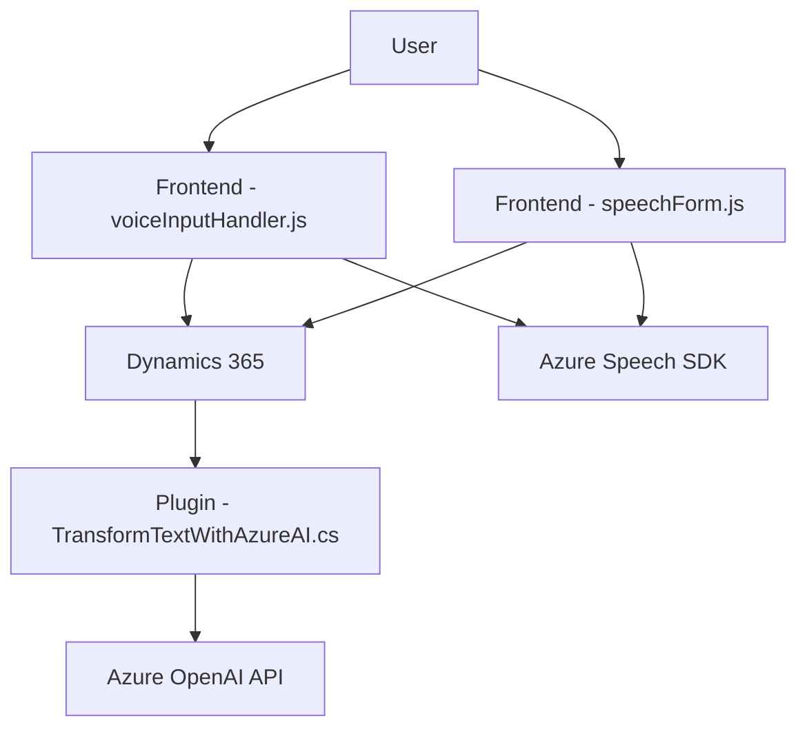

### Breve resumen técnico
Este código pertenece a una solución que integra múltiples capas de funcionalidad para habilitar reconocimiento de voz, procesamiento de texto basado en inteligencia artificial, y generación de contenido dinámico utilizando servicios en la nube (Azure Speech SDK y Azure OpenAI API) vinculados a formularios de Microsoft Dynamics CRM. Está enfocado en la creación de una experiencia integrada de entrada/salida dinámica y transformación de datos en tiempo real.

---

### Descripción de arquitectura
La solución es un sistema modular y distribuido que emplea una arquitectura híbrida, combinando elementos de **arquitectura de n capas** con integración estándar de **microservicios** para conectar con APIs externas. Tiene las siguientes capas:
1. **Capa de presentación**: Archivos JavaScript (`voiceInputHandler.js`, `speechForm.js`) que se integran directamente con el contexto de formularios de Dynamics 365.
2. **Capa de lógica de negocios**: Plugins de Dynamics (`TransformTextWithAzureAI.cs`) que procesan los datos enviados desde las otras capas personalizando las reglas de negocio mediante la API Azure OpenAI.
3. **Capa de integración**: Conexión con APIs externas (Azure Speech SDK y Azure OpenAI API) para ofrecer reconocimiento de voz, síntesis de audio y transformación, todo de manera modular.

El diseño emplea principios de **separación de responsabilidades**, integrando servicios externos para la funcionalidad avanzada y desacoplando las interacciones específicas (procesamiento de transcripciones mediante IA, aplicación de valores a formularios) del código principal.

---

### Tecnologías usadas
1. **Frontend/Interfaz**
   - **JavaScript**: Para la inicialización y procesamiento en el cliente.
   - **Dynamics 365 SDK**: Acceso y manipulación de datos almacenados en los formularios del CRM.
   - **Azure Speech SDK**: Integración con servicios de IA para reconocimiento de voz y síntesis de texto a voz.
2. **Backend**
   - **C# (TransformTextWithAzureAI.cs)**: Implementación de un plugin que extiende la funcionalidad del CRM y procesa texto con OpenAI.
3. **APIs Externas**
   - **Azure Speech SDK** (para síntesis y reconocimiento de voz).
   - **Azure OpenAI API** (para procesamiento y transformación de texto).
4. **Complementos**
   - **Newtonsoft.Json**: Trabajo avanzado con JSON en la parte del plugin.
   - **System.Net.Http**: Manejo de solicitudes HTTPS a servicios externos desde el plugin.

---

### Diagrama **Mermaid**

---

### Conclusión final
La solución destaca por su integración entre tecnología cliente (JavaScript y Dynamics 365 SDK) y servicios empresariales avanzados en la nube (Azure Speech y OpenAI APIs). Es una implementación modular que utiliza n capas con componentes individuales especializados en diferentes funcionalidades, asegurando escalabilidad y separación de responsabilidades.  

El uso extensivo de servicios externos y patrones como `callbacks` y `promesas` en la interfaz lo hace adecuado para sistemas con alta interacción del usuario, mientras que el plugin se centra en la especialización de transformación de datos en una arquitectura extensible. Ideal para empresas que buscan potenciar sus formularios CRM con capacidades de inteligencia artificial y procesamiento dinámico.