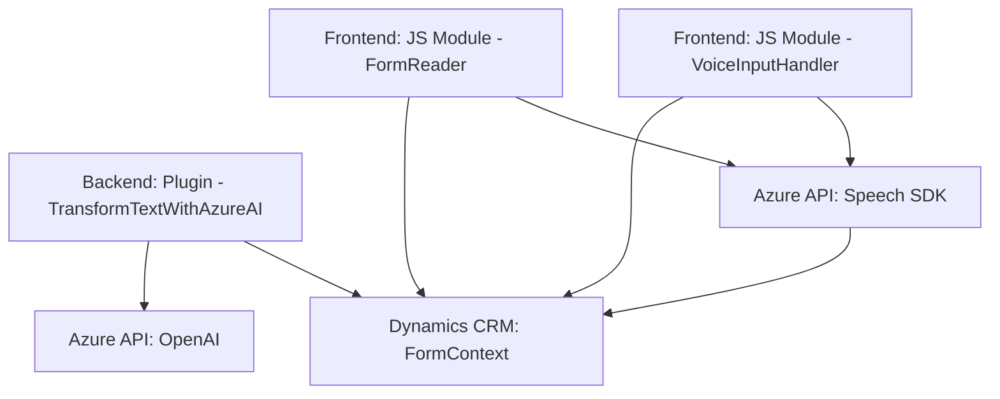

### Breve resumen técnico

- El proyecto incluye una solución que integra reconocimiento de voz y servicios de transformación de texto mediante APIs cognitivas de Azure, específicamente Azure Speech SDK y Azure OpenAI.
- Se compone de múltiples módulos que interactúan con formularios dinámicos y sistemas CRM (Microsoft Dynamics) para lectura, procesamiento y actualización de información.
- Las tecnologías involucradas abarcan **JavaScript**, **Dynamics CRM SDK**, y servicios de **Azure**.
- La arquitectura se basa en una combinación de capas funcionales y servicios externos.

---

### Descripción de arquitectura

**Tipo de solución**: 
- La solución es una composición de módulos frontend especializados en reconocimiento de voz y procesamiento textual, junto con un plugin backend que conecta Azure OpenAI con Dynamics CRM.

**Arquitectura**: 
- La solución sigue un modelo híbrido:
  - **Frontend modular**: Basado en JavaScript con una arquitectura de micro-módulos sueltos. Estas funciones están diseñadas para integrarse con formularios dinámicos. Predominan los patrones como integración con servicios externos y modularidad.
  - **Backend basado en plugins (Dynamics CRM)**: Implementa el patrón de plugins y opera bajo una arquitectura de servicios.

**Patrones usados**:
- **Patrón de servicio**: Interfaz con APIs externas (Speech SDK, Azure OpenAI).
- **Patrón modular**: Separación de responsabilidades mediante funciones que gestionan la lectura, procesamiento y síntesis de datos en el frontend.
- **Capas de arquitectura**: Backend implementa estructuras de middleware claramente definidas (plugin), mientras que el frontend incorpora un flujo funcional basado en eventos y accesos dinámicos a formularios.

---

### Tecnologías y frameworks usados

1. **Frontend**:
   - **JavaScript**: Base del desarrollo en el frontend.
   - **Azure Speech SDK**: Para reconocimiento de voz y síntesis de texto a voz.
   - **Dinámica de formularios en Dynamics CRM**: Manipulación de atributos y campos mediante el contexto `executionContext`.

2. **Backend**:
   - **Microsoft Dynamics CRM SDK**: Para extensibilidad del sistema mediante plugins.
   - **ASP.NET Core/C#**: Implementación del plugin de transformación de texto.
   - **Azure OpenAI**: Servicios de procesamiento avanzado de texto.
   - **JSON manipulation**:
     - `Newtonsoft.Json`.
     - `System.Text.Json`.

3. **Servicios externos**:
   - APIs cognitivas de Azure: Speech y OpenAI.

---

### Diagrama Mermaid 100 % compatible con GitHub Markdown

---

### Conclusión final

- La solución presentada es una **composición modular** para integrar reconocimiento de voz y transformación textual con sistemas CRM, utilizando un enfoque orientado a servicios. 
- El uso de tecnologías como **Azure APIs** permite extender funcionalidades de una plataforma existente (Dynamics CRM) con capacidades cognitivas avanzadas.
- La arquitectura es diseñada para la interoperabilidad y reusabilidad y tiene componentes que pueden ser adaptados, mantenidos o escalados con facilidad.