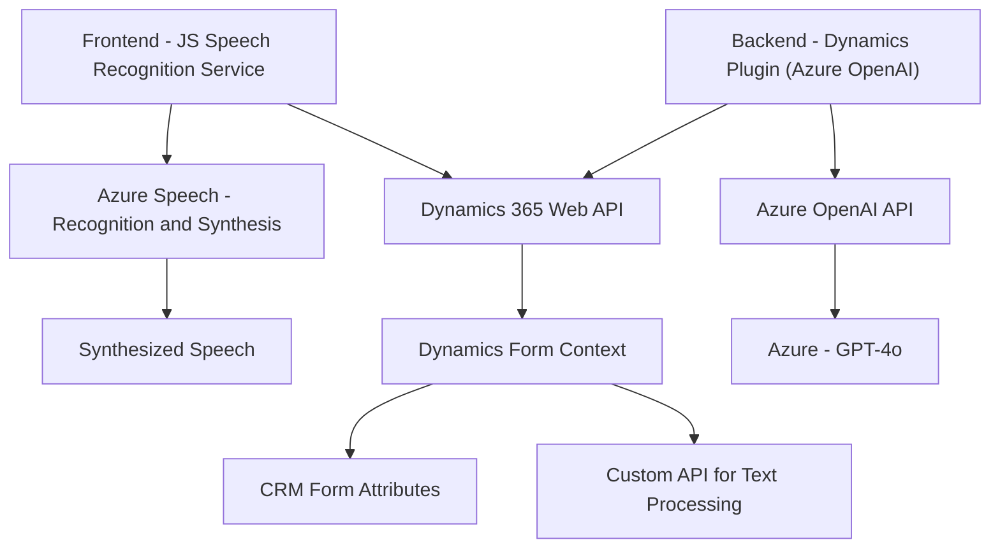

### Breve resumen técnico
El repositorio contiene múltiples archivos diseñados para integrar servicios de reconocimiento y síntesis de voz con **Azure Speech SDK**, más una implementación en .NET destinada a **Microsoft Dynamics CRM** que utiliza **Azure OpenAI** para transformar datos. Los archivos presentan una combinación de tecnologías en frontend (JavaScript, Azure SDK) y backend (.NET) enfocadas en el enriquecimiento y automatización de formularios en entornos corporativos.

---

### Descripción de arquitectura
1. **Tipo de solución**:
   - **Hybrid Solution**: La solución integra frontend (cliente), APIs internas de Dynamics, y backend plug-ins para un sistema ampliable y escalable.

2. **Arquitectura del sistema**:
   - **Modular N Capas**: Cada parte representa una capa dedicada (frontend, capa de negocio, y backend plug-ins).
   - **Integración basada en APIs**: Uso de **Dynamics 365 Web API**, **Azure Speech SDK**, y **Azure OpenAI API** para una arquitectura interoperable donde componentes específicos interactúan mediante protocolos establecidos.

3. **Patrones arquitectónicos usados**:
   - **Fachada y modulación funcional**: En el frontend, funciones como `startVoiceInput` y `startVoiceRecognition` simplifican la interacción con servicios subyacentes.
   - **Event-driven architecture (clientes)**: Las operaciones del frontend dependen de eventos, como el inicializador de reconocimiento de voz.
   - **Plugin architecture (backend)**: El plugin de Dynamics actúa de forma aislada al implementar una lógica dependiente del contexto gracias a `IPlugin`.
   - **Carga lógica diferida**: El SDK de Azure Speech se carga dinámicamente en tiempo de ejecución para optimizar el rendimiento.
   - **Integración de servicios externos**: Tanto el frontend como el backend conectan servicios de Azure para síntesis y reconocimiento de voz, además de la generación y transformación de texto estructurado.

4. **Diagramación del sistema:**
   La arquitectura puede diagramarse en términos de componentes como Frontend (con Azure Speech SDK), integración con Dynamics 365 y Azure OpenAI en el backend.

---

### Tecnologías usadas
- **Frontend**:
  - Lenguaje: **JavaScript**.
  - SDK: **Azure Speech SDK**.
  - Platform APIs: **Dynamics 365 Web APIs**.
- **Backend**:
  - Lenguaje: **C# (.NET Framework)**.
  - Integración: **Microsoft Dynamics CRM IPlugin interfaces**.
  - **Azure OpenAI API** para procesamiento de datos con modelos GPT (específicamente entre modelos nanotécnicos como GPT-4o).
- **Librerías externas**:
  - Newtonsoft.Json para manipulación de JSON en C#.

---

### Diagrama Mermaid válido para GitHub
Este diagrama ilustra en términos generales las conexiones entre los diferentes componentes del sistema, las dependencias externas y el flujo de datos.

---

### Conclusión final
El repositorio implementa una solución híbrida que combina servicios multiplataforma para formularios dinámicos y procesamiento de voz. Tecnológicamente, se apoya en APIs modernas como **Azure Speech SDK** y **Azure OpenAI**, optimizando interactividad mediante eventos en frontend y plug-ins en el backend.

Esta arquitectura modular basada en capas junto con los patrones de integración API asegura un sistema flexible, escalable y listo para integrarse con otras plataformas.