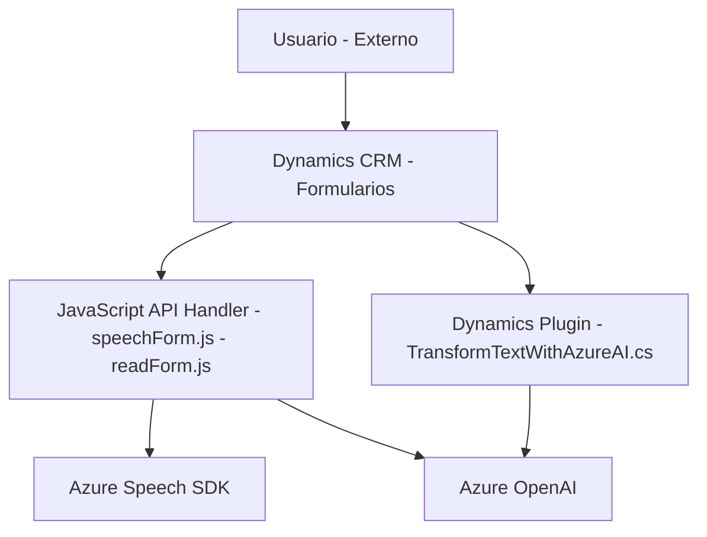

### Breve resumen técnico

El repositorio representa una integración entre Microsoft Dynamics y servicios de Azure (Speech SDK y OpenAI) para crear una solución habilitada por voz e inteligencia artificial. Los archivos **JavaScript** permiten manipular formularios en Dynamics CRM usando funcionalidades de reconocimiento, síntesis de voz, y generación de datos estructurados; mientras que el plugin en **C#** interactúa con el servicio OpenAI de Azure para aplicar transformaciones avanzadas de texto.

---

### Descripción de arquitectura

La solución sigue una arquitectura **heterogénea orientada a servicios**, con los siguientes características clave:

1. **Frontend de integración**: Los archivos en JavaScript sirven de capa de interacción entre el usuario y servicios externos, habilitando voz como entrada y salida dentro de Dynamics.
   - Procesa formularios y datos visibles usando APIs de Dynamics.
   - Integra servicios como Azure Speech SDK para reconocimiento y síntesis en tiempo real.

2. **Lógica de negocio externa**: El archivo de plugin en **C#** actúa como una capa de lógica de negocio adicional en la arquitectura de Dynamics CRM.
   - Usa dependencias externas como Azure OpenAI para aplicar transformaciones a datos mediante peticiones HTTP.
   - Task-oriented mediante el uso de IPlugins de Dynamics.

La arquitectura puede definirse principalmente como **orientada a servicios con integración en capas**, donde la capa externa de servicios (Azure Speech y OpenAI) complementa la lógica principal alojada dentro de Dynamics.

---

### Tecnologías usadas

- **JavaScript**:
  - Azure Speech SDK: Para reconocimiento y síntesis de voz.
  - APIs de Dynamics CRM (`Xrm.WebApi.online`, `formContext`): Para manipulación de formularios.
  - Lazy-loading: Carga dinámica de dependencias externas (Speech SDK).

- **C#**:
  - Microsoft Dynamics Plugins Framework (`IPlugin`): Para lógica modular y extensiones de CRM.
  - Azure OpenAI REST API: Comunicación con servicios en la nube para generación de texto transformado.
  - Newtonsoft.Json y System.Text.Json: Para manejo de objetos JSON.

- **Azure Services**:
  - Azure Speech SDK: Reconocimiento y síntesis de voz en JavaScript.
  - Azure OpenAI: Transformación avanzada de texto en el plugin.

---

### Diagrama Mermaid válido para GitHub

A continuación se presenta un diagrama simplificado que describe la interacción entre los diferentes componentes y servicios:

---

### Conclusión final

La solución integra Azure Speech y OpenAI para agregar nuevas funcionalidades a Dynamics CRM habilitadas por voz e inteligencia artificial. Se trata de una arquitectura distribuida, donde:
1. El JavaScript maneja directamente los formularios en Dynamics y servicios de voz.
2. Un plugin en Dynamics se conecta mediante servicios REST para manejar transformaciones avanzadas de texto.

La arquitectura es robusta y modular, aunque podría beneficiarse de un enfoque más estructurado como arquitectura hexagonal para desacoplar dinámicamente la integración de servicios externos respecto a la lógica interna de Dynamics.