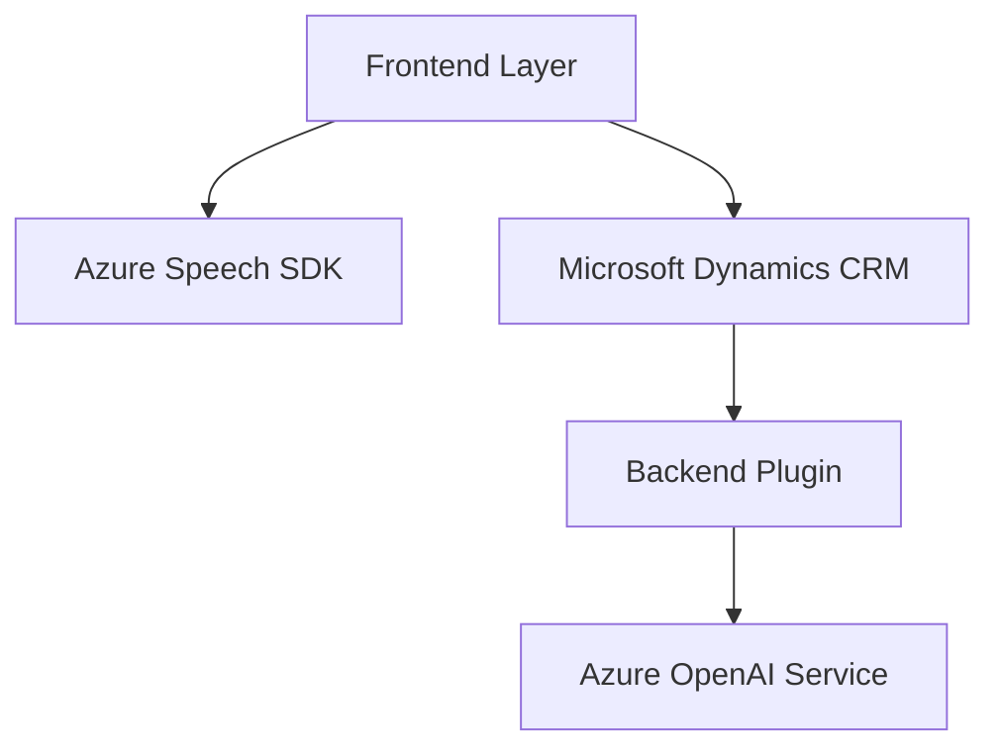

### Breve resumen técnico
El repositorio parece contener archivos orientados a una solución que integra funcionalidades avanzadas de accesibilidad y procesamiento de datos vía voz y texto. Utiliza **Azure Speech SDK** para síntesis y reconocimiento de voz, y **Azure OpenAI Service** para transformación y análisis de texto. Está diseñado específicamente para trabajar dentro de Microsoft Dynamics CRM, lo que permite agregar datos a formularios dinámicamente y enriquecer la experiencia del usuario, utilizando inteligencia artificial y tecnologías basadas en la nube.

### Descripción de arquitectura
Esta solución combina características de una arquitectura **orientada a servicios** (SOA) y **event-driven**. Las piezas están diseñadas para interactuar con servicios externos (Azure SDK y Azure OpenAI) bajo un sistema modular. Su arquitectura consta principalmente de:
1. Un **frontend** compuesto por scripts de JavaScript para la interacción del usuario y el procesamiento dinámico en el navegador.
2. Un **plugin backend** en C# que actúa como middleware entre Microsoft Dynamics CRM y Azure OpenAI, permitiendo la conversión y análisis avanzado de texto.

Se logra una integración fluida entre los servicios y los módulos usando patrones como Observer, Callback y Adapter. La modularización definida sugiere un diseño de n capas.

### Tecnologías usadas
1. **Frontend:**
   - Lenguaje: JavaScript.
   - SDK: **Azure Speech SDK** (synthesis y recognition).
   - Integración: Microsoft Dynamics CRM (basado en Xrm WebApi).
   - Backend API personalizada integrada.

2. **Backend Plugin:**
   - Lenguaje: C#.
   - Frameworks: 
     - Microsoft CRM SDK (`Microsoft.Xrm.Sdk`).
     - JSON Handling: `Newtonsoft.Json.Linq`, `System.Text.Json`.
     - HTTP Client Library: `System.Net.Http` para interacción con Azure OpenAI.
   - Servicios: 
     - **Azure OpenAI** para generación y transformación de texto.
     - Microsoft Dynamics CRM API para obtener y manipular datos del sistema.

3. **Servicios Externos:**
   - **Azure Speech SDK:** Reconocimiento y síntesis de voz.
   - **Azure OpenAI Service:** Procesamiento de lenguaje natural y generación automática de texto.

4. **Patrones principales detectados:**
   - **Observer/Callback:** Manejo de eventos asíncronos en el frontend.
   - **Adapter Pattern:** Uso de plugins para adaptarse entre Dynamics CRM y Azure OpenAI.
   - **Modular Architecture:** División de funcionalidades en módulos especializados.

### Diagrama Mermaid válido para GitHub

### Conclusión final
La solución representa una integración sofisticada de tecnologías de accesibilidad y análisis de datos. Está diseñada específicamente para flujos de trabajo y procesamiento dentro del ecosistema de Microsoft Dynamics CRM. El uso de tecnologías en la nube como **Azure Speech SDK** y **Azure OpenAI Service** facilita la implementación de procesos avanzados como la transcripción de voz y transformación de texto en tiempo real.

Este diseño modular asegura escalabilidad y flexibilidad, mientras utiliza patrones clave como **callback** y **adapter** para garantizar una cohesión entre los diferentes servicios. La elección de una arquitectura de n capas y SOA es adecuada para un sistema empresarial basado en servicios como este.