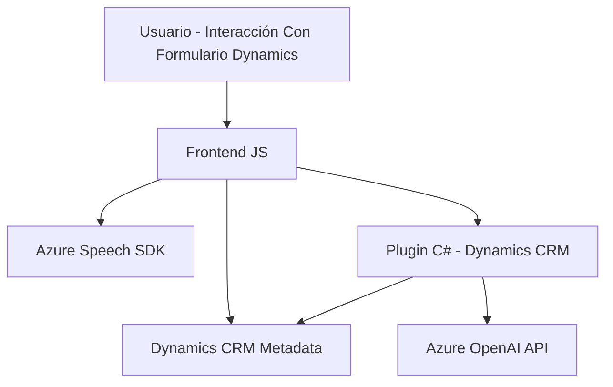

### Breve resumen técnico:
El repositorio contiene principalmente artefactos para un sistema que utiliza Microsoft Dynamics 365 y servicios de Azure, como Azure Speech SDK y Azure OpenAI, para la interacción por voz y transformación de texto. Tres archivos principales se describen:

- **`readForm.js`**: Se encarga de convertir datos de formulario en texto legible y luego sintetizarlo en voz utilizando Azure Speech SDK.
- **`speechForm.js`**: Permite el reconocimiento de voz usando Azure Speech SDK y la entrada de datos en formularios con ayuda de IA.
- **`TransformTextWithAzureAI.cs`**: Plugin de Dynamics CRM que utiliza Azure OpenAI para ejecutar transformaciones de texto basado en normas predefinidas.

### Descripción de arquitectura:
La solución utiliza una arquitectura **modular** y **en capas**, con comunicación directa entre una interfaz de usuario (frontend JavaScript) en Dynamics 365, y dos servicios externos: **Azure Speech SDK** y **Azure OpenAI**. Además, los datos se procesan a nivel de formulario en Dynamics CRM mediante un **plugin de Microsoft SDK**.

- **Módulo frontend**:
  - Responde a eventos del usuario (clics, comandos hablados).
  - Interacción con Dynamics 365 para acceder y operar sobre datos del formulario.
  - Integración principal con Azure Speech SDK.
  
- **Backend (Plugins)**:
  - Responden a eventos del sistema (Dynamics CRM).
  - Realizan procesamiento especializado llamando a servicios externos (Azure OpenAI).
  
### Tecnologías usadas:
1. **Frontend**:
   - JavaScript como lenguaje principal para el desarrollo del script de frontend.
   - **Microsoft Dynamics Form Context API** para interactuar con formularios.
   - **Azure Speech SDK** para la síntesis de voz y reconocimiento de comandos hablados.

2. **Backend**:
   - C# para la implementación del plugin en Microsoft Dynamics CRM.
   - **Microsoft Dynamics CRM SDK** para integrar lógica personalizada con CRM.
   - **Azure OpenAI** para el procesamiento de texto avanzado mediante IA.

3. **Infraestructura en la nube**:
   - Servicios de Azure en roles relacionados a la síntesis de voz y procesamiento inteligente de texto.

### Diagrama Mermaid válido para GitHub:

### Conclusión final:
La solución descrita en los archivos del repositorio implementa una arquitectura **modular y en capas** con elementos de **plugin architecture** y **Service-Oriented Architecture (SOA)**. Utiliza Microsoft Dynamics CRM como la base para almacenamiento y gestión de datos y delega capacidades de voz y procesamiento de texto enriquecido a servicios de Azure como Speech SDK y OpenAI API.

Los componentes están bien definidos con responsabilidades claras:
- **Frontend**: Captura datos de formularios y gestiona interacciones de entrada/salida de voz.
- **Backend Plugins**: Procesan los datos usando servicios externos y actualizan el estado del CRM.
- **Azure Speech SDK y OpenAI API**: Servicios externos para texto a voz y procesamiento avanzado.

Sin poder analizar completamente el negocio, parece orientado a optimizar experiencias de usuario mediante automatización, voice-to-form input, y enriquecimiento de datos vía IA. La arquitectura empleada es una buena solución para este propósito y utiliza una adecuada integración entre tecnologías backend y frontend.