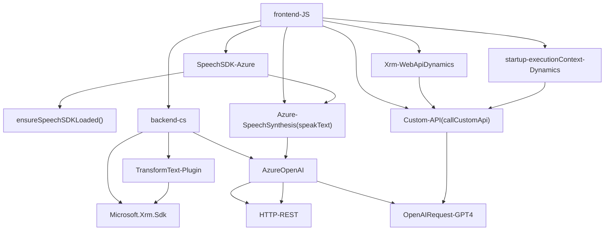

### Breve Resumen Técnico:
El conjunto de archivos del repositorio forma parte de una solución orientada al ecosistema Dynamics 365. Su funcionalidad principal se centra en integrar datos interactivos mediante voz (reconocimiento y síntesis) y capacidades de procesamiento automático utilizando Azure Cognitive Services (Azure Speech y Azure OpenAI). Los componentes están diseñados para extender funcionalidades de Dynamics 365 como plugins y scripts para manejar formularios.

---

### Descripción de Arquitectura:
- **Tipo de solución:** Este repositorio forma parte de un sistema backend integrable con Dynamics 365, que a su vez constituye un entorno CRM. Está compuesto por:
  - Un **frontend** interactivo para formularios (archivos JavaScript).
  - Componentes de procesamiento en el **backend** implementados como plugins de Dynamics CRM (archivo `.cs`).

- **Arquitectura Observada:** N-Capas con extensibilidad hacia microservicios:
  - **Capa presentación:**
    - Archivos de JavaScript que interactúan directamente con los formularios (frontend).
  - **Capa lógica de negocio:**
    - Librerías y plugins integrados con Dynamics CRM (backend) gestionando las reglas de negocio (archivo `.cs`).
  - **Capa de servicios externos:**
    - Integración con servicios SaaS como Azure OpenAI y Azure Speech SDK que actúan como servicios remotos para el procesamiento de voz y datos.

---

### Tecnologías Usadas:
1. **Frontend (JavaScript):**
   - Azure Speech SDK (Cognitive Service).
   - Funciones JavaScript con integración dinámica de formularios (`executionContext`, `Xrm.WebApi`).
   - Uso de ES6+ y APIs asincrónicas.

2. **Backend (C#)**
   - Dynamics CRM SDK (`Microsoft.Xrm.Sdk`, `IPlugin`): Implementación de plugins.
   - Azure OpenAI Endpoint (`HTTP client`): Llamadas REST al modelo GPT.
   - Manejo avanzado de JSON (`Newtonsoft.Json.Linq`, `System.Text.Json`).
   
3. **Servicios externos:**
   - Azure Speech SDK para voz.
   - Azure OpenAI para procesamiento de lenguaje natural y generación de datos detallados.

---

### Dependencias o Componentes Externos:
- **SDKs externos:**
  - Azure Speech SDK: Sintetización y reconocimiento de voz integrada al frontend.
  - CRM SDK (Microsoft Dynamics): Extensiones específicas como `Xrm.WebApi` y manejo de Plugins con `IPluginExecutionContext`.
  
- **Servicios de terceros (PaaS):**
  - Azure OpenAI: Proporciona procesamiento avanzado de texto con GPT.
  - Dynamics APIs: Manejo dinámico de formularios CRM.

---

### Diagrama Mermaid Válido para GitHub (Sintaxis Compatible):

---

### Conclusión Final:
La solución está compuesta por un **frontend de interacción dinámica en Dynamics 365** y un **backend extensible basado en plugins**. Utiliza tecnologías de vanguardia como **Azure Speech SDK** para manejo de voz y **Azure OpenAI (GPT)** para procesamiento avanzado de texto. La arquitectura es una mezcla de **N-Capas** con integración hacia servicios externos (SDKs y APIs) que extensibiliza el entorno CRM. Aunque sólida y modular, existe un riesgo de seguridad si las credenciales (`azureKey`) no están adecuadamente protegidas.