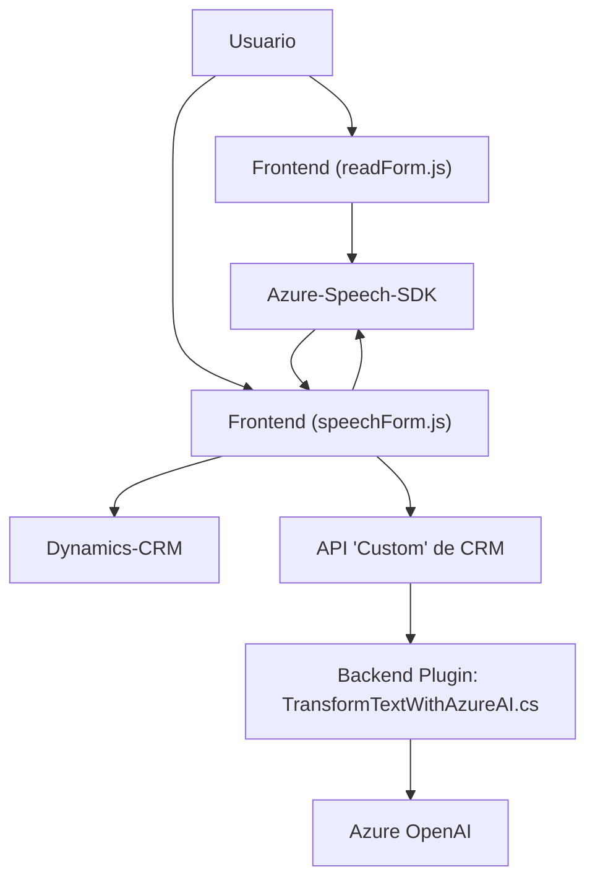

### Breve resumen técnico

Este repositorio representa una solución que integra las capacidades del servicio Azure Speech SDK y Azure OpenAI con Dynamics CRM. Está diseñado principalmente para habilitar funcionalidades de entrada de voz, síntesis de voz y transformación de texto en formato estructurado JSON mediante inteligencia artificial.

---

### Descripción de arquitectura

La solución está formada por dos partes principales:
1. **Frontend**: Implementación en JavaScript para interactuar con los datos del formulario dinámico en Dynamics CRM. Maneja la integración con Azure Speech SDK para entrada y salida de voz (sintetización y reconocimiento).
2. **Backend**: Plugin en C# registrado en Dynamics CRM que utiliza Azure OpenAI para la transformación avanzada de texto.

#### Tipo de arquitectura:
- **Híbrida de capas**:
  - **Frontend**: Representa una capa de presentación moderna que interactúa con servicios externos (Speech SDK y CRM APIs).
  - **Backend**: Implementa una capa de negocio que aplica funciones avanzadas de procesamiento de texto mediante un plugin basado en IA.

#### Patrones:
- **Modularidad funcional**: Cada módulo tiene bien definida su responsabilidad (procesamiento de voz, vinculación con CRM, etc.).
- **Plugin Architecture**: Aplicación de lógica en Dynamics CRM mediante plugins registrados para eventos específicos.
- **Facade Pattern**: Abstracción de servicios externos como Azure Speech y Azure OpenAI usando interfaces del SDK y HTTP APIs.
- **Integration Pattern**: Comunicación eficiente entre sistemas (CRM, Azure SDK, y OpenAI).

---

### Tecnologías usadas

1. **Lenguajes de programación**:
   - JavaScript: Utilizado en los archivos del frontend para manejar la interacción del usuario con el formulario dinámico y la funcionalidad de voz.
   - C#: Usado en el plugin para crear lógica de negocio en Dynamics CRM y realizar las integraciones con Azure OpenAI.

2. **Frameworks y servicios**:
   - Azure Speech SDK: Reconocimiento y síntesis de voz.
   - Azure OpenAI (e.g., GPT-4): Para transformar texto en JSON.
   - Dynamics CRM APIs (`Xrm.WebApi`, `Microsoft.Xrm.Sdk`): Integración con la plataforma CRM.

3. **Libraries**:
   - `System.Net.Http`: Para enviar solicitudes HTTP a servicios externos.
   - `System.Text.Json` y `Newtonsoft.Json`: Para trabajar con JSON.
   - `System.Linq`: Para operaciones de colecciones en C#.

4. **Patterns**:
   - Callback pattern (Frontend).
   - Plugin-based architecture (Backend).

---

### Diagrama Mermaid

---

### Conclusión final

La solución descrita en el repositorio es una integración avanzada entre frontend y backend para trabajar sobre formularios dinámicos en Dynamics CRM. En el frontend, se aprovechan el Azure Speech SDK para sintetizar y reconocer textos, mientras que el backend emplea Azure OpenAI para transformar texto en JSON estructurado mediante un plugin para CRM.

#### Fortalezas:
- **Modularidad**: Cada parte del sistema tiene roles claros.
- **Scalability**: La integración con servicios externos (Azure) permite escalar aplicaciones basadas en IA.
- **Eficiente integración**: Apoyo a Dynamics CRM mediante extensiones especializadas.

#### Mejoras potenciales:
- Considerar implementar una arquitectura completamente orientada a microservicios si las funcionalidades externas crecen y pueden separarse en servicios independientes.
