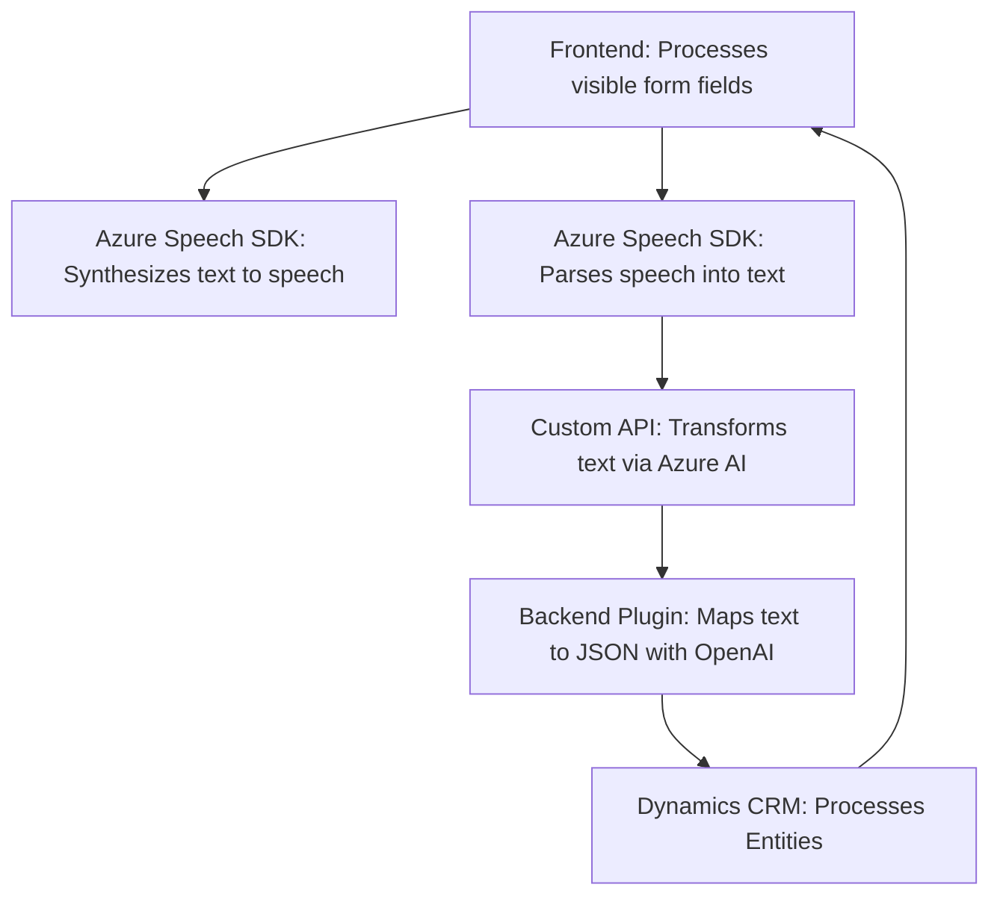

### Breve resumen técnico
El repositorio aborda tres áreas: un frontend en JavaScript orientado a la interacción con formularios y síntesis de voz mediante Azure Speech SDK, otro módulo del frontend para reconocimiento de voz y manipulación de formularios con IA, y un plugin de backend en C# para Microsoft Dynamics CRM que utiliza Azure OpenAI para transformar textos en formato estructurado JSON. Las tecnologías usadas muestran una solución que integra servicios externos como Azure Speech SDK y Azure OpenAI, junto con APIs de Dynamics CRM.

---

### Descripción de arquitectura
La arquitectura es híbrida y orientada a servicios externos. Las siguientes son las características clave:
1. **Modularización con separación de responsabilidades**, donde cada componente maneja una tarea específica (e.g., la síntesis de voz, manipulación de formularios, procesamiento API).
2. **Integración de microservicios**, principalmente con Azure APIs (Speech, OpenAI) y Microsoft Dynamics CRM.
3. **N-capas aplicada parcialmente**, con lógica diferenciada entre frontend, un middleware (API personalizada), y un backend en C# conectado al CRM.
4. **Cliente-Servidor**, el frontend interactúa con servicios y plugins externos para optimizar la transformación y procesamiento de la entrada de datos y la generación de salidas.

---

### Tecnologías usadas
1. **Frontend**:
   - Lenguaje: JavaScript.
   - SDK utilizado: Azure Speech SDK.
   - Programación Reactiva: Callbacks y Promesas.
   - Manipulación de formularios: Integración directa con Microsoft Dynamics REST API.

2. **Backend**:
   - Lenguaje: C#.
   - Runtime: Dynamics CRM Plugin Framework.
   - Librerías: `Microsoft.Xrm.Sdk`, `Newtonsoft.Json.Linq`, `System.Net.Http`.
   - Servicio API externo: Azure OpenAI (GPT model).

3. **Servicios externos**:
   - **Azure Speech SDK**: Para síntesis de voz y reconocimiento.
   - **Azure OpenAI API**: Para transformación avanzada de texto a JSON.
   - **Dynamics CRM API**: Para el manejo avanzado de datos de formularios y entidades.

---

### Diagrama Mermaid

---

### Conclusión final
La solución combina capacidades avanzadas de reconocimiento y síntesis de voz proporcionadas por **Azure Speech SDK**, con inteligencia artificial ofrecida por **Azure OpenAI** para integrar funcionalidades de procesamiento de lenguaje natural en formularios dinámicos de **Microsoft Dynamics CRM**. Su arquitectura es modular, orientada a servicios externos y centrada en la interacción dinámica entre frontend, backend y APIs. Esta estructura facilita la extensibilidad para futuras mejoras y escalabilidad en entornos empresariales.