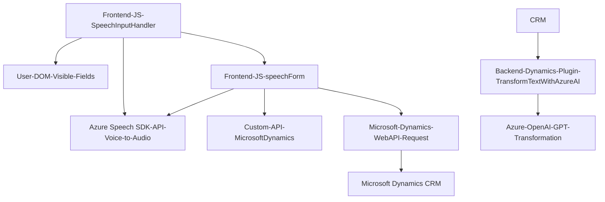

## Breve resumen técnico

El repositorio describe la integración de un sistema de procesamiento de voz y texto en un entorno de formularios asociado a Microsoft Dynamics CRM. Consta de dos principales funcionalidades específicas:

1. Conversión de texto visible en formularios a síntesis de voz utilizando **Azure Speech SDK** (archivo `SpeechInputHandler.js`).
2. Entrada de voz para transcribir y procesar datos dentro de formularios mediante **Azure Speech SDK**, configuraciones predeterminadas, llamadas a APIs personalizadas e interacción con Microsoft Dynamics 365 Web API (archivo `speechForm.js`).
3. Transformación de texto en formato JSON estructurado en un plugin de Dynamics 365 utilizando **Azure OpenAI**.

---

## Descripción de arquitectura

La solución es una integración de un **frontend** basado en JavaScript que interactúa con formularios en Dynamics 365, junto con un backend basado en .NET que proporciona la capacidad de utilizar **Azure OpenAI** para análisis y transformación de texto. La arquitectura se puede clasificar como una **arquitectura n capas distribuida** que utiliza componentes como:

### **Componentes principales:**
1. **Frontend JS Module:**
   - Maneja la interacción con los formularios (captura de datos visuales, procesos de entrada de voz, síntesis de texto visible en voz).
   - Integra directamente servicios de Azure, como el **Speech SDK**, y utiliza patrones de integración como **callbacks** y **facade**.

2. **Backend CRM Plugin:**
   - Funciona como un microservicio que extiende Dynamics 365.
   - Consume servicios externos como **Azure OpenAI** para procesamiento de texto.

3. **Externo (Azure Services):**
   - **Azure Speech SDK** utilizado para la síntesis y reconocimiento de voz.
   - **Azure OpenAI** usado por el plugin para transformar texto en JSON estructurado.

---

## Tecnologías usadas

1. **JavaScript** y su interacción directa con el DOM para la gestión de formularios en el frontend.
2. **Microsoft Dynamics 365 API**:
   - Web API para comunicación entre datos del formulario y servicios externos.
   - Plugin `IPlugin` de Dynamics CRM para lógica personalizada.
3. **Azure Speech SDK**:
   - Utilizado para modelar la interacción de voz en el navegador.
   - Carga dinámica de scripts desde la URL proporcionada.
4. **Azure OpenAI API**:
   - Para procesamiento y transformación de texto en el backend.
   - Comunicación mediante solicitudes HTTP y manipulación de JSON.
5. **Frameworks .NET** utilizados para crear el plugin de Dynamics 365 y trabajar con APIs.

---

## Diagrama Mermaid válido para GitHub Markdown

A continuación se presenta un diagrama en formato Mermaid que representa la interacción de los componentes.

---

## Conclusión final

La solución ofrecida es una integración compleja compuesta por un frontend basado en JavaScript para formularios dinámicos en Microsoft Dynamics CRM, junto con un backend que aprovecha Azure OpenAI para transformar texto. La arquitectura es un ejemplo de **n capas distribuida** donde cada capa delega tareas específicas a otros módulos o servicios.

### Ventajas:
- Uso de servicios de **Azure** (Speech SDK, OpenAI) que simplifican tareas complejas como reconocimiento y síntesis de voz.
- Modularidad en las funciones individuales en los archivos JS y en la lógica aislada del plugin CRM.

### Desventajas:
- Existe una dependencia elevada en servicios externos (Azure Speech/ OpenAI), lo que podría impactar costos y disponibilidad.
- El manejo de errores podría mejorarse, especialmente en casos de fallos de conexión con los servicios externos. 

Las tecnologías implementadas (Azure SDK, Dynamics CRM APIs y OpenAI) aseguran escalabilidad y flexibilidad técnica. Sin embargo, se necesita precaución en la configuración adecuada de las claves de acceso y datos sensibles para evitar vulnerabilidades de seguridad.