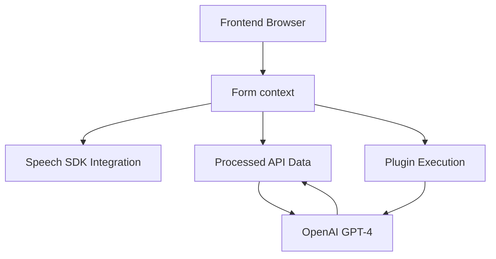

### Breve Resumen Técnico
El repositorio describe componentes diseñados para interactuar con formularios y servicios empresariales en Dynamics 365, con capacidades de reconocimiento de voz, síntesis de texto a voz y procesamiento de texto mediante APIs de Microsoft Azure. Los archivos presentados incluyen código JavaScript para el frontend y un plugin en C# que utiliza **Azure OpenAI GPT-4** para procesamiento avanzado de texto.

---

### Descripción de Arquitectura
La solución se basa en una arquitectura híbrida que combina interacción local (en navegador) y servicios en la nube (Azure API). La arquitectura sigue un diseño de **n capas**:
1. **Presentación/UI**: Archivos `readForm.js` y `speechForm.js` manejan la interfaz (formulario) en Dynamics CRM y las interacciones de voz y texto.
2. **Lógica de Aplicación**: Contiene procesamiento local (extracción y validación de datos del formulario) y llamadas externas al SDK de Azure Speech u OpenAI API (plugin `TransformTextWithAzureAI.cs`).
3. **Servicios Externos (Azure)**: Los datos son procesados por redes neuronales de Azure Speech SDK y el modelo GPT-4 de OpenAI. Esto representa una dependencia clara de estos servicios externos para realizar el procesamiento de audio y texto.

---

### Tecnologías y Frameworks Usados
#### **1. Frontend (JavaScript)**
- **Azure Speech SDK**: Para síntesis de voz (text-to-speech) y reconocimiento de voz (speech-to-text).
- **Dynamics CRM SDK (Xrm.WebApi)**: Obtención y manipulación de datos en formularios empresariales.
- **Promesas y async/await**: Para manejar tareas asíncronas y llamadas remotas.

#### **2. Backend (Plugin en C#)**
- **Azure OpenAI GPT-4**: Procesamiento avanzado de texto (transformaciones vía AI).
- **Microsoft CRM SDK**: Extensión del entorno Dynamics CRM con lógica personalizada mediante plugins.
- **System.Net.Http**: Para realizar solicitudes REST hacia APIs externas.
- **JSON Manipulation**: Via Newtonsoft.Json y System.Text.Json.

---

### Dependencias o Componentes Externos
1. **SDKs de Azure**:
   - Azure Speech SDK para text-to-speech y speech-to-text.
   - Azure OpenAI GPT-4 API para transformación de texto.
2. **Microsoft Dynamics CRM**:
   - Extensibilidad vía Plugins y Web API para interacción con formularios.
3. **Browsers (Frontend)**:
   - Ejecución del JavaScript para reconocimiento de voz y síntesis en vistas de Dynamics CRM.
4. **Servicio HTTP REST**:
   - Integración con la API de Azure OpenAI para transformar texto en JSON estructurado.

---

### Diagrama Mermaid

---

### Conclusión Final
La solución implementada refleja una **n capas híbrida** que combina:
1. **Frontend modular** para manejo de interfaces y servicios de Azure SDK.
2. **Back-end extendido** vía plugins para integrar procesamiento avanzado en Dynamics CRM.
3. Una clara dependencia hacia servicios externos (Azure Speech SDK y OpenAI) para ejecutar tareas de inteligencia artificial sobre texto y voz.
La integración de APIs como OpenAI y Azure refuerza la importancia del desacoplamiento y la reutilización de servicios externos en los sistemas empresariales modernos. Este diseño resulta adecuado para entornos empresariales y aplicaciones que requieren automatización y capacidades avanzadas de IA.