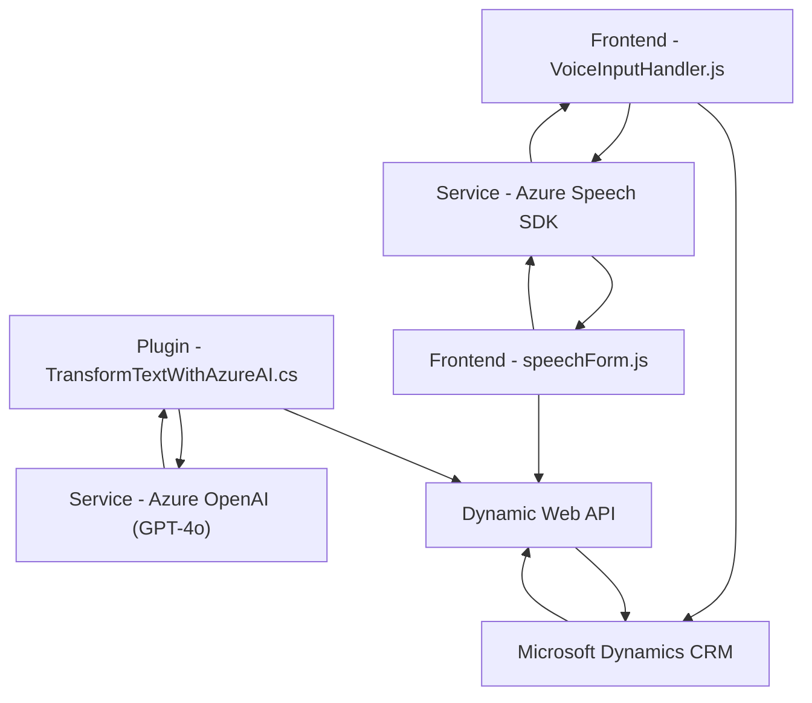

### Breve resumen técnico

El repositorio contiene distintos componentes que implementan una solución para la interacción y automatización de formularios en plataformas como **Microsoft Dynamics CRM**, aprovechando servicios de **Azure AI** (Azure Speech SDK y Azure OpenAI). El sistema está compuesto por:

1. **Frontend**: Para la lectura y transcripción de datos en formularios mediante voz (archivos en `FRONTEND/JS`).
2. **Backend/Plugin**: Para transformar texto con reglas específicas mediante Azure OpenAI dentro de Dynamics CRM (`Plugins/TransformTextWithAzureAI.cs`).

---

### Descripción de arquitectura

La solución utiliza una **arquitectura distribuida basada en consumo de servicios externos**. A nivel técnico, puede clasificarse como una arquitectura de **n-capas**, donde:
- El **frontend (Javascript)** procesa información (voz, texto) localmente y utiliza servicios de Azure para síntesis y reconocimiento de voz.
- El **backend/plugin** (C# .NET dentro de Dynamics 365) se comunica con **Azure OpenAI** para aplicar procesamiento inteligente a los textos.

El uso de SDKs como **Azure Speech** en el frontend y la integración directa con APIs (Dynamics Web API y Azure OpenAI) en el backend indica un diseño modular, siguiendo principios como:
1. **Modular layers**: Frontend y backend gestionan tareas separadas.
2. **SDK-driven architecture**: Dependencias de SDKs enriquecen las capacidades técnicas.
3. **Service consumption**: El consumo de APIs estándar de Azure y Dynamics sugiere interoperabilidad entre servicios.

---

### Tecnologías usadas

#### Frontend:
- **JavaScript**
- **Azure Speech SDK**: Para síntesis y transcripción de voz.
- **Browser APIs**: Para manipulación del DOM y elementos dinámicos.

#### Backend / Plugin:
- **C# .NET Framework**: Para implementar la lógica del plugin.
- **Microsoft Dynamics CRM SDK**: Para integraciones nativas con Dynamics CRM.
- **Azure OpenAI (GPT-4)**: Para transformar texto siguiendo normas específicas.
- **Newtonsoft.Json / System.Text.Json**: Librerías para procesar elementos JSON.

#### Dependencias Externas:
- **Speech SDK para navegador**: `window.SpeechSDK`.
- **Dynamic Web API**: Para manipulación de datos en CRM.
- **HTTP Client**: Para llamadas al endpoint de Azure OpenAI.

---

### Diagrama Mermaid válido para GitHub

---

### Conclusión final

Este repositorio representa una solución orientada a automatizar el flujo de interacción y procesamiento de formularios mediante servicios de voz y API personalizados en entornos **Microsoft Dynamics CRM**. La arquitectura, aunque distribuida, sigue una lógica de **n-capas**, separando procesamiento frontend y backend. El principal valor agregado es la integración de servicios de nube como **Azure Speech** y **Azure OpenAI**, lo que habilita accesibilidad (voz) y automatización avanzada (IA). 

El diseño general es sólido en su modularidad y aprovechamiento de tecnologías líderes, pero podría beneficiarse de mayor encapsulación para el manejo de errores y gestión de dependencias.