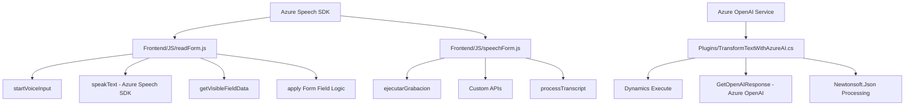

### Breve Resumen Técnico
Este repositorio consiste en módulos de software diseñados para integrar tecnologías de reconocimiento de voz, procesamiento de formularios dinámicos y conversión de texto con APIs externas (Azure Speech SDK y Azure OpenAI). Se enfocan en mejorar la interacción entre usuarios y Dynamics 365 mediante comandos de voz y automatización basada en IA.

### Descripción de Arquitectura
La arquitectura es **modular**, centrada en una combinación de frontend basado en JavaScript y plugins backend sobre Dynamics CRM. Utiliza APIs externas (Azure Speech SDK y Azure OpenAI) para enriquecer la funcionalidad de entradas de voz y procesamiento de texto. Aunque los módulos están organizados, el diseño general sigue una estructura **n-capas**:
1. **Frontend Layer (UI)**: Interfaces para entrada de voz y manejo dinámico de formularios.
2. **Backend Layer (Plugins)**: Plugins que procesan texto y lo integran al sistema CRM.
3. **Integration Layer**: Consumidores de servicios externos (Azure APIs y Custom APIs).

### Tecnologías Usadas
1. **Frontend (JS)**:
   - **Azure Speech SDK**: Comercial para reconocimiento de voz, síntesis de texto y voz.
   - DOM Manipulation: para generación dinámica de scripts y contenido.
   - JavaScript Promises: Gestión de respuestas asíncronas.
   - Xrm.WebApi: Interacción con CRUD y datos de Dynamics 365.
2. **Backend (C#)**:
   - **Microsoft.Xrm.Sdk**: Extensión para plugins Dynamics 365.
   - **Azure OpenAI Service**: Modelo GPT para procesamiento estructurado de texto.
   - **Newtonsoft.Json** y **System.Text.Json**: Manejo extensivo de JSON.
   - **HTTPClient**: Integración a servicios REST externos.

### Dependencias y Componentes Externos
- **Azure Speech SDK**: Reconocimiento de voz y Text-to-Speech.
- **Azure OpenAI API**: Generación y transformación de texto estructurado.
- **Dynamics CRM SDK (Microsoft.Xrm.Sdk)**: Para manipular contexto CRM.
- **Custom APIs**: Probable existencia de endpoints definidos por el usuario para gestionar datos específicos del formulario.

### Diagrama Mermaid (GitHub Markdown Compatible)

### Conclusión Final
El repositorio presenta una solución diseñada para integrarse con Dynamics 365 y enriquecerse con modernas capacidades de voz e inteligencia artificial proporcionadas por servicios de Azure. Aunque modular en el diseño, sigue una estructura básica de **n-capas**: frontend para la interacción del usuario, backend para la lógica de negocio y una capa intermedia de integración con APIs externas. Es una implementación sólida para soluciones empresariales de automatización e interfaces mejoradas.