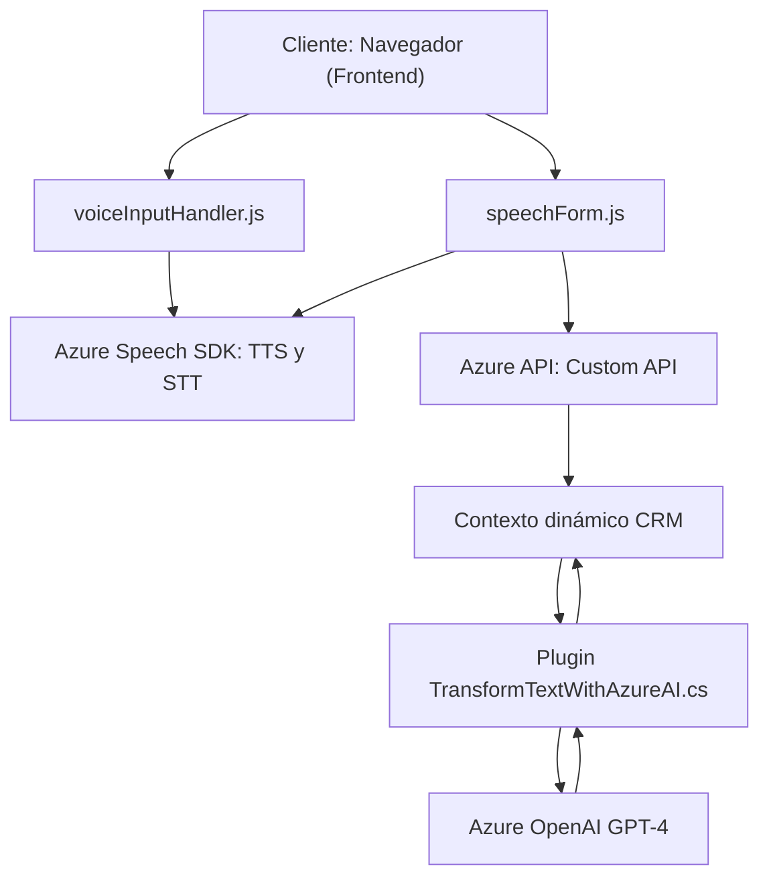

### Breve resumen técnico

Los archivos del repositorio muestran una solución que integra capacidades de inteligencia artificial con síntesis y reconocimiento de voz mediante el uso de *Azure Speech SDK* y *Azure OpenAI API*. La implementación está orientada a mejorar la interacción de usuarios en formularios dentro de un CRM como Dynamics 365 mediante procesamiento de texto a voz (TTS), reconocimiento de voz (STT), y transformación avanzada de texto en formato JSON.

---

### Descripción de arquitectura

La arquitectura utiliza una combinación de componentes distribuidos:
1. **Frontend**: Los archivos JavaScript (`voiceInputHandler.js` y `speechForm.js`) son parte del sistema para sintetizar voz y reconocimiento de entrada hablada. La arquitectura es de *n capas* en el frontend debido a la separación en módulos que gestionan lógica de negocios, interacciones con SDKs y operaciones en formularios.
   
2. **Integración con CRM**: El archivo `TransformTextWithAzureAI.cs` actúa como un *plugin* de Dynamics CRM, que se activa en base a eventos del sistema para conectarse con Azure OpenAI API y realizar la transformación de texto. Esto corresponde al patrón **event-driven architecture** (EDA).

3. **Integración de servicios externos**: La arquitectura general incluye integración con servicios de Azure como Speech SDK y OpenAI API. Esto apunta hacia una **arquitectura de microservicios basada en API**. Si bien no se evidencia un sistema completo, el diseño modular y orientado a servicios refleja principios de microservicios y arquitectura de nube.

---

### Tecnologías usadas

- **Frontend:**
  - Lenguaje: JavaScript.
  - SDKs: Azure Speech SDK (para TTS y STT).
  - Framework CRM: Dynamics 365 (probable, soportado por los métodos de integración del CRM como `Xrm.WebApi`).

- **Backend Plugin:**
  - Lenguaje: C#.
  - Frameworks/bibliotecas:
    - Microsoft Dynamics CRM SDK: Para implementar lógica personalizada en eventos (IPlugin interface).
    - System.Net.Http: Para realizar solicitudes HTTP hacia APIs externas.
    - JSON: Serialización de datos con `System.Text.Json`.
  - Servicio externo:
    - Azure OpenAI API para transformación avanzada de texto.

- **Patrones:**
  - Modularidad: Separación entre funciones específicas en JavaScript y lógica de negocio en el plugin C#. 
  - Data Mapper: Para asociar nombres de campos del formulario con datos transcritos.
  - Event-driven architecture: Uso del plugin para interceptar eventos del CRM.
  - Servicio REST externo: Integración directa con endpoints de Azure (TTS, STT y OpenAI).

---

### Diagrama Mermaid válido para GitHub

---

### Conclusión final

La solución implementa una arquitectura basada en eventos (event-driven) y *n-capas*, con integración de APIs de terceros que implementan servicios de inteligencia artificial avanzados. Resaltan dos módulos clave:
1. Un **frontend**, orientado a la interacción natural mediante voz y datos de formularios en CRM.
2. Un **plugin de backend**, diseñado para transformar texto y delegar la lógica de negocio a servicios externos (Azure OpenAI).

El diseño presenta una buena separación de preocupaciones y usa modularidad y patrones modernos, como el mapeo de datos y manejo asíncrono. No obstante, planteo una recomendación de mejora en la gestión de claves y configuración, que actualmente podría comprometer la seguridad. También sería útil considerar una estrategia más robusta para el manejo de errores y excepciones en la integración con servicios externos.