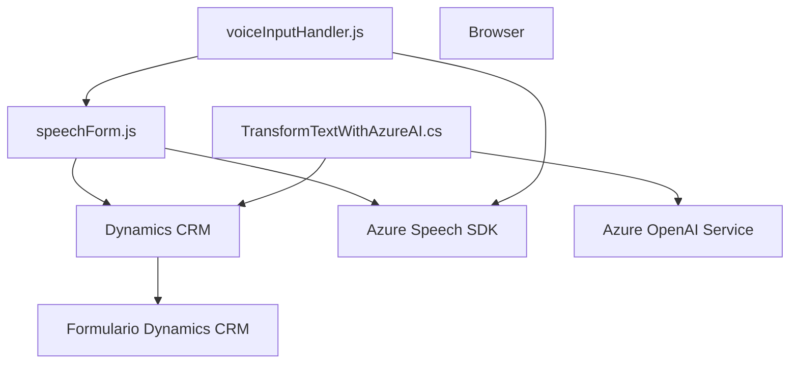

### Breve resumen técnico:
El repositorio contiene tres archivos clave que trabajan en conjunto para integrar capacidades avanzadas de interacción de voz y transformación de texto en sistemas como Microsoft Dynamics CRM. Utiliza múltiples tecnologías y servicios, incluido Azure Speech SDK y Azure OpenAI, para habilitar funcionalidades como entrada de voz, síntesis de texto y transformación basada en inteligencia artificial.

---

### Descripción de arquitectura:
La solución sigue una **arquitectura n-capas híbrida**, donde cada componente tiene un rol específico:
1. **Frontend (JS)**:
   - Implementa interacción de voz con el usuario, utilizando Azure Speech SDK para transformar datos en voz y reconoce entrada de voz.
   - Funcionalidad principal: Usar SDKs externos para integrar capacidades de asistente de voz y vincularlo a formularios en Dynamics CRM.

2. **Backend plugins (TransformTextWithAzureAI.cs)**:
   - Implementa un plugin basado en Dynamics CRM para transformar el texto resultante usando el modelo GPT de Azure OpenAI.
   - Funcionalidad principal: Tomar el texto del cliente e integrarlo en flujos CRM aplicando reglas específicas de procesamiento.

3. **Integración vía APIs**:
   - El procesamiento vocal y la transformación de texto se conectan mediante APIs de Azure para generar resultados usando IA, como JSON estructurado.

La arquitectura muestra separación de responsabilidades con comunicación orientada a servicios, integraciones dinámicas y soporte para SDKs externos. Es una mezcla entre un monolito extendido (debido al uso de plugins) y servicios externos.

---

### Tecnologías usadas:
1. **Frontend (JavaScript)**:
   - **Azure Speech SDK**: Para síntesis de voz y reconocimiento de voz.
   - **Dynamics 365 Web API**: Para mapeo y actualización de datos en el formulario.
   - **Browser API**: Lazy loading del Speech SDK.

2. **Backend (C#)**:
   - **Azure OpenAI Service**: Para transformación avanzada de texto.
   - **Newtonsoft.Json**: Manipulación JSON.
   - **Dynamics CRM Plugin Framework**: Extensión personalizada al comportamiento de Dynamics CRM.

3. **Patrones y paradigmas**:
   - Lazy Loading: Carga dinámica de scripts.
   - Delegación por contexto: Utiliza `executionContext` para enviar/recibir datos en el formulario.
   - External Service Integration: Comunicación con APIs de Azure.
   - Plugin Design Pattern: Arquitectura desacoplada de extensiones en CRM.
   - Modularización: Separación clara de lógica entre reconocimiento de voz y transformación de texto.

---

### Diagramas **Mermaid** válidos para GitHub:

---

### Conclusión final:
La solución está diseñada para mejorar la interacción entre usuarios y sistemas CRM mediante capacidades avanzadas de voz e IA. El repositorio utiliza tecnologías modernas desarrollando en una arquitectura híbrida basada en n-capas y servicios externos. Aunque muestra patrones integrados como Lazy Loading y Plugin Design Pattern, es una solución compleja que depende en gran medida de servicios externos (Azure SDK y Dynamics CRM). Esto lo hace potente, pero también vincula su escalabilidad y adaptabilidad al ecosistema Azure y Dynamics.