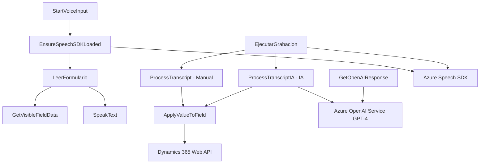

### Breve resumen técnico
Se describe una solución modular para la integración de reconocimiento de voz, síntesis de voz y procesamiento de datos de formularios en aplicaciones basadas en Microsoft Dynamics 365, utilizando servicios de Azure como el Speech SDK y el OpenAI Service. Esta solución presenta una arquitectura orientada a eventos y modular, complementada con un plugin para el CRM que realiza transformaciones de texto mediante IA.

---

### Descripción de arquitectura
Basado en los archivos del repositorio:
1. **Frontend (JS)**:
   - Integración con Azure Speech SDK para reconocimiento y síntesis de voz. Modularización evidente en funciones individuales, que interactúan con formularios de Dynamics 365.
   - Uso de manipulación de datos en contextos de formularios, con mapeo de atributos y etiquetas de campos.
   - Gestión dinámica de dependencias con integración de SDKs externos.

2. **Plugin Backend (.NET)**:
   - Desarrollado en C# para Dynamics CRM, empleando la interfaz `IPlugin`.
   - Lógica encapsulada para transformar texto en JSON estructurado mediante Azure OpenAI Service.
   - Comunicación asincrónica mediante solicitudes HTTP con servicios externos.

El sistema refleja una arquitectura modular con separación de responsabilidades. Aunque la solución no aplica completamente patrones como la arquitectura hexagonal o microservicios, sí utiliza patrones de n-capas y maneja modularización en la interacción con servicios externos.

---

### Tecnologías usadas
1. **Frontend (JS)**:
   - **Azure Speech SDK**: Para la síntesis y reconocimiento de voz.
   - **Dynamics 365 Web API `Xrm.WebApi.online.execute`**: Usado para interactuar con los datos del CRM.
   - **JavaScript ES6+**: Lógicas procesadas de manera modular con soporte para asíncronía.
   
2. **Plugin Backend (.NET)**:
   - **Azure OpenAI Service**: Utilizado para transformaciones avanzadas de texto.
   - **C# (.NET Framework)**:
     - Interfaz `IPlugin` para extensibilidad en Dynamics CRM.
     - Clases y métodos para integración con Microsoft Dynamics SDK.
   - **Libraries**: `Newtonsoft.Json` y `System.Net.Http` para manejo de JSON y comunicación HTTP.

---

### Diagrama Mermaid

---

### Conclusión final
El análisis del repositorio revela una integración avanzada entre la capa de presentación (Frontend) y la lógica de negocio (Backend) en una solución CRM dinámica (Dynamics 365). En el frontend, se destacan capacidades como reconocimiento y síntesis de voz mediante Azure Speech SDK, todo integrado en funcionalidades modulares y reutilizables. En el backend, se utiliza un plugin basado en C# que extiende las funcionalidades del CRM al procesar texto dinámico utilizando inteligencia artificial con Azure AI.

La arquitectura combina características de separación por capas (logic, integration with external services) con patrones de modularización. Sin embargo, es una solución más cercana a un monolito segmentado que a una arquitectura de microservicios o hexagonal. Es ideal para aplicaciones internas con extensibilidad limitada y una necesidad de procesamiento avanzado basado en AI.