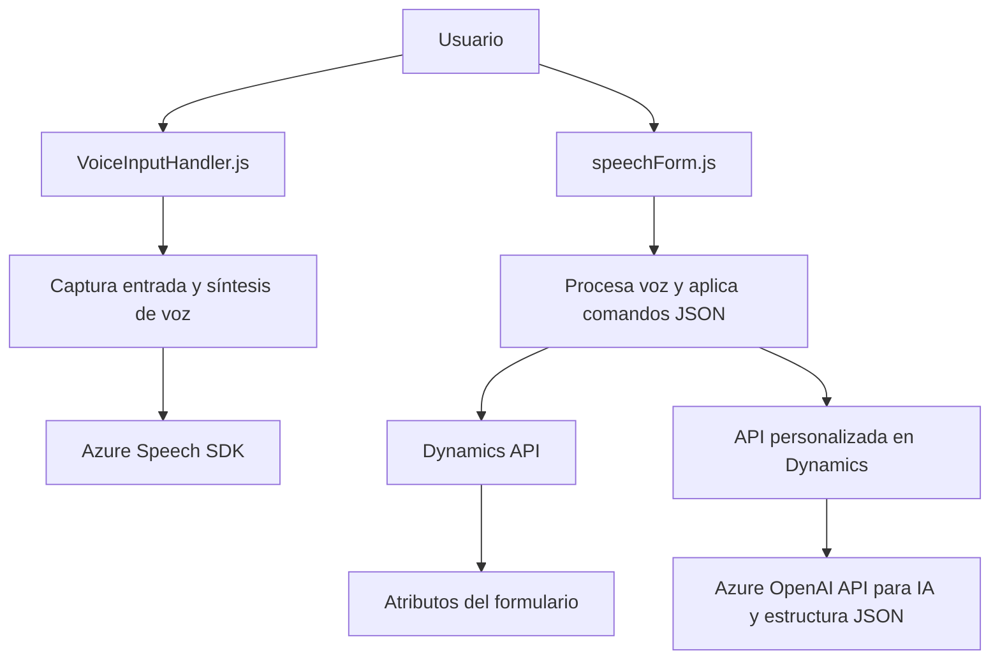

### Breve resumen técnico

El repositorio analiza e implementa tres elementos claves para una solución de entrada de voz y síntesis de texto con el uso de Azure Speech SDK y Azure OpenAI. La solución mezcla procesamiento de datos en el cliente y servidor:

1. **Frontend:** Formado por archivos JavaScript que implementan entrada de voz, obtención de datos de formularios visibles y envío/formateo de información hacia el backend.
2. **Plugins:** Con extensiones del modelo de Dynamics CRM para procesar datos con Azure OpenAI API y modificar la lógica del CRM.
   
Esta estructura indica una aplicación híbrida, donde interactúan el cliente, un servicio Dynamics 365, y servicios externos.

---

### Descripción de arquitectura

La arquitectura es **cliente-servidor** y presenta componentes modularizados, con puntos específicos que se integran a través de APIs y SDKs externas. El frontend interactúa directamente con usuarios para capturar voz y manipular datos de los formularios. Por otro lado, el backend extiende la lógica de negocio en la plataforma de Dynamics CRM usando plugins personalizados. La interacción con Azure services implementa el diseño de **microservicios**, ya que encapsula funciones específicas (como síntesis de texto y transformación) en servicios independientes consumidos mediante API.

El uso de procesos bien definidos en el cliente y del plugin en Dynamics CRM puede alinearse con principios de la arquitectura **hexagonal**, ya que se definen capas funcionales separadas y los servicios de terceros son tratados como puertos externos independientes.

---

### Tecnologías usadas

- **Frontend:**
  - **Lenguajes:** JavaScript/HTML.
  - **Dependency:** Azure Speech SDK.
  - **Frameworks:** Dynamics CRM (formContext, executionContext).
  - **Patterns:** Lazy Loading, Modular Design.

- **Backend Plugin (Dynamics CRM):**
  - **Language:** C#.
  - **Frameworks:**
    - Microsoft Dynamics: SDK para interacción con la plataforma.
    - Azure OpenAI API: transformación de texto.
  - **Libraries:** JSON handling (System.Text.Json, Newtonsoft.Json.Linq), HTTP clients for API calls.
  - **Patterns:** Plugin Design, Service Wrapper, Single Responsibility Principle.

---

### Diagrama Mermaid válido para GitHub

---

### Conclusión final:

1. **Tipo de solución:** La solución es una integración de múltiples componentes enfocada en el ingreso y síntesis de voz para un sistema CRM, que incluye un frontend modular y un plugin con interacciones back-end.
2. **Arquitectura utilizada:** Modelo híbrido cliente-servidor con características de arquitectura hexagonal y patrones de microservicio en la integración de las API externas para síntesis y procesamiento avanzado de texto.
3. **Generalidad del diseño modular y extensible:** Las implementaciones están bien diseñadas para reutilización. A futuro, la estructura puede ampliarse para soportar más plataformas de entrada de datos o servicios de voz/IA diferentes, gracias al desacoplamiento de las dependencias externas en forma de SDK y plugins separados.

Es muy probable que cualquier implementación adicional siga alineada con los patrones actuales para mantener modularidad y escalabilidad en esta solución basada en Microsoft Dynamics y servicios de Azure.