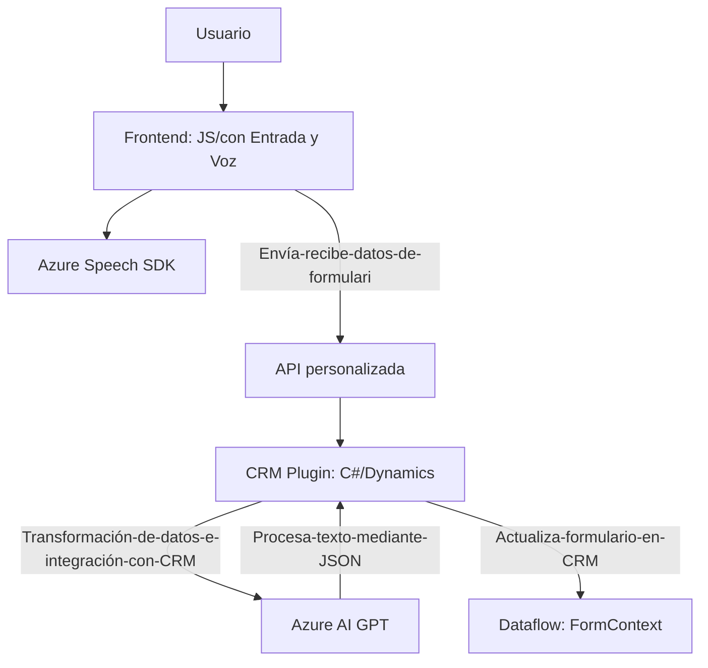

### Breve resumen técnico

El repositorio parece ser parte de una solución integrada que combina varias tecnologías con el objetivo de proporcionar capacidades avanzadas de interacción con formularios, reconocimiento de voz y análisis de texto. Utiliza el **Azure Speech SDK**, **Dynamics CRM**, y **Azure OpenAI GPT** para implementar funcionalidades en un ecosistema orientado al frontend y backend.

---

### Descripción de arquitectura

#### Tipo de solución:
Este sistema combina múltiples componentes:
- **Frontend JavaScript** para interacción con formularios y síntesis/reconocimiento de voz, utilizando SDKs externos.
- **Plugin en .NET** para procesamiento avanzado de texto basado en inteligencia artificial.
- **Integración backend** con Dynamics CRM y APIs personalizadas para extender la funcionalidad estándar hacia capacidades de procesamiento automatizado y reconocimiento semántico.

#### Arquitectura:
La arquitectura combina **patrones en múltiples capas**:
- **Frontend:** Funciones utilitarias distribuidas para manejar eventos, transformaciones de los formularios y la interacción con el **Azure Speech SDK**.
- **Backend (Plugin en Dynamics CRM):** Basado en .NET y diseñado como Plugins que implementan lógica específica al interactuar con entidades de CRM y servicios externos mediante **API adaptador**. Integra capacidades de Azure OpenAI.
- **Estilo modular:** Cada capa establece una responsabilidad clara, siguiendo principios de arquitectura distribuida. Sin embargo, no es estricto en patrones como hexagonal o microservicios.

---

### Tecnologías usadas

- **Frontend:**
  - **JavaScript básico**: Para manipulación del DOM y conectividad con SDKs.
  - **Azure Speech SDK**: Para síntesis y reconocimiento de voz con capacidades de carga dinámica de scripts.
  
- **Backend (Plugins):**
  - **.NET Framework/C#:**
    - `IPlugin` de Dynamics CRM para integrar lógica personalizada al ERP.
    - `Newtonsoft.Json` y `System.Text.Json` para el procesamiento de datos estructurados.
    - Integración REST con **Azure OpenAI API** (GPT) para generación y estructuración textual avanzada.

- **Apis y herramientas externas:**
  - **Azure Speech SDK:** Procesar voz, realizar síntesis y reconocimiento.
  - **Azure OpenAI (GPT):** Transformar texto en JSON estructurado.
  - **Microsoft Dynamics CRM SDK:** Manipulación de datos y flujo dentro del entorno CRM.

---

### Diagrama Mermaid para GitHub Markdown

A continuación, se incluye un diagrama de flujo básico que representa los principales componentes y cómo interactúan entre sí en este sistema:

---

### Conclusión final:

Esta solución combina frontend utilitario, integración de SDKs externos y lógica backend para extender las capacidades de Dynamics CRM con elementos avanzados de IA y procesamiento de voz. Aunque no utiliza un marco de arquitectura avanzado como microservicios o diseño hexagonal, la solución aplica elementos funcionales distribuidos para mantener modularidad y flexibilidad. Es altamente dependiente de Azure Speech SDK, Azure OpenAI, y Dynamics CRM.