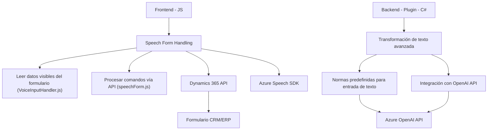

### Breve resumen técnico
El repositorio parece estar diseñado para una solución CRM/ERP basada en Dynamics 365, que integra funcionalidades de entrada por voz y procesamiento avanzado de texto con Azure AI y Azure Speech SDK. Incluye un **frontend** escrito en JavaScript y un **plugin backend** en C#, ambos enfocados en la interacción con los formularios del sistema y datos del usuario.

---

### **Descripción de arquitectura**
1. **Frontend**:
   - Modular y desacoplado, centrado en extender las capacidades de los formularios de Dynamics 365 con entrada y salida de voz.
   - Usa principios de asincronismo y servicios externos (Azure Speech SDK) para integrar reconocimiento y síntesis de voz.

2. **Backend (Plugin)**:
   - Plugin basado en la arquitectura de extensibilidad de Dynamics 365 (`IPlugin`), que actúa como proxy para interactuar con Azure OpenAI.
   - Define operaciones específicas mediante servicios HTTP orientados a transformar texto proporcionado por el usuario.

3. **Arquitectura general**:
   - **Modular en n capas**, donde el frontend y el backend tienen responsabilidades separadas:
     - **Frontend:** Interacción con el usuario y SDKs externos.
     - **Backend:** Procesamiento avanzado y transformaciones con IA.
   - **Integración con microservicios:** Representada por APIs externas como Azure OpenAI y Azure Speech SDK.

---

### **Tecnologías utilizadas**
1. **Frontend**:
   - **JavaScript** para lógica en el navegador.
   - **Azure Speech SDK** para reconocer y sintetizar voz.
   - **API personalizada** de Dynamics 365 (`Xrm.WebApi.online.execute`) para operar en el sistema CRM.

2. **Backend (Plugin)**:
   - **C# (.NET)** para desarrollo del plugin.
   - **Azure OpenAI API** para procesamiento de texto.
   - **Dynamics 365 SDK** para integración con el sistema CRM.

3. **Patrones aplicados**:
   - **Modularidad**: Separación de responsabilidades por función.
   - **Asincronismo**: Uso de promesas y callbacks.
   - **Event-driven**: Reconocimiento de eventos y llamadas basadas en acciones del usuario.
   - **Proxy Pattern**: Uso del plugin para conectarse con APIs externas.

---

### **Diagrama Mermaid válido para GitHub**

---

### Conclusión final
Este repositorio ofrece una solución extendida para un sistema CRM basado en Dynamics 365 que integra entrada por voz y capacidades de inteligencia artificial mediante conexiones a Azure Speech SDK y Azure OpenAI. La arquitectura modular en n capas separa las responsabilidades entre frontend y backend, y combina principios de diseño modernos como asincronismo, integración de servicios externos y extensibilidad. La solución tiene un diseño sólido que permite una fácil escalabilidad y adaptabilidad a implementaciones futuras.