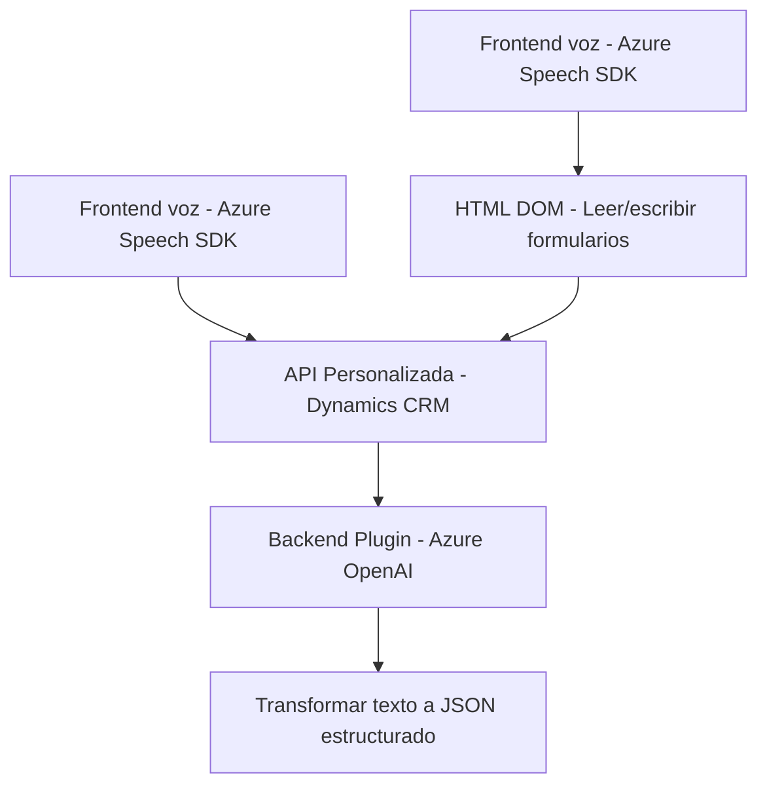

### Breve Resumen Técnico

El repositorio analiza funcionalidad para integrar y procesar interacción mediante voz y texto en formularios dinámicos de un sistema CRM como Dynamics, empleando tecnologías como Azure Speech SDK y Azure OpenAI.

---

### Descripción de la Arquitectura

La solución está dividida en dos componentes principales:  
1. **Frontend (JavaScript)**: Usa funciones encapsuladas para manejar síntesis y reconocimiento de voz mediante Azure Speech SDK. Este componente interactúa con formularios HTML y APIs externas.  
2. **Backend (Plugin en C#)**: Implementa lógica para interactuar con Dynamics CRM y procesar texto utilizando la API de Azure OpenAI, siguiendo un patrón de diseño tipo Plugin de Dynamics.  

#### Tipo de arquitectura:
La arquitectura es **modular** con separación por componentes.
- El frontend trabaja en un esquema basado en funciones, con integración hacia el servicio Azure para procesar voz y conectar el CRM mediante APIs.  
- El backend sigue la **Plugin-based Architecture** propia de Dynamics CRM y la comunicación con servicios externos sigue el **SOA** (Service-Oriented Architecture).  

---

### Tecnologías Usadas

1. **Frontend**:
   - **JavaScript ES6**: Para implementar funciones integradas.
   - **Azure Speech SDK**: Utilizado para reconocimiento de voz y síntesis.
   - **Dynamics CRM APIs**: Interacción con el modelo de datos del CRM y actualización dinámica de formularios.

2. **Backend**:
   - **Microsoft Dynamics CRM SDK** (`Microsoft.Xrm.Sdk`): Para desarrollar plugins que integran la lógica personalizada con el CRM.
   - **C# (ASP.NET)**: Lenguaje de programación para el desarrollo del plugin.
   - **Azure OpenAI API**: Para procesar texto, transformar texto en JSON y estructurar datos.
   - **API REST con HttpClient**: Para integración HTTP con Azure OpenAI.

#### Patrones:
- **Encapsulation**: Las funcionalidades están divididas en métodos independientes tanto en el frontend como en el plugin backend.  
- **Event-driven**: Dynamics CRM invoca plugins mediante triggers en eventos del sistema.  
- **Integration Pattern**: Uso de SDKs para interacciones externas.

---

### Diagrama Mermaid Válido para GitHub

---

### Conclusión Final

Este repositorio contiene una solución para habilitar la interacción por voz y procesamiento digital de textos en un entorno de formularios dinámicos asociados a Dynamics CRM:  
1. **Frontend**: Capacidad de síntesis de voz y reconocimiento, especialmente diseñado como una extensión para trabajar con datos de formulario.  
2. **Backend**: Plugin para transformar texto ingresado por el usuario en una estructura JSON válida, utilizando Azure OpenAI.  

La combinación de Frontend (JS) y Backend (C# Plugin) con las integraciones a través de APIs finales posiciona esta solución en una arquitectura modular y ligera, ideal para entornos dinámicos y escalables.