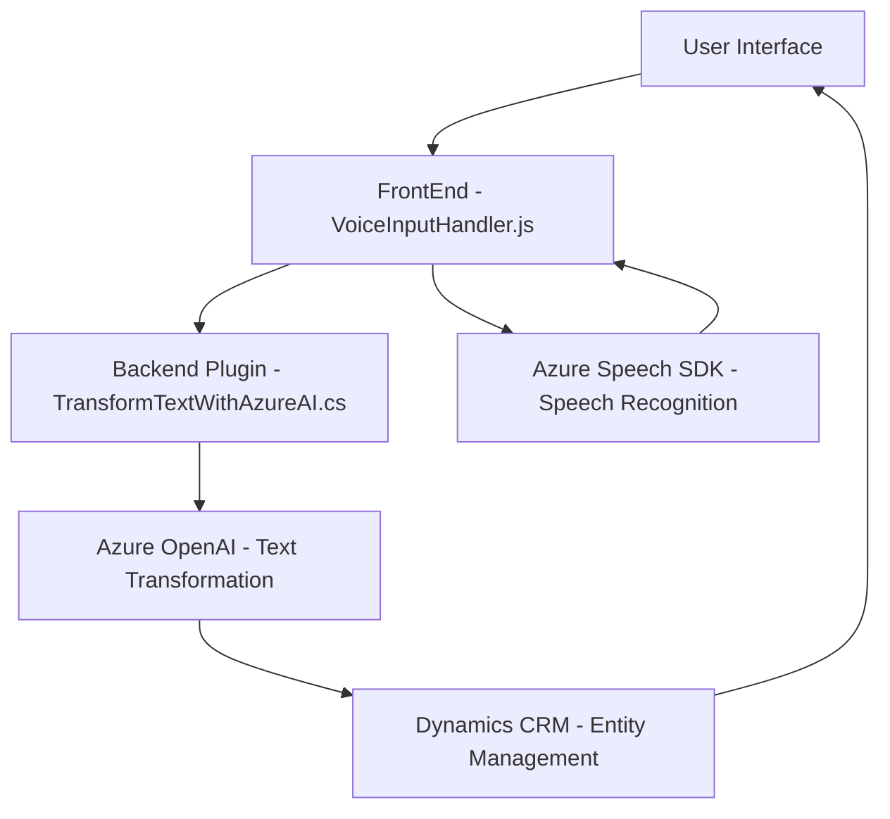

### Breve resumen técnico:
El repositorio contiene tres componentes principales que trabajan en conjunto:
1. **Frontend**: Implementado con JavaScript, interactúa con un formulario en el navegador y utiliza el Azure Speech SDK para reconocimiento y síntesis de voz.
2. **Backend plugin**: Desarrollado en C# implementando el `IPlugin` de Dynamics CRM para integrarse con la plataforma CRM. Utiliza Azure OpenAI API para procesar texto, generar respuestas en formato JSON y retornar al contexto CRM.
3. **External services**: Naturaleza híbrida entre servicios cloud como el Azure Speech SDK y Azure OpenAI API.

En conjunto, esta solución puede calificarse como una integración orientada a servicios para aplicaciones CRM que mediante un enfoque de reconocimiento y síntesis de voz busca mejorar la interacción con formularios por parte de usuarios.

---

### Descripción de arquitectura:
La solución adopta una **arquitectura de integración híbrida**, donde:
- El frontend utiliza una arquitectura modular para interactuar con el usuario mediante funciones bien definidas para la lectura y síntesis de voz.
- El backend se basa en un **patrón de plugin**, típico de Dynamics CRM, para insertar lógica personalizada en los procesos del CRM.
- Comunicación con servicios externos a través de **API Requests** (Azure Speech SDK & Azure OpenAI API). Esto conecta el sistema con servicios de AI en la nube para realizar acciones como reconocimiento de voz, síntesis y transformaciones avanzadas de texto.

El diseño interno de componentes utiliza principios como **modularidad**, **responsabilidad única** para funciones específicas, y dependencia en librerías externas para ofrecer funcionalidades avanzadas.

---

### Tecnologías y frameworks usados:
1. **Frontend (JavaScript)**:
   - Azure Speech SDK: Reconocimiento de voz y síntesis de texto.
   - JS (vanilla JavaScript): Para manipulación del DOM y desarrollo de funciones específicas.
   - Event handling: Procesamiento de eventos de voz.

2. **Backend (C#)**:
   - .NET Framework: Funciona como plugin de Dynamics CRM.
   - Microsoft Dynamics CRM SDK (Microsoft.Xrm.Sdk): Integración con elementos del sistema CRM como contextos, atributos y entidades.
   - System.Net.Http: Realización de llamadas HTTP para la integración remota con Azure OpenAI API.
   - Azure OpenAI API: Procesamiento de texto con modelos GPT para obtener resultados transformados.

3. **Servicios externos**:
   - Azure Speech SDK: Utilizado para reconocimiento de voz y texto.
   - Azure OpenAI API: Utilizado para transformar texto según normas predefinidas.
   - Dynamics CRM Platform: Ambiente de ejecución de los plugins C#.

---

### Diagrama Mermaid válido para GitHub:

---

### Conclusión final:
La solución está basada en una arquitectura **integrada de servicios** que permite vincular elementos de interacción de usuario (frontend) con capacidades avanzadas de reconocimiento de voz y síntesis proporcionadas por el **Azure Speech SDK**. 

El backend soporta la carga de datos estructurados mediante un plugin en **Dynamics CRM**, trabajando con una API personalizada que usa **Azure OpenAI API** para transformar texto bajo normas establecidas. Esta solución es apropiada para aplicaciones empresariales o cases de uso que requieren aumentar la eficiencia y personalización del manejo de formularios mediante tecnologías emergentes de inteligencia artificial y voz.

Sin embargo, se debe ser cauteloso con el manejo de credenciales sensibles (como las claves API) directamente en el código fuente. Una opción sería configurar un servicio de gestión de secretos o incluirlo como variable de configuración específica en el entorno de despliegue para mayor seguridad.

